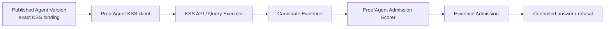

# KSS-only 权威切换与发布边界

更新日期：2026-08-18

[KNOWN | HIGH] ADR-0210 已把 Knowledge Source Service（KSS）设为唯一可执行
知识权威。本文说明本地验证与生产门禁，不是上线批准或生产操作授权。

## 1. 当前运行链路



- Published Agent Version 固定 Knowledge Space、exact Knowledge Base Release、
  client identity、versioned secret reference、Admission Scorer identity/revision
  和 `required` failure mode。
- KSS 负责摄取、版本、发布、检索与 Candidate Evidence；ProofAgent 负责准入、
  冲突治理、上下文和最终回答。
- KSS rank 与 lane-native score 不能作为 Admission Score。
- ProofAgent 不再提供 Hybrid provider、source API、ingestion/publication worker、
  `hybrid-migrate` 或 `knowledge-worker` 命令。KSS 自己的 Knowledge Worker 保留。

## 2. 本地验收

```bash
uv run --extra dev python -m pytest \
  tests/test_kss_authority_cutover.py \
  tests/test_knowledge_source_service_binding.py \
  tests/test_knowledge_source_service_client.py \
  tests/test_production_knowledge_candidate_runtime.py -q

uv run --extra dev ruff check proof_agent tests
npm run build -w proof-agent-dashboard
```

[LIMIT | HIGH] 定向测试通过只证明当前工作区的契约和组合行为，不证明真实 KSS、
client grant、Secret Provider、Admission Scorer 或生产网络已经就绪。

## 3. 生产切换门禁

生产候选必须同时具备：

1. exact KSS OCI、OpenAPI、migration contract 和 Deployment Compatibility
   Manifest 身份；
2. 与 Published Agent binding 匹配的 Client Grant 和 versioned client secret；
3. 已校准、批准且身份与 revision 精确匹配的 ProofAgent Admission Scorer；
4. KSS API、Query Executor、KSS Knowledge Worker、Scheduler 和依赖 readiness；
5. shadow、pilot、容量、恢复演练和 Blue/Green 切换证据；
6. Product Release Authority 对完整候选返回正式 `GO`。

任一项缺失均失败关闭，不得临时恢复本地 provider 或把 KSS 排名当作准入分数。

## 4. 回滚与恢复

[RISK | HIGH] 旧 Hybrid/shared/package knowledge binding 已不再可反序列化执行；对应
Published Agent Version 不能 replay，也不能作为回滚目标。回滚必须选择另一个已发布、
依赖可用且拥有 exact KSS binding 的 Agent Version。恢复已删除的 ProofAgent Hybrid
运行时不属于支持流程。

生产数据或 KSS Release 的恢复仍由 KSS 自身不可变版本、原子 Release 和独立恢复流程
负责；不得在 ProofAgent 内建立第二份知识权威。
