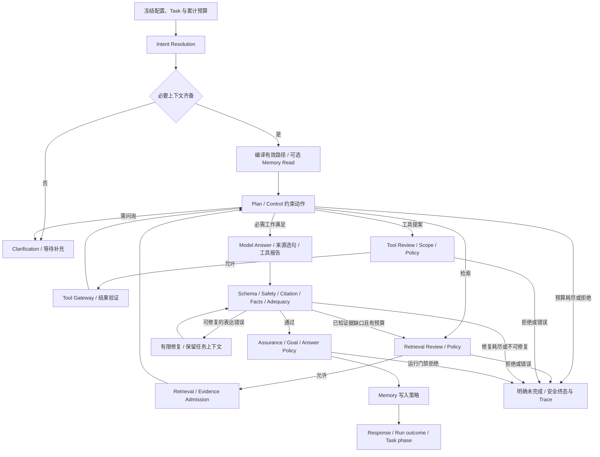

# Orchestration、Workflow 与系统 Prompt 梳理及优化

日期：2026-09-13。目标来源：[AGENTS-COMMON](../../../AGENTS-COMMON.md#product-goals-and-design-acceptance)。
本次设计决策：[ADR-0259](../../adr/0259-preserve-workflow-context-through-planning-and-answer-recovery.md)。
案例依据：[业务任务模板](../../testing/business-task-verification-template.zh-CN.md)。

## 1. 结论与范围

[INFERRED | HIGH] 当前优先级是让同一个任务、配置和证据边界贯穿实际执行与恢复。
核心控制门已有较多实现，局部 Prompt 与数据投影却会丢失约束或给出互相矛盾的指令。
本次优化这些可复现问题，不通过降低校验标准宣称通用智能或业务完成。

仅优化现有 `react_enterprise_qa_v3` 的编排/模型请求构造；保持 Task、Knowledge、Tool Gateway、
PolicyEngine 与发布边界。工作树已有大量先前改动，作为本次输入保留。
用户纠正分工后，分析、设计取舍与最终代码整合由 Astra 主 Agent 承担，Sol Low 用于验证复核。
此前 Sol 的审计及局部草案已经由主 Agent 重新核对；不将它们称为独立业务质量验收。

## 2. 实际编排结构

[KNOWN | HIGH] Orchestration 是执行控制，Workflow descriptor 是阶段与配置的描述，
系统 Prompt 是模型的提议协议；三者有不同职责。

| 层 | 当前职责与事实来源 | 不授予的能力 |
| --- | --- | --- |
| Delivery / Task | 解析用户身份、冻结 Agent 版本、目标修订、幂等与恢复意图 | 浏览器不提供可信权限，不直接标 complete |
| Execution compiler | 根据 complexity、interaction、assurance 与能力编译有效路径 | lite 不删除必要证据/工具验收 |
| Orchestrator | 持有 state、预算、eligible actions、必需工作、观察与终态 | Planner 不能自行越过门禁 |
| Workflow descriptor | 声明十个可见阶段、分支、配置选项和反馈回路 | 可编辑 Prompt 不改拓扑或权威 |
| Capabilities | Intent/Planner/Review/Answer 模型及 Knowledge/工具适配器 | 不独立验收任务或授权 |
| Validators / Goal assessment | 事实、引用、完整性、有界验收与 Task phase | 来源支持不等于一般语义完成 |
| Trace / Receipt / stores | 执行事实与安全投影、结果和恢复证据 | 读模型不变成执行权威 |

主要代码：[composition](../../../proof_agent/control/workflow/controlled_react/composition.py)、
[orchestrator](../../../proof_agent/control/workflow/controlled_react/orchestrator.py)、
[execution compiler](../../../proof_agent/control/workflow/execution_compiler.py)、
[descriptor](../../../proof_agent/control/workflow/templates.py)。

实际顺序如下；以下是阅读导航，不是新增状态机：

1. 加载被冻结的执行配置，恢复 Task 累计预算；先处理必需上下文和冲突约束。
2. Intent 解析目标、缺失项、查询与 Skill 推荐；Control 应用问询策略、接纳 Skill，并冻结必需查询。
3. 编译实际复杂度；轻量路径可确定性决定动作，其余调用 Planner。
4. Control 收窄动作集合、绑定必需检索/工具；Review 与 Policy 执行各自检查。
5. Knowledge 返回 Candidate Evidence，经准入后形成同 Run 的 Observation Truth；工具通过 Gateway 得到受验证结果。
6. 回到规划；只有必要查询/工具进度满足才能进入回答。已尝试、已返回片段与答案完整分开判断。
7. Answer 生成或受支持的来源选句；Schema、Safety、Citation、Facts、Adequacy 校验。
8. 表达/绑定错误进入既有有限修复；已知证据缺口经原受控检索路径补查，受轮数、重复和预算限制。
9. 最终 assurance、Goal assessment、回答 policy 与 Memory 写入策略检查；映射 Run outcome、Task phase 和制品。

Task 跨 Run continuation 不等于同 Run 任意阶段恢复。普通 Run 的 `ANSWERED_WITH_CITATIONS`
也不等于独立业务验收完成；Task 有未评估必需项时可保留回答，但 phase 必须保持未完成。

下图展示实际控制分支；可选 Memory Read 不属于十个 descriptor 节点，工具报告还可由受验证结果确定性生成。

## 3. Prompt 来源与优先关系

[KNOWN | HIGH] 当前不存在一个可随意替换的“全局系统 Prompt”。各能力有自己的硬契约；
Dashboard 的 Workflow Prompt 是业务补充，进入模型工作上下文，不替换 system role。

| 阶段 | system 来源 | 动态输入 / 配置 | 本次处理 |
| --- | --- | --- | --- |
| Intent | `capabilities/react/intent.py::_intent_control_prompt` | 原始问题、已准入上下文、问询规则、UTC 日期、Skill候选 | 保留真实规则，不将模型假设当用户事实 |
| Planner | `capabilities/react/planner.py::_planner_control_prompt` | eligible actions、当前进度、Task、冻结查询、阶段配置 | 优先待执行必需查询，阶段配置只传一份 |
| Retrieval Review | `capabilities/review/subagent.py::_review_control_prompt` | 实际动作、允许建议、业务补充 | 修复配置未接入；只给建议模型，不改变 Policy 输入 |
| 普通 Answer | `harness_helpers.py::build_model_request` | 原始要求、Accepted Evidence、Task、阶段配置 | 明确逐项回应与信任边界，仍按现有事实契约生成 |
| 来源选择 | `answer_source_selection.py::selection_request` | 来源句子ID、有界业务事实、Task与对话范围 | 保留上下文；输出选句或合法证据缺口二选一 |
| 表达修复 | `final_answer_attempt.py::_final_answer_repair_request` | 错误码、前次输出、证据、要求和阶段配置 | 修复丢失的配置/要求；前次输出仍非证据 |
| 超限重试 | `final_answer_attempt.py::_prepare_context_overflow_retry` | 原Task/会话/阶段约束，省略可选Memory | 保留必要范围，一次恢复，仍超限则失败 |

配置顺序是有效 Agent/Draft 配置 → 当前阶段 Prompt → 已准入 Skill 的阶段 addendum → 当前阶段动态事实摘要。
真实 Task 与 Accepted Evidence 独立传递；可选摘要的截断不能代替它们。所有自定义业务文字都不能
改变输出 Schema、准入、权限、预算或验证器。系统契约也不能保证真实模型一定遵守，仍需确定性校验。

## 4. 缺陷、取舍与优化

| ID | 原问题与影响 | 最终处理 | 验证入口 |
| --- | --- | --- | --- |
| O1 | Planner 要求原题逐字查询，与冻结必需查询相冲突 | Mapping 传递 required/attempted/pending；系统提示优先 pending，Control 继续绑定实际查询 | `test_planner_goal_alignment.py` |
| O2 | Planner 的摘要与独立字段各带一次阶段配置，增加上下文并放大提示重复 | 摘要仅留进度，配置走独立字段 | `test_prompt_contract_alignment.py` |
| O3 | 12k 可保存的 Prompt 在运行被 4k 预览限制截断，尾部要求消失 | preview 保持4k，runtime完整传递且合并超限明确拒绝 | `test_runtime_stage_prompt_context.py` |
| O4 | Answer超限重试去掉整个会话，Task约束随之消失 | 保留已准入会话、Task、阶段配置；仅省略可选Memory | `test_answer_context_continuity.py` |
| O5 | 初次业绩选句和修复过滤掉阶段配置/会话摘要 | 显式保留作用域与非证据标记，逐项要求随修复传递 | 同上 |
| O6 | 选句system要求仅statement IDs，Schema却允许gap IDs | 二选一协议一致，已知gap只触发受控补检 | `test_prompt_contract_alignment.py` |
| O7 | Retrieval Review配置未进入模型；Answer可选证据摘要永远为空 | 模型调用前刷新所选摘要，整体重算12k摘要预算，Review业务配置只进建议模型 | `test_runtime_stage_prompt_context.py` |

以下审计意见经主 Agent 核对后没有直接改成“自动通过”：

- 必需查询拿到已准入证据，只证明相应查询的证据绑定，不证明完整回答；这由领域规则明确限定。
  不能用关键词数量、模型自评分或用户确认补成通用语义校验。
- 无支持片段的已尝试必需查询目前 fail closed。引入改写重试必须定义如何将新查询证据绑定回旧要求，
  不能简单拿另一个问题的证据替代原证明。本次未开放这条新完成路径。
- Task有部分有依据回答但未满足必需验收时保留paused，是现行契约；不能为了终态好看改成complete。
- 普通文本事实契约要求来源绑定，任意分析改写仍可能拒绝。扩大业务分析应新增可核验的领域契约，
  单独评测准确、完整、过度拒绝和错误完成，不能仅放宽system Prompt。

## 5. 业务案例及验证层级

[案例卡与已运行映射](orchestration-business-cases-2026-09-13.md) 包含六类合成开发验证：
业绩正反与篡改、必要/可选问询、未授权工具提案、通用语义不假完成、lite升级/封顶、预算恢复。
修复专项还覆盖长Prompt尾部要求、模型违背冻结查询、超限后约束连续、选句补检协议与Review上下文。

这些都是开发回归；没有独立holdout或真实业务正确率。尤其“拒绝越权工具提案”不等于已验证
真实模型能抵御Knowledge文本注入；预算ledger恢复不等于所有生产Task恢复路径都通过。

### RED 与验证记录

- Runtime长Prompt尾部丢失、合并超限未拒绝：2个预期失败后修复。
- Answer动态证据摘要为空、Review阶段配置未传入：失败后修复；测试初次调用helper签名错误单列为fixture错误。
- 超限恢复Task约束丢失、repair配置丢失：专项先失败后修复，再通过真实runner的假模型超限/返回路径确认。
- 业绩选句会话摘要丢失：真实runner初次/修复请求缺字段，修复后保留非证据摘要。
- Planner冻结查询未传入：先失败后补齐；额外反例确认模型返回原题时Control仍执行冻结查询。
- 选句二选一协议与Planner重复阶段配置：2个预期失败后修复；Planner测试通过实际adapter确认。
- 动态摘要刷新后新旧内容共19,259字符，超出12k：新增回归先失败。整体重投影后又暴露固定字段名的143字符未计入，
  随后将字段名与截断标记计入同一文本预算；没有放宽断言。该限额约束投影文本，不是JSON序列化字节数或模型token预算。

最终命令、计数、静态检查与环境限制见下一节；中间版本测试数不作为当前源码证明。

## 6. 当前验证结果

[KNOWN | HIGH] 最终源码的本地回归通过，整体状态仍为 `PARTIAL_VERIFICATION`。
最终结果及15个相关源码/测试文件的SHA-256见
[验证记录](orchestration-verification-2026-09-13.json)。基础HEAD为`2ae4fae`，
工作树包含先前未提交改动；文件指纹仅绑定列出的文件，不代表完整仓库、依赖或部署镜像。

| 验证 | 最终结果与范围 |
| --- | --- |
| 后端全量：`uv run --extra dev python -m pytest tests/ -q --junitxml=/private/tmp/proofagent-orchestration-final-20260913.xml` | **3043 passed，102 skipped，2 deselected，2 warnings**；48.52秒；允许loopback绑定的本地主机，exit 0 |
| 本轮专项 | 最终JUnit包含6个聚焦文件、23项通过；与既有`test_workflow_stage_context.py`一起独立复跑为33项通过 |
| `uv run --extra dev ruff check proof_agent tests` | 通过 |
| `uv run --extra dev --extra openai mypy proof_agent` | 422个源文件通过 |
| `python3 scripts/check-domain-contexts.py`、`git diff --check` | 通过 |
| `uv lock --check --offline` | 通过，114个包 |
| `npm run typecheck`、`npm test`、`npm run build` | 通过；Dashboard 269项、Operator Chat 57项，共326项；本轮后续改动仅涉及后端和文档，无新增前端改动 |

102项跳过包括95项未配置真实PostgreSQL DSN的集成验证、1项未启用的真实LLM回归、
6项依赖已移除embedded Knowledge的旧夹具。2项S3集成测试由仓库默认配置排除。
两条Python警告分别是`authlib.jose`弃用和既有FrozenDict序列化警告；前端构建仍有超过500kB的包体积警告。
这些检查不覆盖真实业务模型效果、浏览器操作体验或生产依赖发布门禁。

初次完整检查中8个HTTP测试因沙箱不允许loopback绑定而失败，在允许绑定的本地主机复跑后全部通过；
未删除或跳过这些测试。收尾发现的摘要预算失败也已修复并包含在上述最终全量结果中。

## 7. 剩余能力与后续顺序

[INFERRED | HIGH] 下一步按用户价值排序：

1. 用独立业务资料标注理赔“适用条件＋例外＋材料”的多问任务，先建立语义判定标准，再扩展有界分析profile。
2. 对固定 Agent/模型/知识观察执行真实模型重复评测，记录修复成功率、错误完成、过度拒绝、澄清和成本；
   外部诊断重放需明确数据与模型授权，本次没有调用。
3. 定义必需查询零证据后的有界替代检索证明、完整性缺口的用户可见表达；保持所需证据不被偷换。
4. 核对未消费的工具review和非模型阶段context选项；工具review目前为确定性policy入口，
   不能仅凭descriptor标记为model-bearing就声称已经配置了模型审查。本次不增加工具执行权威或额外模型调用。
5. 同Run局部恢复、非阻塞问询并行、真实provider最新性/完整性和生产发布依各自契约另验。

本次没有重启现有服务、修改用户Agent配置、提交或推送Git，也没有生产发布。
