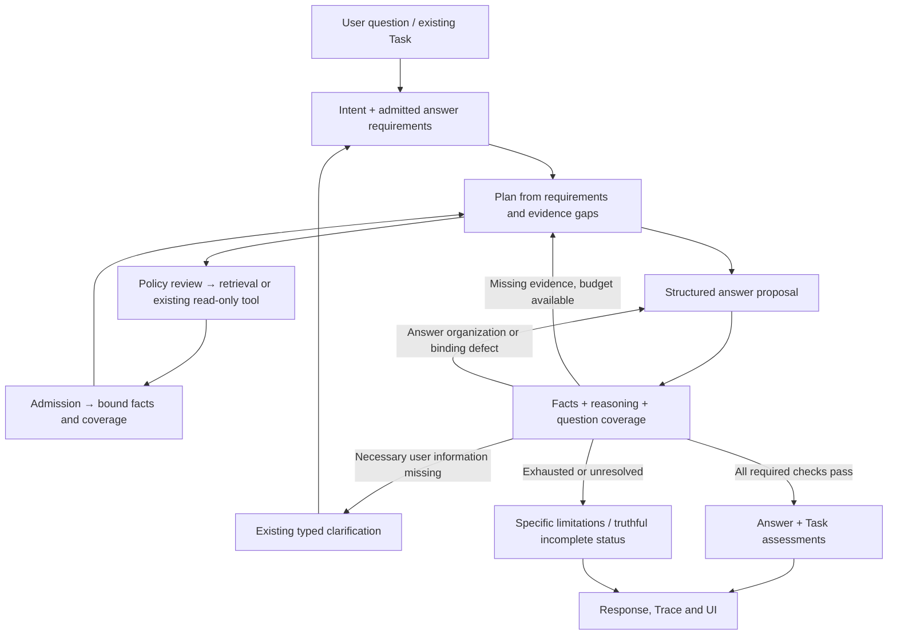
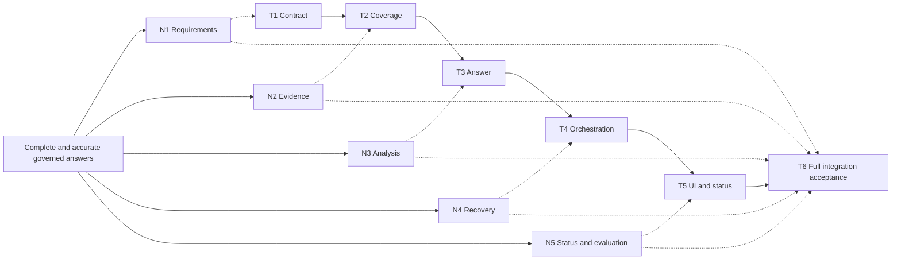

# Task-to-answer workflow optimization — plan v1

Date: 2026-09-13. Status: bounded implementation locally verified; broader real-model/semantic verification remains partial. Plan v1 T1–T6 explicitly confirmed by user “同意” on 2026-09-13.
User request: “按建议优化，如需调整workflow，请整体梳理分析后调整，而不是单独看一个点。”
Baseline: existing V3 workflow and dirty working tree; preserve unrelated changes. Previous recommendations and run-28973387 diagnosis are inputs. This plan covers the complete implementation chain, not just an answer prompt.

## Findings and architecture decision proposal

[KNOWN | HIGH] GoalContract and AcceptanceCriterion already exist (contracts/workflow_task.py). goal_control.assess_goal recognizes source_support, literal answer_coverage and verified_tool proofs. It does not generally establish semantic task completion.

[KNOWN | HIGH] controlled_react/task_completion.py combines bound required-query completion with a performance-specific global three-category check. final_answer_attempt.py activates flat source-ID selection for performance questions; answer_source_selection.py joins selected sentences. The answer port returns a terminal AnswerSynthesisResult, with no typed recoverable evidence-gap result. Orchestrator handles final assurance and Task assessments after synthesis. These boundaries must be changed together.

[KNOWN | HIGH] templates.py describes retrieval → answer/response and answer → response; actual controlled orchestration also revisits planning. New branches must be reflected in both executable behavior and Dashboard presentation, not merely drawn in documentation.

[FRAME | HIGH] Proposed direction: keep the single V3 workflow and existing authorization, evidence admission, immutable Observation Truth, cumulative budgets, Task revision and publication boundaries. Add a shared answer-requirement and proof model across intent, planner, synthesis, validation and Task completion. Business-specific interpretation belongs to versioned domain profiles, not the orchestration kernel.

## Design nodes and proposed execution

- N1: User-bound answer requirements; all explicit subquestions represented, assumptions distinguished, Task/run goals reconciled.
- N2: Evidence-bound facts and gap state; entity, period, unit, source span and relevant counterevidence travel together.
- N3: Structured, grounded analysis; factual queries can remain concise, analysis supports qualified comparisons.
- N4: Typed verification and recovery; semantic findings cannot overrule hard provenance/permission gates.
- N5: Task status, UI/Trace and evaluation show actual coverage, not merely successful execution.

This adds logical checks and feedback within existing stages; it does not require a new public workflow template or an unconditional extra model call at every node.

## Task decomposition and acceptance

| Task | Nodes | Allowed implementation scope | Observable acceptance / verification |
|---|---|---|---|
| T1 Requirements contract | N1 | Contracts, intent admission, goal_control, request context; ADR for changes | Every explicit subquestion is represented; invented goals, dates or user constraints are rejected; same requirements reach planner and answer. Test ordinary Run and persistent Task, goal revisions and follow-up constraints. |
| T2 Evidence and gap assessment | N2 | Knowledge projections, task_completion, planner context | Query completion and answer evidence coverage are distinct; candidates preserve entity/period/units/source and counterevidence. Repeated chunks do not inflate coverage; missing domains are explicit and scoped to the question/report. Test tables, ambiguous subjects, conflicting periods and duplicate observations. |
| T3 Structured answer and validation | N3/N4 | Answer contracts, synthesis runner, validators, assurance | run_28973387-style ungrouped metrics fail completion; supported business/dimension judgments with relevant counterevidence pass. Wrong entity/period, invented calculation or unsupported ranking fail. Facts, calculations and analysis remain distinguishable. |
| T4 Recovery in the orchestrator | N4 | Answer port, orchestrator, execution budget, Task result mapping | Missing evidence returns to planning; expression/binding defects return to synthesis; permission/source conflicts cannot be repaired away. All retries consume the same budget and terminate without duplicate tool effects. Useful partial delivery cannot mark unmet required criteria complete. |
| T5 Observable workflow and compatibility | N5 | Stage descriptors, bounded Trace/read contracts, Dashboard/Operator Chat and Task persistence integration as necessary | UI shows actual evidence-gap and repair loops; successful transport, grounded facts and complete task are distinct. Reconnect preserves progress and goal revision. Existing manifests, read-only tool flow and history remain supported or explicitly migrated. |
| T6 Evaluation and integration | N1–N5 | Synthetic/approved sanitized fixtures, regression runner, integration tests, active docs and verification report | Both historical bug patterns, factual lookup, comparison, conditions/exceptions, mixed evidence, no evidence and multi-turn revisions covered. Include fixed development cases and separately managed holdout cases; report provenance, factual correctness, completion, over-refusal, retrieval gain, retries and cost separately. |

Solid task arrows are implementation dependencies; dotted arrows map design coverage. Evaluation case design begins with T1 and is extended through each task; T6 is whole-chain acceptance, not postponed testing. Main agent owns shared state; no parallel writers or automatic subagent delegation.

## Detailed acceptance rules

1. Requirements proposed by a model bind to the user question/Task revision. Unknown semantic requirements stay unassessed, never pass from model confidence alone. Necessary user ambiguity can trigger existing clarification; harmless defaults are disclosed.
2. Prefer entity/period/metric data obtained from source context. An LLM-extracted field is a proposal until checked against its source span. Chunk adjacency alone must not transfer an omitted subject across documents or conflicting headings.
3. Analysis has a declared dimension and comparison basis. Same-business growth plus margin pressure must remain mixed. Cross-business heterogeneous metrics do not define a global ranking. Unknown domain semantics require qualified reporting or unresolved status, not a heuristic verdict.
4. Semantic review is used for analytical/complex tasks when needed, with bounded structured findings and evidence refs. It cannot grant tool permission, source authority or arithmetic correctness. Failure/unavailability does not silently pass a required review.
5. Recovery is chosen by bounded failure class; preserve verified prior facts, invalidate dependent assessments when evidence or goal changes. Count all model/retrieval calls including repairs. Reserve final validation/output budget; unchanged gaps trigger termination, not repeated identical retrieval.
6. Existing global three-category keyword checks cease to be completion authority when the new requirement contract applies. Source selection remains an appropriate extraction mode; no arbitrary prose exemption in answer_facts.
7. Distinguish partial answer delivery from Task completion. If a public outcome/status or storage change is necessary, record an ADR and version compatibility first; no implicit reinterpretation of ANSWERED_WITH_CITATIONS as universal completeness.
8. Trace contains bounded IDs, statuses and failure codes, not raw source text/model prompts. Existing sensitive capture policy stays separate. No external model diagnostic replay without explicit authorization.

## Verification and deliverables

Test-first per T1–T5, beginning with public contracts/application ports. Capture RED as behavioral assertion failures, then verify each change. Final backend pytest, Ruff, mypy, domain checks and diff check; frontend typecheck/tests/build and rendered critical-flow checks for T5. Use local synthetic dependencies; loopback tests require permitted local binding. Existing dirty changes are not attributed to this work.

Deliver updated ADR and canonical active documentation, runtime/contracts/necessary UI, regression/evaluation runner, evidence report with scoped file fingerprints and real command results. No commit/push, production deployment or external model calls are included automatically. Real-model quality remains separately unverified until authorized replay.

## Execution record

- Plan v1: whole-chain analysis and decomposition complete.
- T1–T5: bounded implementation and local verification complete; unsupported semantic requirements stay unassessed.
- T6: fixed local regression/evaluation and rendered component checks complete. Independent holdout and real-model evaluation remain unperformed.
- Evidence and exact limits: `tdd-task-answer-workflow-2026-09-13.md`.
