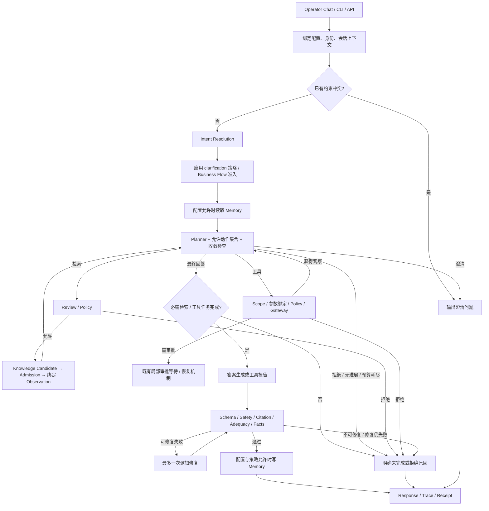

# ProofAgent Workflow 优化分析与落地方案

[KNOWN | HIGH] 本文保留分析时点的建议与验收目标。后续实施状态以 [实施记录](tdd-adaptive-workflow.md) 和 [可用配置](adaptive-workflow-configuration.md) 为准；不得将下面的待实施描述或完整验收目标当作当前已交付事实。

日期：2026-09-12。状态：设计建议，未实施、未批准为新运行契约。

分析基线：本地 HEAD `0d3009bd8d59bac2769e2b9d9212a480977c76ff` 加当前未提交工作区；包括 Workflow UI 简化和 Planner pending context 修改。本文不修改既有运行代码，不把历史测试或未提交 ADR 当作生产发布证据。`KNOWN` 表示直接读取的事实，`COMPUTED` 表示从代码推导，`INFERRED` 表示建议或尚需验证的判断；置信标签不是模型答案正确率。

## 1. 结论与目标

[INFERRED | HIGH] 建议保留唯一的 `react_enterprise_qa_v3` Control Plane，把它演进为“目标驱动、策略编译、可暂停恢复”的受控循环。优先补齐四份契约：`GoalContract`、`InteractionPolicy`、`AssurancePolicy`、`ComplexityProfile`；由服务端生成一份冻结的 `ResolvedExecutionPlan`，统一决定实际路径、预算、问询点与验证要求。

这不是更换框架或增加一组并列 workflow。参考 harness 的价值在于目标状态、事件协议、执行控制和交互机制；ProofAgent 现有的证据准入、工具授权、结果校验和 Trace 应继续作为执行依据。

| 用户目标 | 当前基础 | 必须补齐的可观察结果 |
|---|---|---|
| G1 明确目标、任务可控 | Intent、显式 goal/constraint、必需查询和固定工具计划、循环限制 | 目标有版本、验收项和预算；进度依据验收证明；可修改、暂停、取消；不重复已完成工作 |
| G2 自动推理回答与 HIL | 三档 clarification、Planner 问询动作、局部审批恢复机制 | 全阶段按原因问询；关键问题等待，非关键问题允许独立工作继续；输入与具体问题绑定；可信要求单独配置 |
| G3 按复杂度简化流程 | 检索参数、规划轮数、低风险 review fast path | 一次配置能改变真实执行路径和模型 effort；被跳过阶段可解释；必需目标、权限和证据检查不被裁掉 |

## 2. 参考实现与适用边界

[KNOWN | HIGH] 本次核实了 OpenAI 的 [`openai/codex`](https://github.com/openai/codex) 和 DeepSeek 官方的 [`deepseek-ai/deepseek-harness`](https://github.com/deepseek-ai/deepseek-harness)。DeepSeek [官方 harness 页面](https://deepseek.com/harness/en/)直接关联后者，当前标为 developer preview。源码分别固定到 `c4017a87aacc7558002b7cb510025e967c1d765e` 与 `c291e7961a515f6d7af9304e7fd1d257929aef26`；链接与读取范围见[一手来源研究](../../research/2026-09-12-codex-deepseek-harness-sources.md)。下面的移植判断属于本项目建议。

| 参考点 | 借鉴方式 | ProofAgent 适配边界 |
|---|---|---|
| Codex 的模型—工具—观察循环、会话事件与输入协议 | 用明确事件连接 Planner、执行、用户输入和恢复；减少不必要的模型调用 | 动作仍由 Control Plane 准入，观察仍走本项目 evidence/truth contract |
| Codex 的问询与工具审批分离 | 信息问题和权限决策采用不同对象、不同处理器 | 用户回答信息不能放宽 Tool Gateway 或生产能力范围 |
| Codex 独立的 reasoning effort、sandbox/approval 配置 | 将计算投入、问询偏好和权限分别管理 | `reasoning_effort` 不等于流程长度，也不等于可信度 |
| DeepSeek Goal 的 revision、轮次限制、持久状态和激活状态区分 | Task 有稳定 ID；修改使用 CAS；重放校验版本与预算 | `complete` 要求服务端验收证据，不能仅采信 Agent 自报完成 |
| DeepSeek 用户问询与 approval 插件分离、缺少审批提供者时关闭 | 使用结构化 Question/Answer 契约和明确的无交互端行为 | 浏览器、CLI、后台任务采用同一判定；没有人可问时必须有确定出口 |
| 两者的模式、上下文和工具扩展能力 | 将模式解析为可审计执行配置；按需加载上下文和能力 | 不照搬 shell、插件自动执行、原始思维链落盘或自由副作用操作 |

[KNOWN | HIGH] DeepSeek 的 [goal-round-driver](https://github.com/deepseek-ai/deepseek-harness/blob/c291e7961a515f6d7af9304e7fd1d257929aef26/packages/goal/goal-round-driver/README.md)明确没有独立完成验收器，round cap 也不约束 token、费用或时间；[agent-loop](https://github.com/deepseek-ai/deepseek-harness/blob/c291e7961a515f6d7af9304e7fd1d257929aef26/packages/core/agent-loop/README.md)没有内建 turn budget；[plan-mode](https://github.com/deepseek-ai/deepseek-harness/blob/c291e7961a515f6d7af9304e7fd1d257929aef26/packages/plan/plan-mode/README.md)通过提示词约束，工具仍然可用。Codex 的 [Goal 数据模型](https://github.com/openai/codex/blob/c4017a87aacc7558002b7cb510025e967c1d765e/codex-rs/state/src/model/thread_goal.rs)虽有 token/time usage 与独立状态，也不能替代业务验收。

[INFERRED | HIGH] 参考实现不证明保险问答的事实正确率，也不能提供本项目的可信度阈值。应移植控制机制，并以本项目任务样本验证质量、成本与问询负担。

## 3. 当前 workflow 的实际执行

[KNOWN | HIGH] 注册表只有一个模板、十个阶段；阶段描述主要供配置和展示。真实执行由 `ControlledReActOrchestrator` 的循环决定，Knowledge/Tool 观察会返回规划。现有未提交 `WorkflowConfigurationFlow.tsx` 已显式展示这种回路，不能再把页面简化误认为执行流程裁剪。依据：[模板](../../../proof_agent/control/workflow/templates.py)、[主循环](../../../proof_agent/control/workflow/controlled_react/orchestrator.py)、[UI 回路](../../../dashboard/src/components/agent/WorkflowConfigurationFlow.tsx)。



[KNOWN | HIGH] 图中的审批分支是内核现有机制，不表示当前产品开放审批工作流。`AGENTS-COMMON.md` 明确没有 active approval workflow、customer handoff 或 state-changing production tools；同步 Chat Run API 在生产模式也会拒绝执行，生产使用已有队列路径。[项目边界](../../../AGENTS-COMMON.md)、[Chat API](../../../proof_agent/delivery/api.py)、[队列 API](../../../proof_agent/delivery/run_queue_api.py)。

| 层次 | 当前职责和行为 | 对三个目标的意义 |
|---|---|---|
| 输入/会话 | 最近 3 轮、默认 1200 字符的上下文摘要；单独保留用户显式任务状态 | 已有长对话约束基础，但自然语言目标捕获仍有限 |
| Intent | `user_goal`、已知信息、缺失字段、模型 confidence、必需查询 | 已明确一次 Run 的检索入口，但无一般业务验收清单 |
| Clarification | `minimal / balanced / thorough`；必需上下文不可默认，偏好可有界默认，可检索事实先查 | 自动回答已具备基础，无需重新创建三档开关 |
| Planner/Control | 每轮动作提议、允许动作集合、重复观察/无进展与轮数控制 | 任务可控，但预算和进度口径较局部 |
| Retrieval/Tool | 冻结必需查询；同 Run truth 绑定；固定只读工具任务最多 8 步 | 防止模型提前回答；尚不是通用 Goal 完成判据 |
| Review/Policy | Review 是建议，Policy 是最终控制；已有低风险确定性 fast path | 已有减少 review 模型调用的基础 |
| Answer | Accepted Evidence 驱动，校验与一次修复；失败保留诊断 | 可复用为所有复杂度下的结果门禁 |
| 配置/可视化 | Prompt、context、能力可用性、不同位置的预算/检索参数 | 尚无统一策略编译，也无实际执行路径预览 |

证据：[会话上下文](../../../proof_agent/control/conversation.py)、[任务 reducer](../../../proof_agent/control/conversation_task_state.py)、[Manifest](../../../proof_agent/contracts/manifest.py)、[Clarification](../../../proof_agent/control/workflow/clarification.py)、[检索完成](../../../proof_agent/control/workflow/controlled_react/task_completion.py)、[Review](../../../proof_agent/control/workflow/controlled_react/review.py)、[答案执行](../../../proof_agent/control/workflow/controlled_react/final_answer_attempt.py)。

## 4. 关键缺口与优先级

以下是相对于本次目标的能力缺口，不全部属于现有契约下的缺陷。

| ID / 优先级 | 发现及证据 | 影响 | 建议 |
|---|---|---|---|
| D1 / P0 | [KNOWN \| HIGH] `ConversationTaskState` 只有 goal/constraint 字符串与 unresolved；reducer 使用显式语法、预算和禁止词规则 | 普通自然语言目标可能只存在于摘要和 Intent；缺少持久验收/交付物/完成状态 | 引入 GoalContract 与原文来源绑定的 GoalProposal admission |
| D2 / P0 | [COMPUTED \| HIGH] retrieval completion 判据是必需 query 有同 Run、可引用的已准入 evidence；非业务目标验证 | 查询得到一段证据也可能漏答指标、时间口径或对比维度 | 增加 GoalAcceptanceReport，保留 retrieval completion 作其前置证明 |
| D3 / P0 | [KNOWN \| HIGH] `apply_clarification_policy` 在 Intent 执行；Planner 只注入相同 prompt；`_ask_clarification` 取首字段直接返回等待结果 | 后期模型可再次问偏好；缺少跨阶段去重、问询轮数和统一“是否值得问”判定 | InteractionPolicy 在所有决策点执行，模型仅提出 QuestionProposal |
| D4 / P0 | [KNOWN \| HIGH] Chat 下一次消息创建新 Run；`resume` 主要处理 approval snapshot，澄清没有统一 Question revision/typed answer | 缺少明确回答归属、陈旧回答拒绝和依赖局部重算 | 先实现 Task 级跨 Run continuation，再扩展同 Run checkpoint 恢复 |
| D5 / P0 | [KNOWN \| HIGH] intent/review/route 的 confidence 与 retrieval/admission score 分散；没有统一可校准正确率契约 | 数字易被误当答案正确概率，问人可能被误当提升证据可信度 | AssurancePolicy 约束可验证证据要求；概率校准作为独立能力 |
| D6 / P1 | [KNOWN \| HIGH] `WorkflowConfig` 只有 template、descriptor、stages；stage 仅 prompt/context | 不能通过复杂度真正跳过规划、rerank 或额外 review | 编译 ResolvedExecutionPlan，以服务端阶段执行策略驱动循环 |
| D7 / P1 | [KNOWN \| HIGH] `ModelRequest` 没有 effort；OpenAI-compatible payload 只显式传既有参数；DeepSeek function schema 请求设 `thinking.disabled` | 配置表里的 effort 即使出现也可能不生效 | 增加类型化 reasoning 配置与 provider capability resolver，验证出站 payload |
| D8 / P1 | [COMPUTED \| HIGH] 检索观察后仍进入 Planner；工具观察已有确定性 final 快径；部分检索后动作也可由冻结要求确定 | 增加耗时、输出契约失败点；尚无实测节省幅度 | 在无未决分支时直接选择确定性下一动作，保留同一 admission 路径 |
| D9 / P1 | [KNOWN \| HIGH] 规划轮数、工具次数、检索轮数和 context budget 是不同限制；后者按模型角色解析 | 单一 `max_plan_rounds` 不能表达总成本、总调用数、HIL 等待上限 | 统一 TaskBudget，预留验证与最终输出预算，分别统计活动时间和等人时间 |
| D10 / P1 | [KNOWN \| HIGH] 现有答案事实检查显式统计 `unassessed_statement_count`，P0 评估区分 governed resolution 和 verified quality | 不能把校验通过率、引用率或拒绝率当业务正确率 | 按目标、复杂度、问询力度、可信等级联合评估；未知项单独报告 |

具体位置：D1 [conversation.py](../../../proof_agent/contracts/conversation.py)、[reducer](../../../proof_agent/control/conversation_task_state.py)；D2 [task_completion.py](../../../proof_agent/control/workflow/controlled_react/task_completion.py)；D3 [composition.py](../../../proof_agent/control/workflow/controlled_react/composition.py)、[orchestrator.py](../../../proof_agent/control/workflow/controlled_react/orchestrator.py)；D4 [api.py](../../../proof_agent/delivery/api.py)；D5 [react_workflow.py](../../../proof_agent/contracts/react_workflow.py)、[policy review](../../../proof_agent/control/policy/review.py)；D6 [stage configuration](../../../proof_agent/control/workflow/stage_configuration.py)；D7 [model.py](../../../proof_agent/contracts/model.py)、[provider payload](../../../proof_agent/capabilities/models/openai_compatible.py)；D8 [Planner adapter](../../../proof_agent/control/workflow/controlled_react/composition.py)；D9 [context budget](../../../proof_agent/control/context_budget.py)；D10 [answer facts](../../../proof_agent/control/validators/answer_facts.py)、[ADR-0240](../../adr/0240-separate-verified-quality-from-governed-resolution.md)。

[COMPUTED | HIGH] 可以先优化确定性场景的调用次数。假设 Intent/Planner/Answer 都使用模型、连续完成 N 次检索观察、没有问询/拒绝/修复，外层调用结构为 `1 Intent + (N+1) Planner + 1 Answer = N+3`，另加实际发生的 review、检索内部模型及重试。一次检索的基本路径因此是 4 次调用。若 Intent 已给出唯一必需查询，且检索完成后全部验收条件已可确定，可把两个 Planner 决策改为服务端确定性选择，目标结构降为 `1 Intent + 1 Answer`。这是基于上述控制流的结构计算，不是已实施优化或耗时降低 50% 的实测；复杂分支、拒绝判断与额外验证不适用该简化。

## 5. 目标与任务控制：GoalContract

[INFERRED | HIGH] 一个 Task 可以跨多个 Run；Run 是一次配置和证据绑定下的执行记录。用户回复、更正和追加问题不应自动覆盖原目标。建议最小契约如下，字段是设计草案：

| 对象 | 关键字段 | 规则 |
|---|---|---|
| GoalContract | `task_id, revision, objective, acceptance_criteria, constraints, exclusions, required_context, allowed_assumptions, budget` | objective 与验收项有用户输入/业务模板来源；模型不能改写已接受目标 |
| AcceptanceCriterion | `criterion_id, description, required, verifier_ref, evidence_requirements` | 检索到证据、计算完成和交付物通过分别判断；没有 verifier 的语义项显式 unassessed |
| TaskState | `phase, satisfied, pending, blocked, question_refs, evidence_refs, artifact_refs, consumed_budget` | 状态由事件和验证结果推导；计数不能替代完成证明 |
| GoalRevision | `expected_revision, source_input_ref, changed_criteria, invalidated_refs` | CAS；用户明确修订才变更；保留修订前证据和历史状态 |
| GoalAcceptanceReport | 每项 `pass / fail / unassessed`、检查器版本、证明引用 | 所有 required 项满足且硬门禁通过，才允许 Task complete |

[INFERRED | HIGH] 目标捕获采用“模型提出结构化 GoalProposal → 校验原文引用与业务 schema → Control Plane 接纳”的过程。清晰目标直接接纳并展示可修改摘要；不强制每个任务先问一次。涉及对象、权限、时间范围冲突或无法确定验收时才进入必要问询。模型抽取字段必须保持 `proposed` 与 `accepted` 区别，不能把模型推测记为用户确认。

例如“比较 A、B 产品，重点看住院理赔材料”，可生成：产品身份明确、分别提取材料、标明条款版本、列出相同/差异、每项关键事实可引用。完成两次查询并不等于这五项全部完成；找不到 B 的条款应保留对应缺口。

[INFERRED | HIGH] 采用有界任务图：只有真实依赖才连边；开始时冻结必需验收项，可在权限和预算内增加实现子步骤；不能删 required 项来制造完成。每轮只需回答“还有什么验收未满足、哪项工作能改善它、成本和权限是否允许”，不必每次重写完整计划。

终止与暂停分别表达：`active / waiting_for_input / paused / complete / failed / cancelled`。具体 enum 属于后续契约设计，不能直接替换现有 ReceiptOutcome。预算耗尽可以交付带明确缺口的阶段结果，但 Task 不得标记 complete；发布级 outcome 扩展需 ADR 与迁移。

## 6. 全流程 HIL：统一 InteractionPolicy

[INFERRED | HIGH] “全流程可配置”意味着每个可能出现不确定性的节点调用同一个策略，不意味着每个节点都要求人工确认。保留用户熟悉的三档力度，再增加交互模式、阶段规则和轮数限制。

| 维度 | 建议值 | 意义 |
|---|---|---|
| mode | `autonomous / adaptive / interactive` | autonomous 不发可选问题，必要输入仍等待或返回缺口；adaptive 按影响判断；interactive 更多确认实质偏好 |
| intensity | `minimal / balanced / thorough` | 沿用现有含义；thorough 也受去重、必要性和轮数约束 |
| checkpoints | `goal / plan / evidence / tool_input / finalization` | 每个阶段继承全局配置，可增加问询条件；不得解除必需上下文规则 |
| limits | `max_rounds / max_questions_per_round / wait_timeout` | 限制打扰和等待，超限保留缺口，绝不自动视为同意 |
| unavailable behavior | `return_missing_context / pause` | 后台批处理与无交互客户端有确定出口 |

问询原因须结构化，避免用一个 `low_confidence` 混合所有问题：

| 原因 | 默认处理 | 可否用自动推理解决 |
|---|---|---|
| 身份、权限、明确业务对象等 `required_context` | 从经验证会话/业务上下文解析；仍缺失则问或暂停 | 不可凭模型推断；必需字段由业务 schema/策略声明，不能只由模型分类 |
| 范围、格式、侧重点等 preference | minimal 使用允许默认；balanced 重大分歧才问；thorough 确认实质偏好 | 可以，记录并披露假设 |
| 可通过已授权知识入口获取的事实 | 先检索 | 可以，但最终必须符合 AssurancePolicy |
| 来源冲突、条款版本冲突 | 尝试指定权威版本或补检；用户可确定适用对象 | 用户偏好不能裁决客观真假；仍需证据 |
| 工具必要参数缺失 | 绑定 schema 字段、来源与具体对象后问询 | 不得让 scope assumption 自动进入参数 |
| 超出预算或新增范围 | 交付已完成部分与新增工作说明；需要新的预算/范围决定 | 不得自动扩预算或删除目标 |
| 事实检查或模型 schema 失败 | 使用既有有界修复；仍失败保留诊断 | 不应问用户“是否接受不可靠答案”以绕过门禁 |

[INFERRED | HIGH] 统一 `InteractionDecision` 输出 `continue / ask_blocking / ask_nonblocking / return_gap`，并携带 `reason_code, affected_criteria, allowed_default, source_refs`。决策顺序：先应用硬性必需项和业务规则，再检查已有答案/可检索信息，再比较候选范围是否实质改变结果，最后应用力度与问询预算。可用信息增益辅助问题排序，但不能把模型自评分当经过校准的触发阈值。

**问题与回答协议。** 建议 `QuestionRequest` 包含 `question_id, task_id, goal_revision, stage, missing_fields_schema, blocking, affected_nodes, expires_at, dedupe_key`。回答使用 `question_id + expected_revision + typed_values + idempotency_key`，服务端验证身份、字段类型和目标版本。重复提交返回原结果，过期/陈旧回答明确冲突；取消、撤回和修订保留审计。问题中的预选值不等于用户提交。

**等待与恢复。** [INFERRED | HIGH] 两步推进，避免一次重写生产队列：

1. 第一阶段使用 Task 跨 Run continuation：问题结果持久化；下一条 Run 显式绑定问题、Goal revision 和原配置。复用已有证据引用须重新检查绑定、适用范围与新鲜度，不能直接把 conversation summary 当 evidence。
2. 第二阶段增加同 Run checkpoint：事务内提交等待事件、Question 与 checkpoint 引用，释放 worker lease；回答事务发布唯一恢复工作。恢复前重查权限、Goal/config digest、证据完整性、剩余预算和租约 fencing。多副本竞争只允许一个有效 attempt。
3. 非阻塞问题只允许无依赖、已获授权的分支继续；依赖答案的节点不能提前执行。回答到达后仅使受影响节点失效和重算。信息补充默认不修改目标；修改目标必须产生新 revision。

[INFERRED | HIGH] PostgreSQL 是生产可变状态权威；Question 由 Workflow Control 拥有，Delivery 只接收/投影。等待期间不保持数据库事务；SSE 仅发布安全的粗粒度状态，重连读取持久当前状态。问题/回答按已有受限会话内容策略保留，普通 Trace 只记 ID、原因、计数和摘要，不新增原始思维链或全文模型 prompt。

## 7. 可信度要求：AssurancePolicy

[INFERRED | HIGH] 应把产品里的“可信度要求”解释为可检查的证据与验证标准。它与问询多少、模型思考多久独立。`confidence=0.9`、检索 `score=0.9`、用户点了确认，都不代表答案有 90% 正确概率。

| 等级 | 必需控制 | 可配置的额外要求 |
|---|---|---|
| basic | 权限、Evidence Admission、必需目标、schema/safety/citation/适用事实检查 | 普通单源回答；披露限制，未评估断言可要求删去或限制作答 |
| grounded（建议默认） | 全部基础控制；关键结论绑定证据；适用对象/版本/时点明确 | 对高影响结论执行支持性检查、关键计算验证、完整性检查 |
| strict | 全部 grounded 控制；关键断言不得处于 unassessed；冲突须解决或明确停止 | 权威来源类别、有效时点、独立来源或独立计算复核、必要专家输入 |

[INFERRED | HIGH] 不应机械规定 strict 必须“两条来源”。一份适用的正式条款可能是唯一权威依据，两个网页也可能转载同一原文。来源数量、独立性、权威性和 freshness 要按 claim 类型配置；严格模式下如果缺少所需 scorer/验证器，不得虚报已验证。

内部使用多维 `EvidenceAssessment`：`authority, applicability, freshness, claim_support, conflict_state, calculation_check, assessed_coverage`，每项保留证据引用、检查方法和版本，以及 `pass / fail / unknown`。模型 review 可以提供需要检查的线索，不能覆盖确定性拒绝。

```text
允许最终回答 = 硬门禁全部通过
            AND 当前目标的 required 验收全部满足
            AND 当前 AssurancePolicy 的必要证明齐全
            AND 没有阻塞问询或未解决的关键冲突
```

[INFERRED | HIGH] 如果必须提供“最低可信度 95%”之类数值配置，须先建立同任务类别、同模型/检查器版本的人工标注留出集和校准器。报告校准误差、覆盖率、选择性错误率及样本置信区间；没有合适校准证据时该数值是 `unavailable`，不能退回模型自报分数。第一阶段应先交付等级与证明要求，避免伪精确。

**自动推理的输出。** 基于 Accepted Evidence 的比较、总结、解释和可验证计算可自动完成；关键派生结论记录输入证据和验证摘要，不记录私有思维链。用户文本润色等无需外部事实的任务，若后续纳入范围，应另定义 `context_transform` 结果契约和来源披露；不能为节省检索，把当前事实问答偷偷改成无证据回答。

## 8. 推理复杂度与实际流程裁剪

[INFERRED | HIGH] 对外提供 `lite / standard / deep`，内部至少分开 `workflow_depth` 与模型 `reasoning_effort`。不同 provider/model 能力通过服务端 resolver 映射；不支持时明示配置错误或事先声明的 fallback，不能静默忽略。

| 执行项 | lite | standard | deep |
|---|---|---|---|
| Goal/Intent | 清晰结构化任务可确定性解析；否则一次有界解析 | 独立 Intent 与必要任务分解 | 更细的验收/依赖/待核实问题 |
| Planner | 已确定动作由 Control Plane 直接选；复杂分支不进入 lite | 有界 ReAct，确定性可结束时不再问模型 | 多步骤推理与计划修订，预算内执行 |
| 检索 | 单跳、少量查询，不做非必要 rewrite/rerank | 按需要补检、改写或重排 | 多轮、冲突消解、要求的交叉验证 |
| LLM Review | 仅可跳过规则允许的低风险建议性 review | 风险或不确定性触发 | Assurance/风险要求时进行额外复核 |
| 工具 | 无工具或已绑定的简单只读步骤 | 已授权多步只读依赖 | 更复杂的只读计划；不扩展工具权限 |
| Memory | 可跳过非必要 recall/write；保留当前目标/约束 | 按配置与需要 | 同 standard；更深不意味着加载更多无关历史 |
| 答案 | 一次生成；现有有界修复 | 生成、完整性/适用检查、同样有界修复 | 额外验证与细化交付；不默认无限修复 |
| 必需检查 | 全部保留 | 全部保留 | 全部保留并满足额外证明 |

**可以跳过：** 多余的 Planner 调用、建议性的低风险 LLM review、optional query、非必要 rewrite/rerank、Memory recall/write、可选的答案润色。**条件必须成立：** 当前目标不依赖它、Assurance/Policy 不要求它、所用确定性替代保留原语义。

**不可因 complexity 降低而跳过：** 身份和权限、业务对象/必需上下文、Tool Gateway、Evidence Admission、必需验收、适用的 citation/fact/safety/schema、取消/预算/恢复完整性检查。basic 与 lite 也不能例外。

[INFERRED | HIGH] 复杂度不够时有三种明确行为：在用户已允许的 ceiling 内自动升级；否则问是否扩大计算预算；不可交互时返回限制。绝不能通过减少 required queries/目标项使任务“适合 lite”。`lite + strict` 是合法请求：如果单跳权威证据足以满足严格要求就执行；不够则升级或保留缺口。

**Compiled plan。** 每个阶段生成 `execute / conditional / bypass / deterministic`、依赖、触发条件、预算、必需检查和 `reason_code`；冻结 `goal_revision + agent_version + policy_digest + compiler_version + provider_capabilities`。模板元数据、UI 执行预览和运行 Trace 都消费这一份事实，避免前端维护第二套“实际流程”。完整节点仍可见，被跳过节点标明原因。

**配置优先级。** 权限取平台、组织、发布 Agent、任务授权的交集；资源上限取有效最小值；必需证据要求取合并后的更严格集合。Agent 默认、业务场景覆盖、Run 请求按显式字段解析；Run 不能越过发布允许范围。问询偏好可按约定覆盖，但不能关闭必需输入。执行中配置变化需创建绑定的新 revision/Run，不修改正在运行的冻结计划。

**预算。** 除 `max_plan_rounds` 外，增加总 model calls、总 retrieval calls、tool calls、输入/输出 tokens、活动时间、HIL 轮数/等待期限以及可选成本上限。总预算包含 intent、review、planner、repair 与子任务；调用前预留、调用后结算。usage 缺失保留 unknown，并使用保守预留控制后续调用；不可按 0 处理。最终验证和输出保留预算，避免把预算全耗在规划。

## 9. 配置草案与用户界面

[INFERRED | HIGH] 以下仅说明目标配置形状，**不是当前可加载 YAML**。数字是首轮测试候选，不是已验证最优默认，也不代表用户授权了运行预算。

```yaml
workflow:
  template: react_enterprise_qa_v3
  execution:
    complexity: standard
    ceiling: deep
    auto_escalate: true
    reasoning:
      effort: medium
      unsupported: reject
    budget:
      max_model_calls: 10
      max_retrieval_calls: 5
      max_tool_calls: 4
      max_active_seconds: 120

interaction:
  mode: adaptive
  intensity: balanced
  max_rounds: 2
  max_questions_per_round: 1
  unavailable: return_missing_context
  wait_timeout_seconds: 86400
  checkpoints:
    goal: { ask_on: [required_context, material_ambiguity] }
    plan: { ask_on: [scope_change, budget_change] }
    evidence: { ask_on: [applicability_unresolved] }
    tool_input: { ask_on: [required_parameter] }
    finalization: { ask_on: [user_preference_blocking] }

assurance:
  level: grounded
  unknown_required_claim: block
  evidence_conflict: resolve_or_block
  applicability: required
```

[INFERRED | HIGH] Dashboard 采用一组全局控制：推理复杂度、交互模式/问询力度、证据要求；高级面板提供各阶段覆盖、预算和升级上限。保留全流程图与简洁节点配置，并提供“此配置下的执行预览”：哪些节点必走、条件执行、可跳过、跳过原因及生效配置来源。配置入口不承载生产工具审批。

Operator Chat 显示可编辑的目标摘要、必要缺口、当前阶段、已完成验收与资源用量。HIL 卡片说明“缺什么、影响哪项工作、可选默认及其含义”，支持少量选项和补充文本；非阻塞问题提示其余工作正在继续。用户看到“资料不足”“目标待补充”“模型响应失败”“预算不足”等原因，不能全部显示为一个“置信度不足”。

[INFERRED | HIGH] 迁移保持单一来源：先把现有 `response.clarification_level` 明确映射为 InteractionPolicy；旧配置编译为保持现有行为的 legacy plan。新字段上线时用有版本的迁移和冲突拒绝，不能让新旧两组值长期共同生效或静默忽略旧字段。已发布版本和历史 Trace 保持可读，不能重写历史配置证明。

## 10. 实施顺序与接入点

[INFERRED | HIGH] 建议按六个可独立验收的纵向切片交付。全部属于待实施；本次只完成分析与方案。优先 S1/S2，让目标与问询行为可验证，再开放更灵活的裁剪。

| 切片 | 交付行为 | 主要接入点 | 依赖/完成判据 |
|---|---|---|---|
| S1 目标闭环 | 目标、验收、来源和 revision 持久化；不完整任务不能 complete | `contracts/conversation.py`、新增 Goal contracts、`control/conversation_task_state.py`、`task_completion.py`、Chat 投影 | G1；保留原查询 gate；自然语言提议与用户事实分离；CAS/取消/预算测试 |
| S2 全阶段问询 | 每阶段相同策略；Question ID 与回答绑定；跨 Run continuation | `clarification.py`、`orchestrator.py`、`composition.py`、Conversation/Queue API、Operator Chat | G2；三档一致、去重、无交互出口、陈旧回答拒绝、问题完成不等于授权 |
| S3 可信要求 | grounded/strict 等级、claim 状态与验收证明 | `contracts/manifest.py`、Knowledge admission、validators、answer runner、Receipt/评估投影 | G2；unknown 不伪报 pass，冲突有出口，阈值未校准不展示概率 |
| S4 执行编译与轻量路径 | 预览与实际执行一致；减少确定性场景 Planner 调用 | `stage_configuration.py`、`execution_input.py`、主循环、Dashboard | G3；从现有行为映射开始；剪裁闭包验证；跳过原因有 Trace |
| S5 模型 effort 与统一预算 | 出站请求确实使用支持的 effort；全阶段计费与限额 | `contracts/model.py`、`bootstrap/model_resolution.py`、provider、context budget | G3；mock transport payload、能力不匹配、usage 缺失和预算耗尽验证 |
| S6 durable HIL 与评估 | worker 释放/恢复、多副本幂等、等待重连、质量成本基线 | PostgreSQL repository/UoW、Queue、Executor、Artifact、SSE、evaluation | G1/G2/G3；真实依赖本地演练；发布仍走原生产 Gates |

S1/S2/S3 不依赖先做一个通用 DAG 引擎；先使用现有 Orchestrator。S4 扩展同一路径的确定性决策，不能把 lite 实现为 Delivery API 直接调用模型。S6 的 durable HIL 是完整全流程交互的必需工作，不能因为跨 Run 版本可演示就宣布所有目标完成。

**设计需固定的契约。** Goal 修改语义、Task 与 Run 身份、Question 回答归属、结果部分完成的公开表达、Assurance 等级及 provider fallback；实施时先记录对应 ADR/feature 契约，再 TDD。默认建议已在本文给出，无需每个技术选择都新增确认；涉及扩大生产动作权限、外部模型回放或发布，按现有明确授权边界处理。

## 11. 验收与评估

| AC | 场景与预期 | 覆盖目标 |
|---|---|---|
| AC01 | 清晰普通问题，系统接纳目标并直接工作；无需例行“是否开始” | G1/G2 |
| AC02 | 100 轮后仍保留目标/约束来源；Goal 修订仅使受影响验收失效 | G1 |
| AC03 | 只完成 A/B 比较的 A；即使模型声称完成，也不得 Task complete | G1 |
| AC04 | required_context 在任意 intensity 与阶段都不能被默认；用户已给的信息不重复问 | G2 |
| AC05 | 可检索事实先查；thorough 的偏好问询有界且去重 | G2 |
| AC06 | 非阻塞问题等待时独立分支继续；依赖分支不执行；答案到达局部恢复 | G2 |
| AC07 | 重复/过期/错误 task revision 回答、越权回答、进程重启都不能触发重复恢复 | G1/G2 |
| AC08 | 无交互通道、超时、取消均返回稳定状态，不把默认选项当同意 | G2 |
| AC09 | 一份权威条款可满足对应 strict 规则；两个重复转载不能冒充独立来源 | G2 |
| AC10 | 高模型 confidence + 无证据/错金额，仍失败；unassessed 不能伪报已验证 | G2 |
| AC11 | lite 的 trace 确实减少可选步骤；同一必需目标、证据和权限约束仍成立 | G3 |
| AC12 | lite 无法满足 required 任务时按 ceiling 升级或说明缺口，不删目标；超预算不暗中继续 | G1/G3 |
| AC13 | effort 改变真实 provider payload；不支持值拒绝；DeepSeek thinking 组合单独验证 | G3 |
| AC14 | UI 预览、保存重载、冻结 digest、运行节点/跳过原因一致；旧配置行为不漂移 | G1/G2/G3 |
| AC15 | 外部依赖失败、权限撤销、工人租约过期时 fail closed；恢复不借用另一 Run 的证明 | G1/G2/G3 |

[INFERRED | HIGH] 评估应固定任务与证据快照，比较 `3 complexity × 3 intensity × 3 assurance` 的关键组合，采用配对实验；交互模式再覆盖 autonomous/adaptive/interactive 的分支测试，不必全部依赖昂贵 live-model 笛卡尔积。数据覆盖单跳事实、复合对比、模糊偏好、真正缺失对象、证据冲突、资料不存在、长对话修订、工具依赖、恶意输入与恢复失败。

质量指标分别统计：验收完成率、答案正确率、关键断言支持率、错误自动回答率、正确问询率、不必要问询率、重复问询率、unassessed 覆盖率、拒绝/部分完成原因。效率统计模型调用数、token、成本、活动 p50/p95 延迟、HIL 等待时间、恢复成功率。分母包含失败/未知任务，不能仅在成功回答上计算正确率；保留 missing usage。

[INFERRED | HIGH] 简化策略的接受条件是同一任务集合上预先约定的质量约束不退化、错误自动回答不增加到不可接受水平，并确实降低调用或延迟。具体质量阈值需要业务留出集；现在不承诺“减少 50% 成本”或“95% 正确率”。外部模型实测需要单独的已授权数据范围；当前分析未执行外部模型回放。

## 12. 本次验证与剩余证据

[KNOWN | HIGH] 本次读取当前源代码、主项目规则、相关 ADR 与未提交 diff；进行了以下本地定向回归：

```text
.venv/bin/python -m pytest -q \
  tests/test_clarification_policy.py tests/test_retrieval_task_completion.py \
  tests/test_conversation_task_state.py tests/test_tool_task_completion.py \
  tests/test_workflow_stage_configuration_resolution.py tests/test_planner_pending_context.py
→ 99 passed, 1 warning

.venv/bin/python -m pytest -q \
  tests/test_openai_compatible_provider.py tests/test_review_subagent.py \
  tests/test_controlled_react_orchestrator.py tests/test_context_budget.py \
  tests/test_context_assembler.py
→ 86 passed
```

第一组警告为 Pydantic 对 `params` 中 `FrozenDict` 的序列化提示。共 185 项通过，不等于全量测试或真实问答质量验证。未运行生产依赖、部署、外部模型与新方案性能测量；未改变运行代码或现有工作区修改。

[INFERRED | HIGH] 下一实施优先级为 S1 → S2 → S3，随后 S4/S5，最后完成 S6 与整体评估。以“目标是否被满足、何时需要人、用了多少计算、为什么可信”四项可观察结果判断完成，避免只增加配置表单而没有端到端行为。
