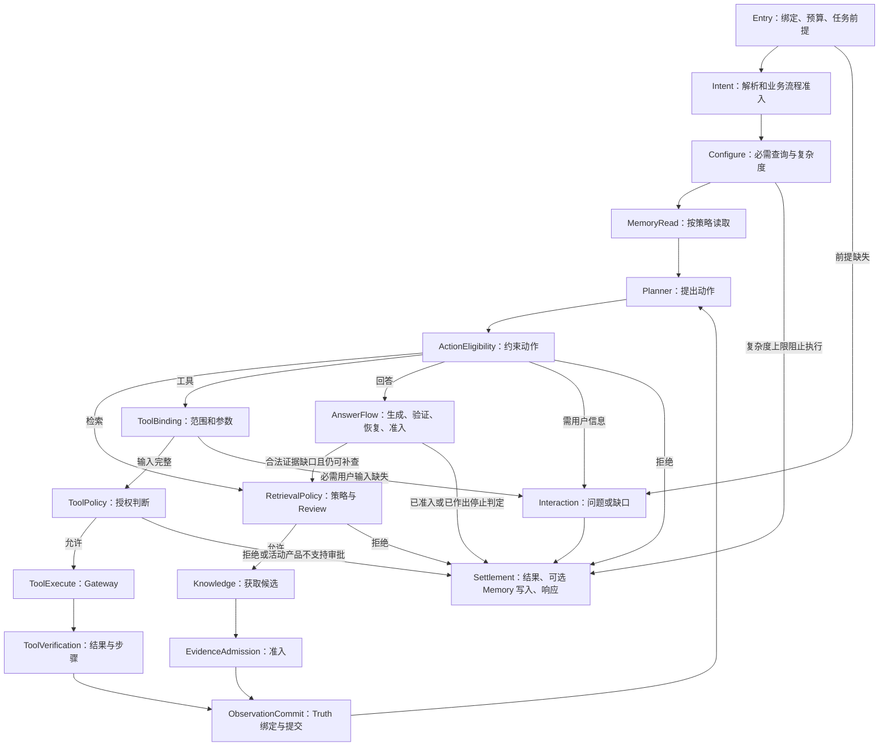
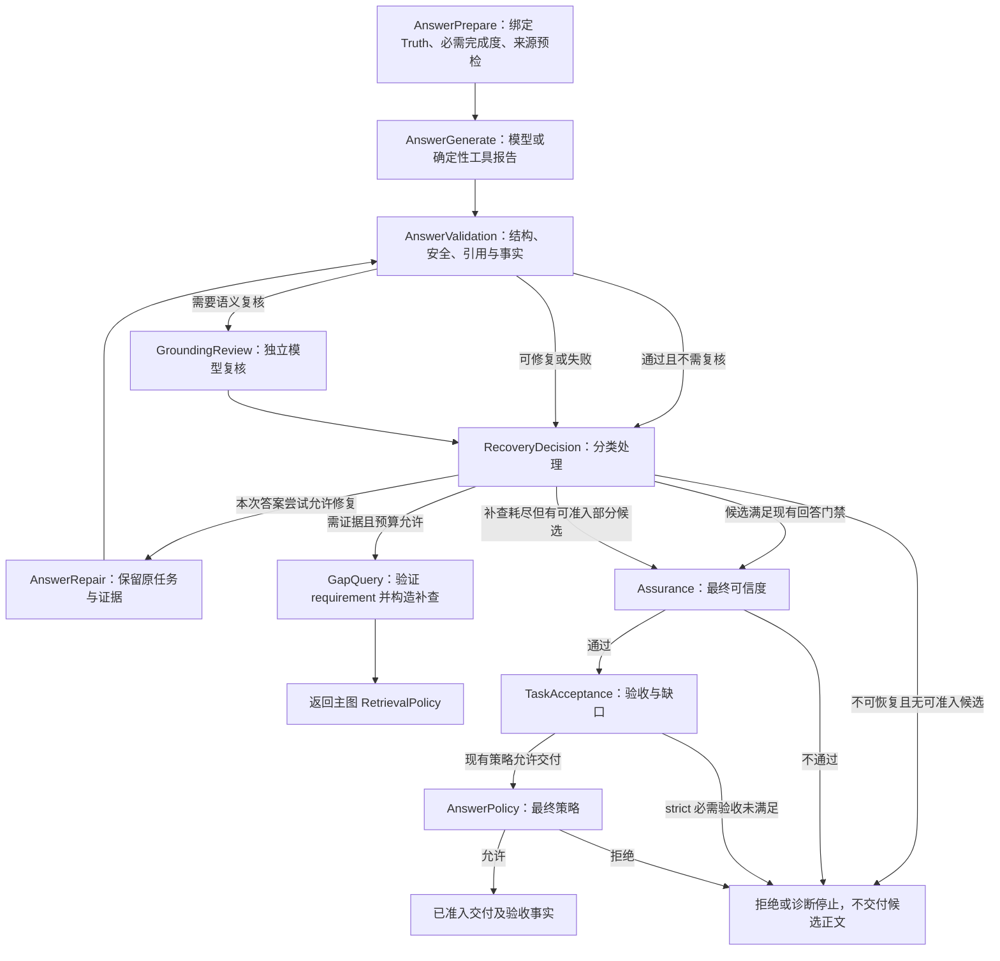

# Orchestrator 状态机重构设计

## 当前契约

| 项 | 内容 |
|---|---|
| Feature / 版本 | `orchestrator-state-machine` / scope v1，2026-09-14 |
| 用户目标 | G1：Orchestrator 装载并编排 Workflow，直接看到节点与运行线路；G2：Planner、Knowledge、Tool、Answer、Policy、验证独立封装规则；G3：提炼职责独立的实体，减少重复数据 |
| 已确认选择 | 用户选择“代码定义流程并注册装载，节点和连线可直接阅读”；不设计 YAML/JSON 流程语言或可视化流程编辑器 |
| 授权 | 分析、重新设计及设计文档；尚未授权实现。本文件不拆 TDD 任务，不修改运行代码 |
| 设计结论 | `[INFERRED | HIGH] TDD_INPUT_READY`：本文件声明的结构重构范围具备设计与验收输入；不是用户接受全部建议、已实施或发布批准 |
| 当前进度 | 设计完成、实现未开始、目标验收未执行；TDD 任务与图示确认留给后续阶段 |
| 范围 | 当前唯一活动 Workflow `react_enterprise_qa_v3`，其全部主路径、工具任务、澄清、答案修复/补查、结果与预算、现有快照读取边界 |
| 非目标 | 新增活动 Workflow、改变模型/Prompt/业务验收语义、生产审批产品、任意脚本工具、并行节点调度、分布式工作流引擎、全节点崩溃恢复或新的 event-sourcing 数据库 |
| 风险 | P1：错误路由可跳过权限/证据门禁，数据精简可破坏恢复和累计预算；由 AC-02/04/05/06/09/10 覆盖 |
| 文档定位 | 本文件是本次结构重构的单一设计树；既有答案质量、Task、适应性配置计划保留其业务语义与历史证据，不复制为第二份业务规范 |

## 依据与现状

下列 `KNOWN` 为当前源码/规则事实。后续“建议”均为待实施设计，不改变现行规则；不以现状缺陷作为业务规范。

| ID | 来源 | 事实 / 本次约束 |
|---|---|---|
| E-01 | [AGENTS-COMMON.md](../../../AGENTS-COMMON.md)；[hicode coding rules](../../rules/hicode-coding-rules.md) | `[FRAME | HIGH]` Control Plane 拥有策略、准入、验证、结果映射；模型只提案；保留任务、预算、只读工具与生产存储边界 |
| E-02 | [orchestrator.py](../../../proof_agent/control/workflow/controlled_react/orchestrator.py) | `[KNOWN | HIGH]` 2364 行文件混合入口、while 分派、规则、工具绑定、Truth 读取、答案恢复、Task 更新和阶段投影；并有对象字段及局部变量承载执行中状态 |
| E-03 | [state_machine.py](../../../proof_agent/control/workflow/controlled_react/state_machine.py) | `[KNOWN | HIGH]` 只定义 `RECORD_OBSERVATION` 命令及 OBSERVING → PLANNING，尚未承载完整路由 |
| E-04 | [templates.py](../../../proof_agent/control/workflow/templates.py)；[execution_compiler.py](../../../proof_agent/control/workflow/execution_compiler.py) | `[KNOWN | HIGH]` Registry 当前注册展示描述；实际线路在 Orchestrator，复杂度编译也读取展示描述，三者存在分开维护的关系 |
| E-05 | [composition.py](../../../proof_agent/control/workflow/controlled_react/composition.py)；[ports.py](../../../proof_agent/control/workflow/controlled_react/ports.py) | `[KNOWN | HIGH]` 已有能力 Port，但多接受完整 RunState；composition 同时有装配和大量业务适配逻辑，Answer Port 已包含生成/验证/修复 |
| E-06 | [controlled_react contracts](../../../proof_agent/contracts/controlled_react.py)；[artifact_binding.py](../../../proof_agent/control/workflow/controlled_react/artifact_binding.py) | `[KNOWN | HIGH]` RunState 混合核心事实、派生范围、Trace 投影、模型捕获；快照 digest 绑定整个序列化 payload，不能直接删除字段后当作旧快照读取 |
| E-07 | [task_completion.py](../../../proof_agent/control/workflow/controlled_react/task_completion.py)；[goal_control.py](../../../proof_agent/control/workflow/goal_control.py)；[assurance.py](../../../proof_agent/control/workflow/assurance.py) | `[KNOWN | HIGH]` 检索完成、答案可信度、Task 完成各有不同判定，领域特化检查不能迁入通用调度器 |
| E-08 | [ADR-0260](../../adr/0260-synthesize-answers-with-bound-source-quotes.md)、[ADR-0261](../../adr/0261-answer-independent-parts-before-personal-clarification.md)、[ADR-0262](../../adr/0262-bind-semantic-claim-labels-through-grounding-review.md)、[ADR-0263](../../adr/0263-check-purchase-clarification-dependencies.md) | `[FRAME | HIGH]` 保留总结分析、原文绑定、独立有界模型复核、先答独立部分后追问、当前问题依赖判断；不退回自动逐句摘录 |
| E-09 | [Workflow Control glossary](../../domain/workflow-control/CONTEXT.md) | `[FRAME | HIGH]` 公共 Stage 是展示/配置契约，非任意执行节点；内部状态不能返回 Delivery；不能保留两套长期执行器 |
| E-10 | [agent_package_execution.py](../../../proof_agent/delivery/agent_package_execution.py)；[workflow_execution contracts](../../../proof_agent/contracts/workflow_execution.py) | `[KNOWN | HIGH]` Delivery 已调用 start 并消费统一结果；Task authority、队列、Receipt/artifact 最终化不应并入新 Engine |

参考业务计划：[Task-to-answer](../agent-kernel-quality/task-answer-workflow-plan-2026-09-13.md)、[Adaptive workflow](../agent-kernel-quality/adaptive-workflow-configuration.md)。它们的稳定业务要求继续生效，本设计只重划执行结构。

## 设计结论与主要取舍

`[INFERRED | HIGH]` 建议采用“代码定义的有限状态流程 + 纯迁移内核 + 独立节点”，保持现有同步、单 Run 单执行者模型。先复用 Python 类型、现有 Port 和验证服务，不引入新的工作流框架依赖。

状态机的价值在于让**下一步路由显式化、状态写入单一化、能力执行可替换**。只将每个 if 分支搬到一个 State 类、让 State 自己调用下一 State，仍会留下分散路由和隐藏循环，不能满足 G1。

职责分层：

| 层 | 唯一职责 | 不承担 |
|---|---|---|
| `WorkflowOrchestrator` | 按已绑定的模板/版本装载流程，启动或恢复 Engine，返回统一结果 | action_type 分支、查询拼接、字段问询、答案验收和投影拼装 |
| `WorkflowDefinition` | 节点、事件边、入口/出口、预算循环声明、public stage 映射 | 执行副作用、保存运行数据、从 Prompt/YAML 接收新连线 |
| `WorkflowEngine` / `StateMachine` | 节点调度、纯迁移、执行身份核对、结果提交、挂起/结束 | 理解保险指标、决定查询是否完成、判定工具风险、解释模型正文 |
| Action / Control nodes | 通过小型输入输出契约执行一项职责，产出结果事实 | 直接指定 next_node、递归调用其他节点、修改共享 Frame |
| Capability ports / domain rules | Provider-neutral 能力、确定性规则和现有 Gateway/validators | workflow 路由、Task 持久状态的最终提交 |
| Projection / checkpoint adapters | 真实执行事实的展示，受保护的恢复序列化 | 将展示摘要作为执行依据、从历史 Trace 自动恢复业务权限 |

`[INFERRED | HIGH]` Policy 和 Validation 都保持独立，但不建设可随意调整顺序的通用规则引擎。不同门禁是同类节点的具名实例，例如 `retrieval_policy`、`tool_policy`、`answer_policy`；它们的输入域和 enforcement point 静态绑定，不能混用。

## 设计树与接入点

```text
G：Workflow 可读、节点独立、核心实体精简 [全部待实施]
├─ N1 流程定义与装载                 → G1
│  ├─ N1.1 Registry / WorkflowDefinition / ExecutionBinding
│  ├─ N1.2 节点、事件、连线及编译校验
│  └─ N1.3 从同一流程定义生成展示描述
├─ N2 状态机与执行生命周期           → G1/G3
│  ├─ N2.1 纯迁移、单执行者、类型化结果应用
│  ├─ N2.2 累计预算、取消、异常及挂起
│  └─ N2.3 原有恢复边界与快照迁移
├─ N3 独立能力及控制节点             → G2
│  ├─ N3.1 前提、Intent、执行策略、Memory read
│  ├─ N3.2 Planner 与 ActionEligibility
│  ├─ N3.3 Knowledge、EvidenceAdmission、ObservationCommit
│  ├─ N3.4 ToolBinding、ToolPolicy、ToolExecute、ToolVerification
│  ├─ N3.5 Answer、Validation、GroundingReview、Recovery
│  └─ N3.6 Interaction、Assurance、TaskAcceptance、Memory write
├─ N4 核心实体与数据所有权           → G3
│  ├─ N4.1 执行绑定 / 控制游标 / 工作事实
│  ├─ N4.2 Action / Observation / Answer / Assessment
│  └─ N4.3 派生 View / Trace / capture / 兼容 DTO
└─ N5 对外结果与可观察验收           → G1/G2/G3
   ├─ N5.1 真实 visit → Stage/Trace/Receipt 投影
   ├─ N5.2 Run outcome 与 Task update
   └─ N5.3 契约对照、图路由、失败/恢复及界面验证
```

主流程接入：现有 Delivery 解析 Agent/Published configuration → `WorkflowOrchestrator.start()` → Registry 装载冻结定义 → Engine 执行 → `WorkflowTemplateExecutionResult` → 原 Delivery artifact finalization / Task authority。新 Engine 完全位于 Control Plane；不建立 `proof_agent/runtime/`。

## 执行线路

下图是主流程视图；`answerFlow` 在下一图展开。分组只用于阅读，所有子节点在编译后成为同一张扁平执行图，使用同一个 Engine 和预算；不增加运行时子状态机栈。



图中每个节点的异常出口均由显式 failure contract 收敛到诊断停止；完整 Definition 必须列出该出口，不以这张概要图代替边表。活动入口不新增审批能力；历史内部审批恢复的兼容边界见后文。



重要语义：有据部分交付仍需原有验证/Assurance/Policy；不把存在缺口的内容直接从 Recovery 绕到交付。类型化结果区分“允许准入的部分候选”和“无候选的拒绝/失败”。Intent 中的缺失字段/拒绝建议继续随 IntentState 经过 Configure、按现有策略处理 MemoryRead 和 Planner strategy，最终由 ActionEligibility 路由；不能为缩短图形而改变原有能力调用顺序。

### 节点契约表

以下是作用域契约，不要求一个节点一个文件。纯规则允许普通函数；只有独立依赖、输入输出或副作用边界才设置节点。

| 节点 / 设计归属 | 输入 | 输出事件 / 后继 | 节点封装的规则与限制 | 依据 / 验证 |
|---|---|---|---|---|---|
| Entry / N3.1 | Start 或受支持的 Resume command、绑定上下文、Task usage | ready→Intent；required_input→Interaction；error→停止 | Task phase/版本、机构、配置、快照；预算恢复；非法恢复在任何能力调用前失败 | E-01/06/10；AC-06/09 |
| Intent / N3.1 | Question、准入上下文、冻结 Stage context | resolved（含缺失字段/不准入建议）→Configure；contract_failure→诊断 | 意图模型和有界结构修复、Business Flow 准入；输出 typed IntentState，模型不决定路由 | E-02/05/08；AC-03/07 |
| Configure / N3.1 | IntentState、TaskGoal、执行配置 | configured→MemoryRead；blocked→停止 | 合并 required queries；保持最多 5 条、复杂度升级和 ceiling；策略选择不删除必需门禁 | E-04/07；AC-04/06 |
| MemoryRead / N3.1 | 上下文与 MemoryPolicy | loaded / skipped→Planner | lite/禁用时明确跳过；读取事实属于上下文，不成为证据 | E-01/05；AC-03/08 |
| Planner / N3.2 | PlanningInput：任务、意图、观察摘要、eligible actions、工具接口、剩余预算 | proposed→ActionEligibility | compiled lite 或配置的 Planner 实现；只输出 proposal；保持现有 terminal-intent/tool-observation shortcut 的语义，封装在 Planner strategy | E-02/05；AC-03/04 |
| ActionEligibility / N3.2 | proposal、查询/工具完成度、历史、预算、Interaction 规则 | retrieval / tool / answer / clarification / refused | 未完成 required query 强制补齐；工具任务下一步；防重复；显式拒绝/澄清优先级；不能由模型修改规则 | E-02/07/08；AC-02/04/06 |
| RetrievalPolicy / N3.3 | QueryAction、执行授权、Stage context、Review 配置 | allowed→Knowledge；denied→停止 | 确定性 Policy 最终裁决，Review 只给评估；deep 不使用低风险 fast path；失败关闭 | E-01/05；AC-02/03 |
| Knowledge / N3.3 | 已审查查询、固定 binding、检索限制 | candidates→EvidenceAdmission；error→诊断 | 通过既有 KnowledgeRetrievalService；内部检索循环保留其细粒度 Policy 和预算；不把外层节点算成只调用一次底层查询 | E-05；AC-04/06 |
| EvidenceAdmission / N3.3 | 候选集、原查询、来源绑定、admission 配置 | observation_proposed→ObservationCommit；error→诊断 | 保存 Accepted/Rejected 事实；可返回空准入集；不伪造 completion。若服务已产生类型化准入事实则校验承接，不重复 scorer 调用 | E-01/05/07；AC-04/10 |
| ToolBinding / N3.4 | ToolProposal、有效接口、已回答字段、冻结工具步骤 | bound→ToolPolicy；required_input→Interaction；denied/error→停止 | 范围、USER_SUPPLIED、SYSTEM_GENERATED、未知参数、参数 digest；不增加支持的工具类型 | E-05；AC-02/05 |
| ToolPolicy / N3.4 | BoundToolAction、当前授权、配置 | allowed→ToolExecute；denied→停止；requires_approval→既有受控出口 | 绑定工具、参数和 scope；活动产品不激活审批；无授权不能执行 | E-01/05；AC-02/05/09 |
| ToolExecute / N3.4 | 执行身份、绑定 action、Policy fact | tool_effect→ToolVerification；error→诊断 | 唯一调用 ToolGateway 的节点；Gateway 仍执行服务器授权/schema；不得因上游有 Decision 而免检 | E-01/05；AC-05/09 |
| ToolVerification / N3.4 | 原参数/步骤、工具返回、前序 Truth | observation_proposed→ObservationCommit；invalid→诊断 | executed、schema、同 Run 依赖、只读合同、计算和 report_fields；保留 Decimal/精度语义，不新增金融规则 | E-05/07；AC-05 |
| ObservationCommit / N3.3/4 | ObservationEffect、预分配身份、当前游标 | committed→Planner；duplicate→原合法后继；conflict/error→诊断 | Truth digest、读回、同身份幂等、类型/动作绑定；仅成功提交后增加可用于决策的观察 | E-03/06；AC-04/09 |
| AnswerPrepare / N3.5 | 工作事实、Truth refs、Task/Assurance | ready→AnswerGenerate；incomplete/denied→停止 | 重载和验证 Truth；工具步骤完成；required retrieval；来源 Assurance 预检；模型不能替代必需证明 | E-06/07；AC-04/07 |
| AnswerGenerate / N3.5 | AnswerInput、证据、原任务/Stage context | candidate→AnswerValidation；policy_denied/error→停止 | 模型正文生成与确定性工具报告两种 provider；模型调用使用原 Policy/预算；无证据不能自由回答 | E-05/08；AC-03/07 |
| AnswerValidation / N3.5 | AnswerCandidate、绑定证据、需求 | validation→GroundingReview 或 RecoveryDecision | schema/safety/quote/citation/事实/覆盖；保留原验证顺序和硬失败，不把成功模型调用当验证通过 | E-07/08；AC-07 |
| GroundingReview / N3.5 | 候选、绑定原文、任务、Stage context | assessment→RecoveryDecision；policy/error→停止 | 含 quotes 时独立有界模型复核；使用相同策略/预算；模型评估不升级为确定性证明 | E-08；AC-07 |
| RecoveryDecision + GapQuery / N3.5 | 分类验证结果、需求集合、已尝试查询、Attempt/Budget | repair→AnswerRepair；evidence_gap→RetrievalPolicy；admit_candidate→Assurance；stop→结果 | 只接受已知 requirement；Control 构造查询；合法补查沿原 review/commit 路径；不把模型 URL 当工具输入；见优先级表 | E-02/07/08；AC-04/06/07 |
| AnswerRepair / N3.5 | 候选、结构化诊断、相同任务/证据、repair allowance | candidate→AnswerValidation；error→停止 | 原有一次一般修复；原有 context-overflow 压缩重试单独计数，不通过重新进入节点重置额度 | E-05/08；AC-06/07 |
| Assurance / N3.6 | 绑定证据、候选、fact validation、AssurancePolicy | passed→TaskAcceptance；blocked→停止 | 来源、日期、元数据、冲突、适用性、有界 facts；strict 未评估规则保持 | E-07/08；AC-07/08 |
| TaskAcceptance / N3.6 | 冻结目标、检索/工具证明、候选 | assessed→AnswerPolicy；strict_blocked→停止 | 生成 CriterionAssessment；不在这里提交 Task authority；一般语义 criterion 保持 unassessed | E-07/08/10；AC-08 |
| AnswerPolicy / N3.6 | 已验证候选、最终证据基线、Policy | allowed→Settlement；denied→停止 | 原 BEFORE_ANSWER 裁决；不能删除或让模型复核覆盖 | E-01/05；AC-02/07 |
| Interaction / N3.6 | 有类型的缺失字段、stage、Task 问答、InteractionPolicy | question / missing_context→Settlement | 先查可检索事实、保留硬前提、问询上限/超时、先答独立部分；输出问题草稿，由 Task authority 持久化 | E-08/10；AC-08 |
| Settlement / N3.6/N5 | 已准入交付/拒绝/失败/等待、验收、预算、运行记录 | WorkflowTemplateExecutionResult | 类型化停止原因映射；可选 MemoryPrepare→MemoryPolicy→MemoryCommit；Response→TaskUpdate。下文限定 Memory 行为和错误传播 | E-01/02/10；AC-06/08/10 |

### 规则分支优先级

`[INFERRED | HIGH]` 优先级按局部决策点定义，不设覆盖全系统的“大规则排序器”：

1. Entry：绑定/恢复完整性失败先停止；有效 Task 的硬前提缺失先交互，未运行 Intent 不伪造 Intent 结果。
2. 每次外部能力 dispatch：先确认当前执行身份与已绑定输入，再执行原 enforcement point 和预算检查；取消/失效执行者不能继续提交。
3. ActionEligibility：保留已明确的 REFUSE/ASK 语义；其他提案依次遵守必需检索、冻结工具任务、动作可用集和无进展限制。已完成 required queries 能在其既有预算边界进入回答，不能机械套用无 required-query 模式的“轮数达到就拒绝”。
4. Answer validation：身份、Policy、安全硬失败不可变成普通证据补查；原本可修复的 schema/引用/事实问题按既有 allowance 修复；只有校验产生的已知 evidence-gap ID 进入检索回路。
5. 预算不足或补查无新合法查询：保留最近合法的部分候选与原失败类别，按现有结果映射结束；不可将 FAILED_WITH_TRACE 统一改为缺证据拒绝。
6. Task complete：只有有资格交付的 Run、全部 required criterion 具备有效 proof、没有 deferred fields 才可请求 complete；交付成功和 Task 完成始终分开。
7. Memory：只有当前既有路径原本允许 prepare_write 时才进入该分支。策略拒绝/验证不通过按原规则投影，不自动撤销已经准入的答案；BudgetExceeded、store/adapter 异常沿现有契约传播，不在此次结构重构中一律吞掉。

Memory 路由明确为：普通回答流程的最终结果（包括 synthesis/admission 后的拒绝或失败）和 REFUSE 动作处理路径可以 prepare；前提澄清、工具范围/Policy 直接拒绝、检索 Review 直接拒绝、入口预算耗尽和早期契约失败跳过；lite/禁用/无候选时始终跳过。新图不得把所有 STOP 都接到一次无条件 Memory 写入。

## 代码形态与状态机契约

建议单一 `definitions/react_enterprise_qa_v3.py` 暴露入口、分组和完整边表。下面是接口草图，不是现有可运行代码；最终命名可在 TDD 保持语义前提下调整。

```python
def react_enterprise_qa_v3() -> WorkflowDefinition:
    return WorkflowDefinition(
        key=WorkflowKey("react_enterprise_qa_v3", definition_revision="1"),
        entry="entry",
        nodes=(entry, intent, configure, memory_read, plan, action_gate,
               retrieval_policy, knowledge, evidence_admission,
               tool_binding, tool_policy, tool_execute, tool_verification,
               observation_commit, *answer_flow.nodes,
               interaction, *settlement_flow.nodes),
        edges=(
            edge("entry", EntryReady, "intent"),
            edge("intent", IntentResolved, "configure"),
            edge("configure", Configured, "memory_read"),
            edge("memory_read", MemoryReady, "plan"),
            edge("plan", ActionProposed, "action_gate"),
            edge("action_gate", RetrievalSelected, "retrieval_policy"),
            edge("action_gate", ToolSelected, "tool_binding"),
            edge("action_gate", AnswerSelected, "answer.prepare"),
            edge("action_gate", ClarificationSelected, "interaction"),
            edge("observation_commit", ObservationCommitted, "plan"),
            edge("answer.recovery", EvidenceGapApproved, "retrieval_policy"),
            *retrieval_edges, *tool_edges, *answer_flow.edges,
            *interaction_edges, *settlement_flow.edges, *failure_edges,
        ),
    )
```

完整定义不以此摘录代替遗漏的边；分组常量应在同文件展开可见或由 `describe(expand=True)` 无副作用地列出。只允许重复边族用于统一错误出口，不允许在 handler 里补隐藏跳转。

```python
class WorkflowNode(Protocol[InputT, ResultT]):
    def execute(self, request: InputT) -> ResultT: ...

class WorkflowOrchestrator:
    def start(self, request: StartRequest) -> WorkflowTemplateExecutionResult:
        execution = self.registry.bind(request.workflow_key, self.dependencies)
        completed = self.engine.run(execution, execution.start_input(request))
        return execution.result_projector.render(completed)
```

Engine 内部顺序固定为：

1. 从 `ExecutionCursor` 读取当前 node / visit，核对可执行生命周期。
2. 由该 `NodeSpec.input_builder` 构造只读的小型 Input；通过构造函数注入该节点必要的 Port，不传 `HarnessInvocation` 或全量服务定位器。
3. 执行节点，得到其声明的类型化 Result。Result 变体本身表示事件，如 `ToolBound(action)`，避免独立 event 字符串与 payload 不一致。
4. 纯迁移内核验证 `(node_id, result_type)` 有且只有一条边；节点对应的纯 reducer 只应用其声明拥有的事实字段。未知结果、重复边、越权字段写入立即失败。
5. 执行必需的提交协议，记录 visit 与安全事件，再公布新游标；进入后继，或产出等待/停止结果。

StateMachine 不调用 LLM/网络/数据库；Engine 不写业务 if/elif；Node 不接收 Engine，也不返回任意 `next_node`、`dict patch` 或新的全量 RunState。各 reducer 与节点契约同处维护，避免新建一个巨大的全局 reducer。

当前 ObservationCommitter 中“验证并保存 Truth”与“更新旧 RunState”的职责需要拆开：前者保留为提交服务，后者合入新迁移内核的 Observation reducer。旧 `ControlledReActStateMachine` 不作为新 Engine 下的第二套状态权威继续运行。

流程编译必须验证：节点/handler 完整、入口与出口有效、事件覆盖且互斥、Result 到目标 Input 的绑定成立、无不可达必需节点、所有环路有显式预算/有限进展规则、能力门禁不能被 shortcut 绕过。静态门禁检查同时需要运行期绑定检查，不能只依赖图形可达性。

## 实体、核心字段与数据所有权

`[INFERRED | HIGH]` 分开“运行生命周期”“当前节点”“ReAct 动作”。内部生命周期只表达 RUNNING / WAITING / STOPPED；`node_id` 表示位置；`ReceiptOutcome` 是对外结果。它们不互相冒充，也不把每种拒绝理由扩成一个 State 类。

建议执行聚合为 `ExecutionFrame(binding, cursor, facts)`。这是 Engine 私有容器，不是新的万能节点参数。瞬时派生 View、IO handles、SDK client、capture 正文均不进入 Frame。

| 实体 / 所有者 | 必要核心数据 | 保存与生命周期 | 去重原则 |
|---|---|---|---|
| `ExecutionBinding` / 入口 | Run identity、workflow key/revision/digest、冻结配置、机构授权、当前 Question、admitted context、可选 Task snapshot/goal revision | 单 Run 不可变；恢复绑定 | 原问题和 Task objective 语义不同，不能相互覆盖；用引用或同一不可变对象共享上下文 |
| `ExecutionCursor` / StateMachine | node_id、visit_id/序号、RUNNING/WAITING/STOPPED、active action id、observation round、可选 ResumePoint | 唯一执行位置所有者 | public stage 从 NodeSpec 映射，不重复保存；不能用 stage_results 推断位置 |
| `IntentState` / Intent + Configure | validated intent、selected business flow、missing/deferred fields、冻结 required query 集 | 解析后冻结；Task revision 变化重新准入 | 原模型 intent 与 Control 合并事实明确区分，避免多份无类型 dict 反复改写 |
| `ActionRecord` / ActionEligibility + commit | action_id、proposal、执行时绑定参数/合同摘要、状态、observation 关联 | 按 action_id 保存一次，保留去重与工具依赖需要的历史 | proposal 参数和 execution 参数是不同语义，只有发生系统绑定时保留差异；不在 history/pending/snapshot 各复制整个 action |
| `ObservationRecord` / ObservationCommit | observation/action identity、round、truth_ref、不能从 Truth 恢复的控制事实（如 unresolved 标识） | 核心索引追加；Truth 仍由原不可变 store 保存 | source/citation/count 从已绑定 Truth 构建 View；用于安全核对的冗余绑定保留在边界 DTO 或校验 envelope，不因精简删除 |
| `AnswerAttempt` / Answer flow | attempt id、candidate、证据 basis digest、Task revision、验证/复核结果、repair 与 overflow allowance、合法 gap history | 一次 synthesis 尝试；必要状态进入受支持的 checkpoint 才持久化 | 模型 response/capture 不嵌套复制 previous attempts；已变证据使旧验证无效，不能用上次 passed |
| `Assessment` / 对应 verifier | kind、subject/input digest、规则版本、状态、proof refs、原因代码 | 绑定特定目标与输入；可缓存但可重新验证 | retrieval coverage、answer validation、Assurance、Task acceptance 用不同类型，不共用 complete bool |
| `StopDecision` / Settlement | answered/refused/waiting/failed 类别、reason code、可选已准入交付、问题/诊断/验收引用 | 最终一次产生 | 内部只有一份正文；`final_output` / `message` 在现有公共 DTO 适配边界按原语义生成 |
| `WorkflowBudgetLedger` / 执行资源服务 | 原有模型/查询/工具/Token/active seconds 与未知消耗 | 从 Task 恢复、所有角色共享、由既有 authority 持久化 usage | 不在每个节点复制或自建预算；observation round 与模型次数不是重复字段 |
| `ExecutionRecord` / 执行提交与投影 | visit、node、结果类别、safe fact refs、预算关联、诊断引用 | 有界过程记录供结果生成，按现有 Trace 机制发出 | 不是新建事件溯源数据库；不是执行恢复权威；原文和敏感 capture 进入独立受控出口 |

### 派生与持久化的边界

1. `effective_react_action_set`、完成度、工具接口 scope、source/citation/count、流程图数据是 View。其基线包含 facts revision、配置和工具合同；变化后重算，不作为可长期复用的授权。
2. 当前 action 获得的 Policy fact 绑定 action/input/scope/configuration/visit；变参、换 Run、换目标或恢复后必须失效或重新验证。它不是对外授权 Token，Gateway 仍保留自己的服务器检查。
3. `tool_proposal_scope_trace_projections`、`observation_trace_projections`、`stage_llm_interactions` 从核心 State 移到投影/capture 出口；需要公共结果时通过有界 collector 组装，不从日志反向执行。
4. `last_task_checkpoint_ref`、`last_execution_plan`、`_task_question`、`_goal_assessments`、局部 `recovery_diagnostics` 各有明确执行所有者：checkpoint metadata、compiled binding、interaction result、assessment、attempt diagnostics。取消依赖 Orchestrator 对象的隐含跨方法可变状态。
5. 不把所有小对象改成磁盘 ref：短的动作、意图和候选可以在内存保存不可变值；大 Evidence Truth 复用既有 store。没有确定恢复需求时不新增存储。
6. 只在有序列化/持久化用途时把 DTO 放 `proof_agent/contracts/`；节点 Input/Result、Protocol、reducer 保持 Control 内部。现有 `WorkflowStageResult` 继续是公共安全 envelope，不变成全量内部 Result union。

## 循环、预算、恢复和提交协议

### 保留的循环语义

| 循环 | 进展依据 / 额度 | 退出条件 |
|---|---|---|
| 检索/工具观察 → Planner | 原 observation round、必需查询 attempted/support、冻结工具步骤 | 满足则允许回答；缺证据/无进展/预算耗尽则按既有语义停止 |
| Answer repair → Validation/Review | 同一 AnswerAttempt 的既有一般修复额度 | 一次一般修复耗尽、安全失败或 Policy 阻止即不再修复 |
| Context overflow → compact generate | 原有独立有界压缩重试标记；共享模型/Token 预算 | 已压缩仍溢出则按原诊断停止；不由节点重入获得新额度 |
| Answer evidence gap → RetrievalPolicy → Commit → Planner | 合法 requirement、未尝试补查、剩余 observation/检索/模型预算 | 无合法新查询或额度不足时停止补查，保留部分交付/失败的正确类别 |
| 问询后的 Task continuation | Task authority 的 version/CAS、typed answer、原累计 usage | 新 Run 重新准入；不是从旧 node 任意跳入；不得重置预算 |

真正的新证据批次可以启动下一次 synthesis attempt，按原行为获得该次 attempt 的修复额度；Run/Task 总预算和已尝试查询不重置。图中跳转本身不消耗一次模型调用，也不把每个纯验证节点计作一个 observation round。

### 执行与存储原子性

`[INFERRED | HIGH]` 保留现有 Run Executor/Task authority 对所有权、队列租约和 CAS 的控制。Engine 不建设第二个 lease 服务，不宣称跨外部服务 exactly-once。

- 节点执行身份由 Run、node visit、action/attempt 和已冻结输入确定；重复相同结果幂等，变更结果冲突；不能每次 retry 生成新 action id 绕过历史。
- 普通纯节点仅在内存以不可变值迁移。Observation 使用现有 committer 的完整性验证、不可变写入和回读协议后，才让新索引对规划可见。
- 需要持久 Task/checkpoint 提交时，通过现有生产 S3/PG authority：外部 artifact 成功并核验后，执行既有受 fencing/CAS 保护的可见性事务；不在数据库事务内调用模型/工具/Knowledge。
- 外部调用后、结果尚未提交即中断，不能仅靠游标重放假装调用未发生。默认沿已有失败/未知消耗处理，保持关闭；当前重构不承诺任意节点透明崩溃恢复。
- Memory 写入是可变副作用，保持原有幂等和错误规则；不能因为通用 retry middleware 自动重复写。只有明确可恢复的节点拥有具体 retry contract。
- cancel / lost lease 是独立控制停止；不能被捕获为普通 no-evidence 后继续调用。存储/Trace 必需提交失败不能伪造成功终态。

### 快照与审批保留边界

目标内部数据布局不同，故采用显式版本化 snapshot codec，而不是对旧 `ControlledReActRunState` 删除字段后继续使用原 digest 版本。

1. 旧 snapshot 必须先按原 schema/digest/身份完整验证，再通过白名单转换器导入新 Frame；保留原工件及其引用，不重写已有工件。
2. 新 snapshot 绑定 definition revision/digest、configuration digest、机构、Task revision、游标、必需核心事实与原始 proof refs；不包含 provider handles、秘密或捕获正文。
3. 只有已证明的旧快照阶段/配置组合可以迁移；无法证明等价时显式失败，不用 latest 配置和空 usage 自动恢复。支持映射由脱敏 fixtures 和契约测试列明。
4. 编解码兼容仅转换数据，不运行旧 Orchestrator；切换完成后只有一个执行引擎。兼容读取器退役依赖已记录的支持窗口/保留策略，不在此次设计中清理历史数据。
5. 活动产品仍无审批 Workflow。当前 `resume()` 的内部契约如需保留，由封闭的 `ResumeAdmission` / checkpoint profile 校验后进入同一图的受控恢复入口；仅对既有受支持测试/调用面有效，不能成为新的 API/工具权限。批准/拒绝均保留原有观察后再规划规则。
6. 历史审批到期/授权完整性如存在未覆盖语义，应单列缺陷处理；本次不静默扩权，也不将历史分支存在视为产品承诺。需要新审批产品时另立 scope。

## 展示、结果和版本契约

`[INFERRED | HIGH]` 单一事实源是**代码 WorkflowDefinition**。它生成执行图和 public stage 的展示投影；用户的 `workflow.stages[]` 继续只配置内容/可用能力，不能回写拓扑。

- 内部 Node 与 public Stage 多对一：`plan` 可含 Planner/ActionEligibility；`model_answer` 含生成/验证/复核/修复；`tool_review` 含范围/参数/Policy；内部纯 housekeeping 可无公共 stage。它们是不同概念，不按 UI 十个框机械切代码。
- Definition 为内部 node 声明稳定 public stage mapping、标签和可配置字段。投影器从真实 visit 构造 StageResult，不为“看起来走全流程”补造 Review、Memory 或模型调用。
- Graph exporter 能展开所有内部节点/回路；Dashboard 默认保留完整公共主流程，节点详情可解释内部步骤，不新增自由拖拽编排。实际展示所需最小改动纳入 N5。
- 当前正在修改的 Dashboard 文件属于用户其他工作；实施时先合并其最新契约，不能覆盖为基线版本。
- 保留公共模板名、stage IDs、Prompt/context 字段与 `WorkflowTemplateExecutionResult` 核心 schema。节点名、visit 与内部 union 不自动暴露为公共 API。
- `definition_revision` 与现有 public `descriptor_version` 分开；注册表只接受经过验证的版本组合，恢复绑定 exact definition，禁止静默 latest fallback。
- 若纠正公开 predecessor/successor/branch 含义需要 descriptor 变更，则生成新 descriptor version 并提供显式兼容映射；旧 Published/snapshot 继续绑定原版本，不能原地重解释。实现前以本设计建立决策记录并完成消费者兼容验证，不能偷偷修改公开契约。
- `workflow_task_update` 仍由 Control 生成，由既有 Task authority 提交；state/cursor 不穿过 Delivery 输出。模型捕获字段仍通过原受控链路返回/保存，普通 Trace 不含原文。

## 模块边界建议

这只是职责归属，不是 TDD 文件任务清单；纯规则无需强行“一类一文件”。

```text
control/workflow/
  orchestrator.py                 # start/resume facade
  engine/                        # definition、typed transitions、runner
  definitions/
    react_enterprise_qa_v3.py     # 完整节点、事件边、public stage mapping
  nodes/                         # 按职责分组；Input/Result 与 reducer 紧邻
    planning.py
    knowledge.py
    tools.py
    answer.py
    governance.py
    interaction.py
    memory.py
  controlled_react/               # ReAct 专用选择/完成度/工具任务规则，逐步归位
  projection/                    # public stages、result、execution graph
  composition.py                 # 只装配显式依赖
```

保留已有 `control/knowledge/`、`control/validators/`、`control/policy/` 和能力适配器作为规则/能力所有者；节点只是拥有明确输入输出的执行边界，不复制这些业务服务。`composition.py` 中现有适配业务随职责归位，不允许把旧 Orchestrator 原样移成一个超大 AnswerNode 或 RulesService。

## 验收契约与验证入口

以下是待实施 AC，不是本次已经通过的测试。新增测试优先验证行为/调用约束；结构检查仅用于“通用 Engine 不依赖 ReAct/业务模块”“节点不能互相调度”等真实架构边界，不锁死函数命名或行数。

| AC | 可观察结果 | 节点 / 目标 | 验证入口与失败对照 |
|---|---|---|---|
| AC-01 | 从一个 Definition 可枚举所有节点、事件边和循环；Orchestrator 无业务 action 分派 | N1/N2；G1 | definition contract tests；非产品用最小测试图验证 Engine 可复用；重复边/缺失节点/无出口/无界纯循环均拒绝装载 |
| AC-02 | 所有能力动作通过其原门禁，模型/节点不能伪造后继或复用旧 Policy fact | N2/N3；G1/G2 | `test_controlled_react_orchestrator.py`、fake-port counters；直接 ToolResult、未知事件、变参/旧 scope、不经 review 的补查均在调用前或提交前失败 |
| AC-03 | Planner/Knowledge/Tool/Answer/Policy/Validation 可用窄输入独立调用和替换；替换不改图 | N3/N4；G2/G3 | node port contract tests；通过类型/依赖检查确认不接收全量 State/HarnessInvocation，不互相调用；模型调用角色、数量及上下文与既有模式一致 |
| AC-04 | 必需检索、空结果、可选补查、双向覆盖、重复查询、错 Run Truth 保持原业务约束 | N3.2/3/5；G2 | `test_retrieval_task_completion.py`、`test_controlled_react_observation_commit.py`、`test_task_answer_workflow.py`；提前回答不能跳过 A/B 查询，调用成功不能伪装覆盖 |
| AC-05 | 冻结只读工具步骤、参数来源、依赖、Decimal 计算、报告字段验证不变 | N3.4；G2/G3 | `test_tool_task_completion.py`、`test_tool_task_execution.py`、`test_tool_task_gateway_integration.py`；错参数/工具/结果/schema/范围均无成功报告 |
| AC-06 | 所有角色/重试共享预算；纯节点不增加业务 observation 次数，重新进入节点不重置额度 | N2/N3.5/N4；G1/G3 | `test_workflow_execution_budget.py`、`test_adaptive_workflow_execution.py`、`test_adaptive_workflow_adversarial.py`；最后一轮边界、未知消耗、修复/补查/取消对照 |
| AC-07 | 分析生成、原文引用、独立复核、一次修复、证据补查与准确失败类别保持 | N3.5/6；G2 | `test_task_answer_workflow.py` 及既有 quoted-answer/final-answer 测试；安全失败不修复、Policy 拒绝不补查、修复后仍无依据保留 FAILED_WITH_TRACE；无自动逐句摘录 |
| AC-08 | 混合问题先答独立部分；问询与 Task 状态、验收和 proof 一致 | N3.6/N5；G2/G3 | `test_workflow_task_package.py`、`test_workflow_tasks.py`、`test_workflow_task_api.py`；deferred fields 不 complete，Task revision/CAS 与回合上限不变 |
| AC-09 | 同身份同结果幂等、冲突失败；旧快照先验证再转换；不能用缺失/新配置续跑 | N2.3/N4；G1/G3 | `test_controlled_react_state_machine.py`、`test_controlled_react_local_store_security.py`、snapshot/observation tests；注入写入/回读失败、失效 owner、重复 resume；不承诺全节点崩溃恢复 |
| AC-10 | Trace/Stage/Receipt 来源于真实 visit；无伪造节点、无敏感正文、恢复不依赖展示数据 | N5；G1/G3 | `test_workflow_execution_contracts.py`、`test_workflow_templates.py`、既有 trace/capture 测试；拒绝路径不补造调用，history 可读，稳定 public stage/config 映射 |
| AC-11 | 内部实体各有一个所有者；删去派生 State 字段后，决策和边界完整性可由核心数据重建 | N4；G3 | round-trip/转换契约和行为对照；保留 query、unresolved、tool inputs、Task 原意、预算、digest 所需字段；不以序列化字节减少百分比当成功标准 |
| AC-12 | Dashboard/Operator Chat 显示同一线路、修复/补查/等待/停止及真实当前状态 | N1.3/N5；G1 | template/config tests、相关前端 tests、实际渲染与保存/重载/重连；兼容当前进行中的 Dashboard 变更；未实现不得声称已验证 |
| AC-13 | 整条真实 Delivery→新 Engine→统一结果路径只有一个执行器 | N1/N2/N5；G1/G2/G3 | Delivery smoke、fake-provider 模式对照、受影响 backend suite；无旧 Orchestrator fallback、无额外 provider 调用、无新增活动模板 |

跨节点业务案例必须覆盖：普通有据问答；复合必需查询一条为空；先答公共规则后问个人情况；两步只读工具计算；合法证据补查后回答；修复耗尽；Policy 拒绝；strict 验收未评估；累计预算跨 Run 用尽；快照篡改与重复提交。比较 outcome、proof、调用顺序/次数、Task update、上下文与真实访问阶段，不以旧的不真实投影顺序作为不可更正的金标准。

适用系统特征：service / ai / library-tool，以及证据、金额和 Task authority 的 high-integrity 边界。当前无外部业务写入，不新增支付、交易、清结算或监管算法；计算规则原样保持。真实模型质量、部署验证与生产迁移须独立证据，合成回归不作代替。

## 设计自审、未决项与交接

`[INFERRED | HIGH]` 本轮由主 Agent 按入口、每种动作、所有补查/修复、等待、恢复、最终结果逐项自审；未使用独立 reviewer，不将自审描述为独立验证。

| 取舍 / 风险 | 决定与理由 | 影响 |
|---|---|---|
| “State 类自己跳转” vs 数据定义迁移 | 采用结果事件与统一边表；可读性和静态覆盖更直接 | N1/N2 |
| 第三方引擎 vs 现有纯内核演进 | 先选轻量同步内核；当前没有分布式/并行需求，不引入新的调度和恢复语义 | N2；未来可另行评估 |
| 六个巨大节点 vs 每个辅助函数一个节点 | 能力边界和独立门禁为节点，细节为纯规则；答案线路展开可见，图分组编译为同一执行图 | N3 |
| 所有数据放 State vs 全部变 Artifact ref | Frame 只含恢复/决策核心事实，小数据内存不可变值，大 Truth 复用 store；派生数据按需构建 | N4 |
| 独立保留展示图 vs Definition 产生展示 | 内部代码定义是主源，公共 stage 仍是投影；配置不拥有拓扑 | N1/N5 |
| 保留内部审批代码 vs 新产品审批 | 本次只兼容现有受支持内部入口，不开放产品审批；不靠删历史分支来宣称模块简化 | N2.3 |
| 新状态格式 | 需要 snapshot codec/兼容证明；不修改原 artifact，不运行旧引擎 | N2.3/N4 |

无须用户补充的设计阻塞项。以下属于实施准入检查，不编造当前生产事实：受支持快照版本/入口和保留策略清单；需要保留的 public descriptor 版本组合；当前 Dashboard 未提交变更合并后的消费者契约。若实际清单发现必须丢弃历史、改变 API 语义或开放新能力，再将具体受影响 AC 退回 Scope 确认。

正式架构/兼容决策记录在用户接受设计后、编码改变契约前建立；本文件不把建议直接写入现行 glossary/已接受 ADR。原领域术语中“Orchestrator 拥有”的 authority 保留；物理职责委托给内部节点不移出 Control Plane。

本轮检查点：源码基线 HEAD `a42229e`，工作区已有无关 Dashboard 改动；只新增本设计文件。未运行新方案、未执行目标 AC、未测量性能；上一轮的 144 个现有回归通过不能作为本方案实现验证。后续 TDD 复用本设计树，增加任务/依赖与图示，确认具体方案后实施。
