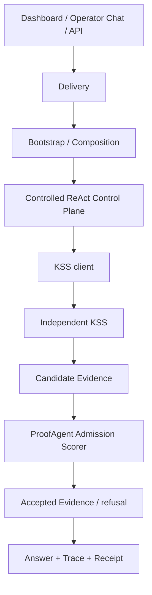

# Proof Agent 新手运维、部署与开发指导书

更新日期：2026-08-18

适用对象：第一次接触本仓库的开发、测试、平台运维和 Agent 负责人。

## 1. 当前边界

[KNOWN | HIGH] ProofAgent 只保留一个受控工作流、Dashboard、Operator Chat、
Run Executor 和通用治理能力。Knowledge Source Service（KSS）是唯一可执行的知识
Source、版本、Release 和 Candidate Evidence 权威。ProofAgent 只负责查询 KSS、执行
Evidence Admission、治理回答并记录审计证据。

[LIMIT | HIGH] 当前工作区完成了 KSS-only 代码切换，但正式生产仍为 **NO-GO**。
本地测试、服务启动或类生产 Compose 成功都不能替代发布 Gate。

## 2. 架构速览



分层规则：

- Delivery 只处理协议、身份和输入输出，不拥有业务决策。
- Bootstrap 只装配依赖，不实现检索或准入规则。
- Control Plane 拥有策略、Evidence Admission 和回答治理。
- Capability Layer 只实现 KSS、评分器、模型、存储等端口适配。
- KSS 独立拥有摄取、版本、发布、检索和 Candidate Evidence。

## 3. 本地开发

基础环境需要 Python 3.12+、`uv`、Node.js 和 npm。

```bash
uv sync --extra dev --extra dashboard
npm install
uv run --extra dev --extra dashboard proof-agent doctor
```

运行离线开发示例：

```bash
uv run --extra dev proof-agent run \
  examples/agent_management_insurance_specialist/agent.yaml \
  --question "What evidence is required?"
```

[KNOWN | HIGH] 离线示例可以没有 KSS binding，并因此稳定返回无证据或拒答；它不能
证明生产知识链路。不要创建本地 provider 来掩盖缺失的 KSS 依赖。

## 4. 开发规则

1. 先从活跃事实源确认边界，再修改代码。
2. 行为变化先写最小失败测试，再做小步实现。
3. 在职责拥有者中修改，不从 API、前端或测试夹具创建旁路。
4. 先跑定向测试，再跑受影响套件和静态检查。
5. 同步更新 ADR、领域决策、Feature Evidence 和活跃文档。
6. 不读取、打印或提交 `.env` 和真实 Secret。

常见入口：

| 改动 | 首选位置 | 最小验证 |
| --- | --- | --- |
| Agent / binding 契约 | `proof_agent/contracts/` | contract、publication tests |
| KSS 运行时装配 | `proof_agent/bootstrap/knowledge_candidate_runtime.py` | production runtime tests |
| KSS transport | `proof_agent/capabilities/knowledge/` | client tests |
| Admission | `proof_agent/control/knowledge/retrieval_service.py` | retrieval/run tests |
| API | `proof_agent/delivery/` | API/security tests |
| Dashboard KSS 管理 | `dashboard/src/` | page tests + production build |
| 独立 KSS | `services/knowledge-source-service/` | KSS contract suite |

## 5. 提交前验证

```bash
uv lock --check
uv run --extra dev python -m pytest tests/ -q
uv run --extra dev ruff check proof_agent tests
uv run --extra dev --extra openai mypy proof_agent
npm run typecheck
npm test
npm run build
python3 scripts/check-domain-contexts.py
git diff --check
```

部分 HTTP/Gateway 测试需要 loopback socket。受限沙箱若因 `PermissionError` 失败，
必须在允许本地 socket 的 CI 或主机环境重跑，不能把跳过当作通过。

## 6. KSS-only 运行约束

knowledge-enabled Published Agent Version 必须精确冻结：

- Knowledge Space ID；
- exact Knowledge Base Release ID；
- KSS client ID；
- versioned client-secret reference；
- ProofAgent Admission Scorer ID 和 revision；
- `required` failure mode。

以下情况全部失败关闭：KSS 不可用、Release 不匹配、Client Grant 不允许、Secret
无法解析、评分器身份或 revision 不匹配、候选集合漂移、分数不是 0–1 有限值。

ProofAgent 已删除 `hybrid-migrate`、`knowledge-worker` 和旧 `knowledge` 管理命令，
也不再运行 Hybrid provider、ingestion/publication worker 或本地索引回退。独立 KSS
仍有自己的 API、Query Executor、Knowledge Worker、Scheduler 和 Migration 角色。

## 7. 类生产与正式部署

本地类生产栈：

```bash
./scripts/production-local-up.sh
./scripts/production-local-verify.sh
```

ProofAgent 入口为 `https://proof-agent.localhost:8443`，KSS readiness 为
`https://proof-agent.localhost:8444/readyz`。Dashboard 通过同源
`/api/config/knowledge-service` BFF 管理 KSS；浏览器不持有 operator token。

checked-in 本地栈使用 `KSS_QUERY_GRANT_POLICY_JSON` 固定 runtime client、允许的
strategy、预算上限和 access-scope digest。当前 active runtime identity 为
`proof-agent-production-local-v2`，并使用独立 Secret Handle
`knowledge/source-service/runtime-client-v2`。KSS migration 完成后，一次性 bootstrap
只注册该 runtime client credential digest；另一个 bootstrap 注册专用 Reference client。
两个 bootstrap 都不创建 Query Grant。只有 KSS operator credential 可以针对正式候选
已选定的 exact Release 创建 Grant，runtime 与 Reference credential 不能自授权限。
该 policy 是 secret-free 本地 fixture，不应写入 Agent Draft，也不是生产 access-scope
enforcement 或发布 Gate 证据。

全栈启动并通过基线检查后，操作者可以显式验证一个已存在的 exact Release：

```bash
./scripts/production-local-verify-query-authority.sh <exact-kss-release-id>
```

该命令不会查找 `latest`、创建 Release、启动/停止 Compose 或修改 readiness。它会为 active
runtime identity 创建或精确重放当前 deployment policy 的持久化本地 Grant，再执行一次有界
`single_pass` Query；成功时只输出 secret-free JSON。TDD-05R 不读取、比较、改写或删除旧
runtime client 的历史 Grant。旧 client、旧 Secret 和旧 Grant 仍可能存在于保留卷中，但不进入
active ProofAgent locator、KSS policy 或 runtime bootstrap。成功创建的新 Grant 会保留，因为
当前没有 selective revoke 能力；它不代表 Agent 已发布、激活或获得用户侧 Run 权限。

重复验证同一 Release 时，成功输出中的 `client_grant_id` 必须保持不变，
`knowledge_query_id` 必须变化。前者证明 Grant 精确重放，后者证明每次 Query 使用独立标识。
Release 必须由调用者显式选择。不要把 Release 创建或自动选择逻辑加入 verifier。

如需先独立检查 production-local Admission Scorer composition，运行：

```bash
./scripts/production-local-verify-admission-scorer.sh
```

该命令不接受参数。它固定构造一个完全虚构的问题和一个 Candidate，通过 production runtime
binding 解析 deployment-owned Scorer identity/revision、versioned Secret Handle、Vault Secret
Provider 和 guarded egress，然后校验 exact Candidate response contract。它不调用 KSS、DeepSeek、
Draft-selected answer model、artifact store 或 formal publication endpoint，也不创建 Query、Grant、
Reference、Formal Command、Version 或 Active pointer。

成功只证明本地 compatibility Scorer 接线可用，不能证明真实 Candidate Evidence 质量、阈值或
policy 决策，也不能追溯判断已结束的 Draft@14 probe。输出只包含固定输入摘要、计数、Scorer
identity/revision 和显式 false authority flags；失败输出不包含 exception、credential 或 raw
response。该命令不是 external model smoke、Phase F、publication approval、release Gate 或
Production GO。

如需继续检查固定 Candidate 能否通过当前 Control Plane Admission 路径，运行：

```bash
./scripts/production-local-verify-control-plane-admission.sh
```

该命令同样不接受参数。它只在 KSS service 端口返回固定内存 Candidate Result，随后执行公开
Knowledge Retrieval Service、deterministic Policy、deployment-owned Scorer 和 Evidence
Evaluation。成功必须得到明确的 policy allow、Evidence Validation passed 和 accepted count 1；
策略拒绝或分数低于固定阈值均失败关闭。

输出不包含 question、Candidate 标识/内容、分数、阈值、citation、credential、endpoint 或 raw
response。该命令不创建 KSS Query，不调用 DeepSeek，不写 Artifact Store，也不进入 Phase F 或
formal publication。通过结果只是 fixed-synthetic production-local 证据，不是完整 Agent Run、引用
回答、release Gate 或 Production GO。

如需继续检查固定 Candidate 能否通过完整受管 Run 并形成引用回答，运行：

```bash
./scripts/production-local-verify-governed-run.sh
```

该命令仍不接受参数。它复用 production runtime binding、query factory、Admission Scorer、
Controlled ReAct、Evidence Evaluation 和公开 Agent Run 入口；只有 KSS service 端口返回固定
内存 Candidate Result。planner、reviewer 和 answer provider 均为 checked-in deterministic
fixture。成功必须得到 `answered_with_citations`、1 份 Accepted Evidence 和 1 条 citation。

trace 和 receipt 只写入临时目录，并在命令结束后删除；它们不会进入 Artifact Store。命令不创建
KSS Query，不调用 DeepSeek，不进入 Phase F 或 formal publication。输出不含 question、Candidate
标识/内容、citation 正文、分数、阈值、credential、provider response 或 artifact path。失败只输出
固定 envelope；已分类失败可附一个 allowlist stage。通过结果不是 Draft@14 external smoke、formal
online-smoke qualification、release Gate 或 Production GO。

在运行正式发布命令前，可以对一个 exact Draft revision 执行只读候选预检：

```bash
./scripts/production-local-verify-formal-publication-preflight.sh \
  <exact-agent-id> <exact-draft-id> <exact-draft-revision>
```

该命令使用 production API 的同一 Draft/KSS/deployment Profile 组合，但不会预留 formal
publication command，也不会运行 Phase F、注册 Reference、创建 Grant、提交 Query、运行 online
smoke、创建 Version 或更新 Active pointer。成功 JSON 中的
`publication_authorized` 固定为 `false`；候选摘要只适合后续精确复核，不是发布批准。失败时只输出
稳定 error/blocker code。若出现 `memory_must_be_disabled`，应通过既有 Draft 编辑权限和 revision CAS
显式关闭首期生产 Memory，再对新 revision 重新预检；不要直接改数据库或放宽候选规则。

需要在正式发布授权之外验证 exact Candidate 的真实 KSS/model 依赖时，运行：

```bash
./scripts/production-local-verify-formal-candidate-external-smoke.sh \
  <exact-agent-id> <exact-draft-id> <exact-draft-revision>
```

该命令使用固定的 checked-in 非敏感问题。调用者不能传入 Release、Model Connection、
credential、Profile、question 或 budget。只有结果为 `ANSWERED_WITH_CITATIONS`、至少一条
accepted citation 非空，且 immutable trace/receipt 均可 exact read-back 时才成功。成功输出不含
问题、回答、Candidate/Evidence 内容、credential、raw prompt 或上游异常详情。

该 probe 不创建或重放 formal Command、Phase F、Reference 或 Grant，也不创建 Version 或更新
Active pointer；它最多复用既有 active Grant 创建一条 Query，并保留两份 validation artifact。
`formal_candidate_contract_bundle_not_materializable` 表示 exact Candidate 的 Contract 路径不能被
安全 materialize。此时应通过独立、可审计的 exact Draft revision CAS 修复 Contract；不要放宽
path traversal 校验、在 probe 内重写 Candidate，或改用独立 manifest。TDD-05V 对 Draft@13 的
实测在 KSS Query 前返回该错误，Grant/Query 和所有发布权威计数均未变化。

若 exact Draft 仍使用固定的 legacy audit path pair，可运行单用途规范化命令：

```bash
./scripts/production-local-normalize-draft-contract-paths.sh \
  <exact-agent-id> <exact-draft-id> <expected-draft-revision>
```

命令只接受 `../../runs/latest/trace.jsonl` 与
`../../runs/latest/governance_receipt.md` 同时存在的 exact pair，并固定改为 `./trace.jsonl` 与
`./governance_receipt.md`。它通过既有 Workspace 完整 Contract 校验、revision CAS、原子 Draft
保存和 configuration audit 创建一个新 revision；mixed、unexpected、duplicate、missing 或
already-normalized 状态均失败关闭。调用者不能传入路径、YAML、Release、Model Connection 或
credential。成功只证明该 Draft 修复已审计，不授权 formal publication 或 Production GO。

TDD-05W 已在 production-local 将 Draft 13 规范化为 revision 14，configuration audit count 从
7 增为 8；对 revision 14 重放以 `draft_contract_paths_already_normalized` 失败，没有创建 revision
15。Draft@14 的只读 preflight 已通过。

每次 external-dependency probe 都需要单独的数据外发授权。一次授权只覆盖本次固定问题、exact
Draft revision，以及明确批准的 Query/artifact 上限。TDD-05W 后续验证已获一次授权并执行一次：
exact KSS Query 成功，返回 3 条 Candidate Evidence；之后命令以
`formal_candidate_external_smoke_failed` 失败，没有生成 ProofAgent validation artifacts。不要直接
重试。TDD-05X 已增加以下 secret-free stage diagnostics：

| 错误码 | 可确认的失败边界 | 下一项安全检查 |
| --- | --- | --- |
| `formal_candidate_external_smoke_kss_failed` | exact KSS Query 边界失败 | 检查 exact Release、active Grant 和 KSS 可用性；不要改绑到 `latest` |
| `formal_candidate_external_smoke_evidence_admission_failed` | Admission Scorer 失败，或没有 Evidence 被接受 | 检查受管 Scorer 配置和可用性；不要输出 Candidate Evidence |
| `formal_candidate_external_smoke_model_failed` | configured model transport、output normalization 或非引用类 final-answer validation 失败 | 检查受管 Model Connection、Secret Provider 和 egress 状态；不要读取 provider response |
| `formal_candidate_external_smoke_citation_validation_failed` | accepted Evidence 缺少正式 citation，或 final answer citation binding 失败 | 检查 trace-safe validation code 和引用规则；不要输出 answer 或 Evidence content |
| `formal_candidate_external_smoke_artifact_retention_failed` | trace/receipt 本地校验、immutable write 或 exact read-back 失败 | 检查 artifact store 可用性与 exact read-back；不要绕过保留要求 |
| `formal_candidate_external_smoke_failed` | 现有结构化事实不足以安全定位阶段 | 停止并补充 trace-safe 结构化诊断；不要根据异常正文猜测或直接重试 |

TDD-05Z 将 strict failure envelope 升级为
`production-local-formal-candidate-external-smoke-failure.v2`。只有
`formal_candidate_external_smoke_evidence_admission_failed` 可以包含以下可选
`reason_code`：

| `reason_code` | 可确认的类别 | 下一项本地检查 |
| --- | --- | --- |
| `evidence_admission_scorer_unavailable` | Scorer authorization、transport 或 response contract 边界不可用 | 检查受管 Scorer identity、Secret Provider、egress 和 endpoint readiness；不要读取响应正文 |
| `evidence_admission_score_invalid` | Scorer 返回非有限值或超出 0 至 1 | 检查已批准 Scorer revision 的输出合同；不要把 retrieval rank 当 Admission score |
| `evidence_admission_candidate_set_empty` | 没有可进入 Evidence Admission 的 Candidate | 检查 exact Query 的 trace-safe candidate count 和 Release 状态；不要输出 Candidate 内容 |
| `evidence_admission_score_missing` | Candidate 存在，但缺少受管 Admission score | 检查 exact Scorer composition 与 identity binding；不要使用 provider-native score 回退 |
| `evidence_admission_threshold_not_met` | 已有受管分数，但没有 Evidence 达到阈值 | 检查批准的 Scorer revision 与 Draft retrieval 配置；failure envelope 不返回分数或阈值 |
| `evidence_admission_policy_denied` | ProofAgent retrieval policy 拒绝进入 Admission | 检查 trace-safe policy decision；不要绕过 Control Plane policy |

`reason_code` 缺失表示结构化事实不足，不表示上述任一类别。不得根据 exception message、日志正文
或 provider response 猜测。v1 failure consumer 必须显式升级后再读取 v2；success envelope 保持 v1。

错误输出不得包含 Candidate Evidence、raw prompt、provider detail、credential、question 或 answer。
新的探针需要新的明确授权。探针授权不包含 Phase F、formal publication 或上线批准。

如需关闭上述首期生产 Memory，production-local 可以使用以下单用途命令完成 exact CAS：

```bash
./scripts/production-local-disable-draft-memory.sh \
  <exact-agent-id> <exact-draft-id> <expected-draft-revision>
```

命令要求 Tools 已禁用、Memory 已启用，且 Memory 不含 `scopes`。它只把 Memory
收敛为 disabled 形态：原位修改 `enabled` 并移除必须同时清理的 `provider`；其余
YAML 原始字节保持不变。真正写入仍由既有 Workspace 执行完整 Contract 校验、revision
CAS、原子保存和审计。成功输出的 `publication_authorized` 固定为 `false`。对新
revision 重放会以 `draft_memory_already_disabled` 失败关闭，不会再生成 revision。

正式发布命令使用 PostgreSQL 时间管理执行租约。部署参数
`PROOF_AGENT_FORMAL_PUBLICATION_COMMAND_LEASE_SECONDS` 必须为 1–3600 秒；默认值和
production-local 显式值均为 900 秒。进程在命令处于 `in_progress` 时退出后，应使用相同的
操作者身份、`Idempotency-Key`、请求路径和规范化请求体重放。租约未到期时只返回原有
`in_progress`；租约到期后，一个调用者可以原子接管并使用更高 fencing token 继续。旧执行者
随后提交成功或失败都会被拒绝。不要为了恢复创建新的 `Idempotency-Key`，否则会形成另一个
逻辑命令。

TDD-05T 在只读 Candidate 装配后、Phase F 前写入内部 checkpoint。checkpoint 包含
`formal_candidate_sha256`、`knowledge_release_candidate_sha256` 和 PostgreSQL 时间。相同命令接管
后会重新装配 Candidate；两个摘要都匹配时才能继续。任一摘要漂移时，旧命令以
`formal_publication_candidate_checkpoint_conflict` 失败，且本次接管不会进入 Phase F、Reference、
Grant 或 smoke。不要修改 checkpoint，也不要让旧 `Idempotency-Key` 采用新的 Candidate。复核新
Candidate 后，使用新的 `Idempotency-Key` 发起新命令。

重放前，原操作者可以只读查询 exact command receipt：

```text
GET /api/config/agents/{agent_id}/drafts/{draft_id}/formal-publications/{command_id}
```

调用者必须持有 `agent.publish`，且 OIDC actor subject 必须与命令创建者一致。
错误 command ID、其他 actor 或错误 Agent/Draft path 统一返回
`formal_publication_command_not_found`。响应只包含公开 receipt，不包含
`Idempotency-Key`、lease、fencing token、Candidate checkpoint 或原请求。GET 不续租、
不接管、不改变命令状态。需要恢复时，仍重放原 POST。

当前没有后台 recovery process、heartbeat 或 cancel。部署仍需由操作者使用相同身份、请求路径、
请求体和 `Idempotency-Key` 重放 exact command。租约或 checkpoint 都不会授权发布，也不能替代
Phase F、真实外部依赖证据或 Product Release Authority `GO`。当前 ProofAgent schema head 为
`0024_formal_candidate_checkpoint`。

正式候选至少需要：exact KSS product binding、Deployment Compatibility Manifest、
Client Grant、versioned secret、批准的 Admission Scorer、真实依赖 readiness、shadow、
pilot、容量、恢复演练、Blue/Green 证据和 Product Release Authority `GO`。

完整边界见 `docs/deployment/kss-authority-cutover.md`。

## 8. 回滚与事件处理

[RISK | HIGH] 旧 Hybrid/shared/package knowledge binding 已不能执行。对应 Published
Agent Version 不能 replay，也不能作为 rollback target。回滚只能选择另一个 exact
KSS-bound Published Agent Version。

故障排查顺序：

1. 检查 Published Agent binding 的 Space、Release、client 和 scorer identity；
2. 检查 KSS readiness、Client Grant 和 versioned secret resolution；
3. 检查 Admission Scorer identity/revision、候选集合和分数合法性；
4. 检查 Trace、Receipt 和 RunStore 中的安全错误码；
5. 依正式发布流程决定保持失败关闭、切换另一 KSS-bound version 或恢复 KSS；
6. 不恢复旧 ProofAgent Hybrid 路径，不启用 allow-all，不把 KSS rank 当准入分数。

## 9. 权威资料索引

按以下顺序判断当前事实：

1. `README.md`；
2. `docs/prd.md`；
3. `docs/technical-design.md`；
4. `docs/developer-guide.md`；
5. `docs/development-progress.md`；
6. `docs/adr/0210-make-kss-the-only-executable-knowledge-authority.md`；
7. `docs/deployment/kss-authority-cutover.md`；
8. `docs/features/knowledge-source-service/`；
9. `docs/DOMAIN_KNOWLEDGE.md` 与领域 Context。

历史 ADR、dated specs 和 plans 可能描述已删除的 Hybrid 能力，只能用于解释历史，
不能覆盖 ADR-0210 与当前代码。
