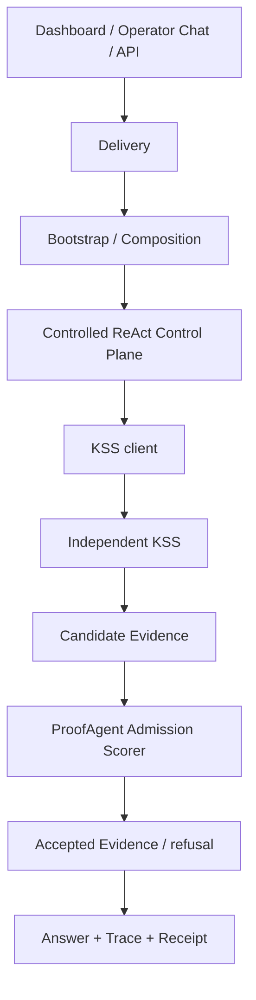

# Proof Agent 新手运维、部署与开发指导书

更新日期：2026-08-18

适用对象：第一次接触本仓库的开发、测试、平台运维和 Agent 负责人。

## 1. 当前边界

[KNOWN | HIGH] ProofAgent 只保留一个受控工作流、Dashboard、Operator Chat、
Run Executor 和通用治理能力。Knowledge Source Service（KSS）是唯一可执行的知识
Source、版本、Release 和 Candidate Evidence 权威。ProofAgent 只负责查询 KSS、执行
Evidence Admission、治理回答并记录审计证据。

[LIMIT | HIGH] 当前工作区完成了 KSS-only 代码切换，但正式生产仍为 **NO-GO**。
本地测试、服务启动或类生产 Compose 成功都不能替代发布 Gate。

## 2. 架构速览



分层规则：

- Delivery 只处理协议、身份和输入输出，不拥有业务决策。
- Bootstrap 只装配依赖，不实现检索或准入规则。
- Control Plane 拥有策略、Evidence Admission 和回答治理。
- Capability Layer 只实现 KSS、评分器、模型、存储等端口适配。
- KSS 独立拥有摄取、版本、发布、检索和 Candidate Evidence。

## 3. 本地开发

基础环境需要 Python 3.12+、`uv`、Node.js 和 npm。

```bash
uv sync --extra dev --extra dashboard
npm install
uv run --extra dev --extra dashboard proof-agent doctor
```

运行离线开发示例：

```bash
uv run --extra dev proof-agent run \
  examples/agent_management_insurance_specialist/agent.yaml \
  --question "What evidence is required?"
```

[KNOWN | HIGH] 离线示例可以没有 KSS binding，并因此稳定返回无证据或拒答；它不能
证明生产知识链路。不要创建本地 provider 来掩盖缺失的 KSS 依赖。

## 4. 开发规则

1. 先从活跃事实源确认边界，再修改代码。
2. 行为变化先写最小失败测试，再做小步实现。
3. 在职责拥有者中修改，不从 API、前端或测试夹具创建旁路。
4. 先跑定向测试，再跑受影响套件和静态检查。
5. 同步更新 ADR、领域决策、Feature Evidence 和活跃文档。
6. 不读取、打印或提交 `.env` 和真实 Secret。

常见入口：

| 改动 | 首选位置 | 最小验证 |
| --- | --- | --- |
| Agent / binding 契约 | `proof_agent/contracts/` | contract、publication tests |
| KSS 运行时装配 | `proof_agent/bootstrap/knowledge_candidate_runtime.py` | production runtime tests |
| KSS transport | `proof_agent/capabilities/knowledge/` | client tests |
| Admission | `proof_agent/control/knowledge/retrieval_service.py` | retrieval/run tests |
| API | `proof_agent/delivery/` | API/security tests |
| Dashboard KSS 管理 | `dashboard/src/` | page tests + production build |
| 独立 KSS | `services/knowledge-source-service/` | KSS contract suite |

## 5. 提交前验证

```bash
uv lock --check
uv run --extra dev python -m pytest tests/ -q
uv run --extra dev ruff check proof_agent tests
uv run --extra dev --extra openai mypy proof_agent
npm run typecheck
npm test
npm run build
python3 scripts/check-domain-contexts.py
git diff --check
```

部分 HTTP/Gateway 测试需要 loopback socket。受限沙箱若因 `PermissionError` 失败，
必须在允许本地 socket 的 CI 或主机环境重跑，不能把跳过当作通过。

## 6. KSS-only 运行约束

knowledge-enabled Published Agent Version 必须精确冻结：

- Knowledge Space ID；
- exact Knowledge Base Release ID；
- KSS client ID；
- versioned client-secret reference；
- ProofAgent Admission Scorer ID 和 revision；
- `required` failure mode。

以下情况全部失败关闭：KSS 不可用、Release 不匹配、Client Grant 不允许、Secret
无法解析、评分器身份或 revision 不匹配、候选集合漂移、分数不是 0–1 有限值。

ProofAgent 已删除 `hybrid-migrate`、`knowledge-worker` 和旧 `knowledge` 管理命令，
也不再运行 Hybrid provider、ingestion/publication worker 或本地索引回退。独立 KSS
仍有自己的 API、Query Executor、Knowledge Worker、Scheduler 和 Migration 角色。

## 7. 类生产与正式部署

本地类生产栈：

```bash
./scripts/production-local-up.sh
./scripts/production-local-verify.sh
```

ProofAgent 入口为 `https://proof-agent.localhost:8443`，KSS readiness 为
`https://proof-agent.localhost:8444/readyz`。Dashboard 通过同源
`/api/config/knowledge-service` BFF 管理 KSS；浏览器不持有 operator token。

正式候选至少需要：exact KSS product binding、Deployment Compatibility Manifest、
Client Grant、versioned secret、批准的 Admission Scorer、真实依赖 readiness、shadow、
pilot、容量、恢复演练、Blue/Green 证据和 Product Release Authority `GO`。

完整边界见 `docs/deployment/kss-authority-cutover.md`。

## 8. 回滚与事件处理

[RISK | HIGH] 旧 Hybrid/shared/package knowledge binding 已不能执行。对应 Published
Agent Version 不能 replay，也不能作为 rollback target。回滚只能选择另一个 exact
KSS-bound Published Agent Version。

故障排查顺序：

1. 检查 Published Agent binding 的 Space、Release、client 和 scorer identity；
2. 检查 KSS readiness、Client Grant 和 versioned secret resolution；
3. 检查 Admission Scorer identity/revision、候选集合和分数合法性；
4. 检查 Trace、Receipt 和 RunStore 中的安全错误码；
5. 依正式发布流程决定保持失败关闭、切换另一 KSS-bound version 或恢复 KSS；
6. 不恢复旧 ProofAgent Hybrid 路径，不启用 allow-all，不把 KSS rank 当准入分数。

## 9. 权威资料索引

按以下顺序判断当前事实：

1. `README.md`；
2. `docs/prd.md`；
3. `docs/technical-design.md`；
4. `docs/developer-guide.md`；
5. `docs/development-progress.md`；
6. `docs/adr/0210-make-kss-the-only-executable-knowledge-authority.md`；
7. `docs/deployment/kss-authority-cutover.md`；
8. `docs/features/knowledge-source-service/`；
9. `docs/DOMAIN_KNOWLEDGE.md` 与领域 Context。

历史 ADR、dated specs 和 plans 可能描述已删除的 Hybrid 能力，只能用于解释历史，
不能覆盖 ADR-0210 与当前代码。
