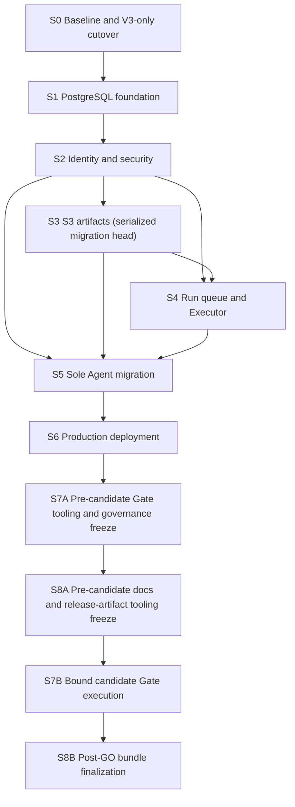

# Proof Agent Initial Production Release Closure Master Implementation Plan

> **For agentic workers:** REQUIRED SUB-SKILL: Use superpowers:subagent-driven-development (recommended) or superpowers:executing-plans to implement this plan task-by-task. Steps use checkbox (`- [ ]`) syntax for tracking.

**Goal:** [FRAME | HIGH] Deliver the user-approved Initial Private Pilot as one formally releasable, candidate-bound Proof Agent system with no unresolved required release blockers.

**Architecture:** [FRAME | HIGH] Execute nine dependency-ordered vertical slices. PostgreSQL owns mutable structured state, S3-compatible storage owns immutable artifacts, the same product image supplies API and worker roles, and a strict Release Gate Manifest is the sole GO/NO-GO authority.

**Tech Stack:** [KNOWN | HIGH] Python 3.12, Pydantic v2, FastAPI, Typer, React 19, Vite, PostgreSQL, S3-compatible object storage, OIDC, Docker Compose, pytest, Ruff, mypy, Vitest, Playwright, and GitHub Actions.

---

## 1. Authoritative Inputs

- [ ] [KNOWN | HIGH] Read `docs/superpowers/specs/2026-07-11-proofagent-initial-production-release-closure-design.md` completely.
- [ ] [KNOWN | HIGH] Read ADR-0101 through ADR-0132 and the contexts routed by `CONTEXT-MAP.md` before changing a covered domain.
- [ ] [FRAME | HIGH] Treat the approved scope, non-goals, service objectives, failure semantics, retention windows, and Gate families as fixed inputs. A material change requires an ADR/spec amendment and user review before implementation continues.
- [ ] [FRAME | HIGH] Treat production dependency brands and versions as candidate inputs, not universal compatibility claims. Before S6 starts, create a complete Deployment Compatibility Manifest with exact product/version/digest and tested capability for PostgreSQL, S3, OIDC, Secret Provider, Gateway, model provider, and any read-only tool service. Reject blank, `TBD`, mutable-tag-only, or untested entries.

## 2. Execution Isolation and Branch Contract

- [ ] [FRAME | HIGH] Before S0 implementation, invoke `superpowers:using-git-worktrees` and create an isolated worktree on a `codex/` branch from the reviewed planning commit.
- [ ] [KNOWN | HIGH] Preserve the untracked `graphify-out/` and `reports/` trees; never stage them as implementation input or release Evidence.
- [ ] [FRAME | HIGH] Execute implementation serially. Although S2 and S3 are logically independent after S1, both own schema revisions and production composition; run S2 then S3 on one Alembic head to avoid branch-head/merge-migration ambiguity. S4 and S5 wait for both.
- [ ] [FRAME | HIGH] Use test-first red/green/refactor steps, one concern per commit, and `superpowers:requesting-code-review` at each slice exit.
- [ ] [FRAME | HIGH] Use `superpowers:verification-before-completion` before claiming any slice or the release complete.

## 3. Dependency DAG and Plan Index

| Order | Plan | Hard prerequisites | Review boundary |
|---:|---|---|---|
| 0 | [S0 baseline and V3-only cutover](2026-07-11-proofagent-s0-v3-baseline-plan.md) | Approved design and plans | Root build, strict Gate contracts, V3-only deterministic product |
| 1 | [S1 PostgreSQL foundation](2026-07-11-proofagent-s1-postgresql-foundation-plan.md) | S0 | Focused ports, expand-only migrations, real-PostgreSQL repositories |
| 2 | [S2 identity and security](2026-07-11-proofagent-s2-identity-security-plan.md) | S1 | OIDC-only sessions, permissions, Secret Handles, guarded egress |
| 3 | [S3 S3 artifacts](2026-07-11-proofagent-s3-s3-artifacts-plan.md) | S2 implementation merge | S3-first finalization, cache, retention, GC, recovery |
| 4 | [S4 queue and Executor](2026-07-11-proofagent-s4-run-queue-executor-plan.md) | S2 + S3 | 5/50 queue, leases/fencing, cancellation, coarse SSE |
| 5 | [S5 sole Agent migration](2026-07-11-proofagent-s5-sole-agent-migration-plan.md) | S2 + S3 + S4 | Only production Agent, V3, Case Memory, S3 Knowledge, evaluation contract |
| 6 | [S6 production deployment](2026-07-11-proofagent-s6-production-deployment-plan.md) | S5 + complete compatibility input | Hardened image, readiness, Blue/Green, Release Registry/download API, runbooks |
| 6.25 | [S7A Gate-tooling freeze](2026-07-11-proofagent-s7-release-gates-plan.md) | S6 | Candidate binder, all Gate producers/workflows/tests, and repository governance committed before binding |
| 6.5 | [S8A documentation/artifact-tooling freeze](2026-07-11-proofagent-s8-release-documentation-plan.md) | S7A | English/Chinese docs and all closure/report/bundle/integrity code committed and green before binding |
| 7 | [S7B bound candidate execution](2026-07-11-proofagent-s7-release-gates-plan.md) | S8A | Build/bind once, run rehearsals/Gates without repository mutation, strict verified Manifest |
| 8 | [S8B post-GO finalization](2026-07-11-proofagent-s8-release-documentation-plan.md) | S7B `GO` | Execute bound code only: Closure Audit, verified HTML, final Bundle Index/attestation, downloads/integrity |

## 4. Program-Level Todo and Stop/Go Rules

### S0 — Baseline and Deletion Boundary

- [ ] [FRAME | HIGH] Close the root frontend build contract.
- [ ] [FRAME | HIGH] Establish strict Gate Profile, Production Candidate Binding, Evidence, Gate Result, Manifest, and verifier contracts with fail-closed decision-table tests.
- [ ] [FRAME | HIGH] Move retained V3 helpers out of `proof_agent/runtime/`, then remove LangGraph, V1/V2, Agentic RAG, approval command surfaces, customer production surfaces, extra public examples, and their active tests/docs.
- [ ] [FRAME | HIGH] Stop if any production route, fixture, navigation item, dependency, or published workflow can still select a removed path.

### S1 — PostgreSQL Foundation

- [ ] [FRAME | HIGH] Extract focused immutable DTOs and ports before adding production adapters.
- [ ] [FRAME | HIGH] Add locked, explicit, expand-only migrations and PostgreSQL repositories for configuration, conversations, Case Memory, audit metadata, and run metadata.
- [ ] [FRAME | HIGH] Keep local adapters only behind an explicit development composition root.
- [ ] [FRAME | HIGH] Stop if application code imports PostgreSQL SDK types across a port or if a single repository recreates `LocalAgentConfigurationStore` as one large class.

### S2 — Identity and Security

- [ ] [FRAME | HIGH] Add OIDC Authorization Code + PKCE, opaque server-side sessions, seven-day absolute expiry, 24-hour idle expiry, and one-hour claim freshness.
- [ ] [FRAME | HIGH] Add the exact global permission vocabulary, immutable Recovery OIDC Group mapping, atomic Dashboard configuration, CSRF, and authoritative backend checks.
- [ ] [FRAME | HIGH] Add opaque Secret Handles, production rejection of environment credential references, exact-origin HTTPS egress, and read-only tool publication/runtime enforcement.
- [ ] [FRAME | HIGH] Stop if local accounts, user management, wildcard CORS/egress, browser tokens, state-changing tools, MCP stdio, or Local Tool Handler can start in production mode.

### S3 — Immutable Artifacts

- [ ] [FRAME | HIGH] Add the Artifact Port and S3-compatible adapter with unique keys, exact version IDs, length/SHA-256 verification, and manifest-last finalization.
- [ ] [FRAME | HIGH] Commit PostgreSQL visibility only after every object verifies; accept loss of uncommitted fine progress and collect invisible orphans after a fixed 24-hour grace period.
- [ ] [FRAME | HIGH] Add digest-keyed read-only materialization, reference-safe retention, seven-day recovery-copy enforcement hooks, exact-version recovery, and combined restore verification.
- [ ] [FRAME | HIGH] Stop if filesystem bytes become production authority or an unverified object is visible to a Run, Knowledge revision, Dashboard, or release Gate.

### S4 — Asynchronous Run Execution

- [ ] [FRAME | HIGH] Add atomic idempotent admission, five claimed nonterminal Attempt slots, 50 queued requests, explicit overload, and per-operator fair claim selection.
- [ ] [FRAME | HIGH] Add a same-image Run Executor role, immutable execution snapshots, leases, claim tokens, activation epochs, cancellation, lost-executor failure, and conditional terminal commit.
- [ ] [FRAME | HIGH] Add durable coarse state plus best-effort trace-safe SSE detail using PostgreSQL coordination, with reconnect returning current durable state.
- [ ] [FRAME | HIGH] Stop if `CANCEL_REQUESTED` frees capacity, a browser disconnect cancels work, an old Executor can commit, or an Attempt is silently replayed after uncertain external work.

### S5 — Sole Agent

- [ ] [FRAME | HIGH] Migrate and publish only `agent_management_insurance_specialist` on `react_enterprise_qa_v3` with PostgreSQL Case Memory, S3 Knowledge, Production Secret Handles, and the active Egress Policy.
- [ ] [FRAME | HIGH] Bind an optional production read-only HTTPS Tool Source only when the compatibility manifest supplies and validates the concrete service; retain no local executable tool path.
- [ ] [FRAME | HIGH] Add deterministic and candidate real-LLM cases for supported answer, refusal, clarification, state-change denial, provider failure, and hard budget. When a validated remote read-only Tool Source is bound, require a successful tool-read case; otherwise require explicit disabled-tool behavior with no skipped Gate.
- [ ] [FRAME | HIGH] Stop if any other public Agent or template is discoverable, importable, published, routed, or evaluated as supported.

### S6 — Production Deployment and Operations Prerequisites

- [ ] [FRAME | HIGH] Freeze dependencies and build clean-install distributions, static assets, and a non-root read-only production image without a development toolchain.
- [ ] [FRAME | HIGH] Create stable Gateway plus Blue/Green slot Compose roles, explicit migration job, dependency-aware `/readyz`, liveness-only `/livez`, worker activation states, and N/N-1 contract checks.
- [ ] [FRAME | HIGH] Implement 150-second drain, atomic surface switch, higher fencing epoch, external smoke, 30-minute soak, retained rollback assets, and no down migration.
- [ ] [FRAME | HIGH] Add the finalized Release Registry, authenticated `audit.export` bundle download, telemetry/alerts, backup policy, support policy, and every required incident/recovery/rollback runbook before operations Gates run.
- [ ] [FRAME | HIGH] Stop if the compatibility manifest is incomplete, readiness is process-only, the Gateway is inside a slot, or rollback could reinterpret queued work.

### S7A — Pre-Candidate Gate Tooling and Governance Freeze

- [ ] [FRAME | HIGH] Implement, test, and commit candidate binding, all 13 Gate producers, Evidence/attestation/freshness/assembly/verifier tooling, CI/candidate workflows, security/load/fault/recovery/deployment/browser harnesses, and repository governance before any candidate is built.
- [ ] [FRAME | HIGH] Run reference-service tests and independent review, then hand a clean S7A commit to S8A; no S7 producer implementation may occur after binding.

### S8A — Pre-Candidate Documentation and Release-Artifact Tooling Freeze

- [ ] [FRAME | HIGH] Finalize active English documentation and its release-time Chinese sync before candidate binding.
- [ ] [FRAME | HIGH] Implement and test Closure Audit, deterministic HTML rendering, Bundle Index/finalization, detached attestation, Release Registry integration, final integrity verification, and remote-download browser checks.
- [ ] [FRAME | HIGH] Commit all source/runtime/frontend/test/documentation changes, run full verification, and hand the resulting clean commit to S7B candidate binding.
- [ ] [FRAME | HIGH] Stop if any planned post-`GO` step would edit or commit source, runtime, frontend, tests, or docs; such a change requires a new candidate and complete S7 rerun.

### S7B — Bound Candidate Gate Production

- [ ] [FRAME | HIGH] From the clean S7A+S8A commit, build/bind the candidate once and execute all 13 already-frozen Gate producers, including full quality, supply-chain security, real dependency compatibility, deterministic/real-LLM evaluation, load, resilience, recovery, deployment, browser, and operations evidence.
- [ ] [FRAME | HIGH] Run a 30-minute production dependency load test, four-hour soak, timed combined restore, alert/runbook exercises, and a 3–5 operator pilot spanning one support day.
- [ ] [FRAME | HIGH] Verify freshness, sample sufficiency, digests, attestations, and exact binding; emit `GO` only when every immutable required result is `passed`.
- [ ] [FRAME | HIGH] Stop on `failed`, `skipped`, `error`, `not_run`, stale/missing evidence, binding mismatch, incomplete dependency binding, invalid attestation, any Critical/High security finding, or any need to mutate repository content.

### S8B — Post-GO Artifact Finalization

- [ ] [FRAME | HIGH] Execute the bound Closure Audit against verified Manifest/Evidence/frozen docs and require zero unresolved P0 and required P1 blockers.
- [ ] [FRAME | HIGH] Render `release-readiness-report.html` from the verified Manifest plus Closure Audit, upload exact members, generate/upload `release-bundle-index.json` last, create/verify detached attestation, and atomically finalize the Release Registry.
- [ ] [FRAME | HIGH] Run a separate post-bundle integrity verification and authenticated remote-download check without feeding new output back into the indexed HTML/Index.
- [ ] [FRAME | HIGH] If any defect requires a code/doc/test/frontend change, invalidate the candidate, return through S7A/S8A as affected, create a new binding, and rerun S7B; never patch the approved candidate.

## 5. Requirements Traceability

| Requirement family | Decision source | Primary slice | Final proof |
|---|---|---:|---|
| [FRAME | HIGH] Internal single-tenant/private operator scope and sole Agent | ADR-0101, ADR-0102, ADR-0124 | S0/S5 | Browser + Agent inventory Gates |
| [FRAME | HIGH] OIDC-only, no local users, seven-day session policy | ADR-0103, ADR-0104, ADR-0119 | S2 | Identity Gate |
| [FRAME | HIGH] Global permissions, recovery mapping, direct configuration | ADR-0105, ADR-0126, ADR-0127 | S2 | Authorization and recovery-group Gates |
| [FRAME | HIGH] No approval workflow; read-only tools; future sandbox excluded | ADR-0106, ADR-0107, ADR-0108 | S0/S2 | Negative route/publication/runtime Gates |
| [FRAME | HIGH] Exact-origin egress and external Secret Handles | ADR-0109, ADR-0120 | S2 | Secrets and egress Gate |
| [FRAME | HIGH] PostgreSQL structured authority and Case Memory | ADR-0111, ADR-0121 | S1/S5 | Repository, retention, Agent Gates |
| [FRAME | HIGH] S3 immutable authority and S3-first visibility | ADR-0112, ADR-0122 | S3 | Artifact/recovery Gate |
| [FRAME | HIGH] In-process product queue role, 5/50 capacity, SSE/SLO | ADR-0114, ADR-0115, ADR-0116, ADR-0117 | S4 | Capacity, queue, responsiveness Gates |
| [FRAME | HIGH] Retention and RPO/RTO | ADR-0110, ADR-0118 | S3/S6/S7 | Timed combined recovery Gate |
| [FRAME | HIGH] V3-only without LangGraph and only the chosen Agent | ADR-0124, ADR-0125 | S0/S5 | Deterministic + inventory Gates |
| [FRAME | HIGH] Provider-neutral code with concrete candidate binding | ADR-0128 | S0/S6/S7 | Compatibility Manifest Gate |
| [FRAME | HIGH] Same-host Blue/Green and drain/switch/fence semantics | ADR-0113, ADR-0131 | S4/S6 | Deployment Gate |
| [FRAME | HIGH] Real-LLM requirement, strict machine authority, evidence freshness | ADR-0123, ADR-0129, ADR-0130, ADR-0132 | S7/S8 | Verified Manifest and Bundle Index |

## 6. Per-Slice Verification Baseline

- [ ] [FRAME | HIGH] Run focused tests named by the slice plan and observe the intended red result before implementation.
- [ ] [FRAME | HIGH] Run the focused tests again after implementation and observe a clean pass.
- [ ] [KNOWN | HIGH] Run `uv run --extra dev python -m pytest tests/ -v`.
- [ ] [KNOWN | HIGH] Run `uv run --extra dev ruff check proof_agent tests`.
- [ ] [KNOWN | HIGH] Run `uv run --extra dev --extra openai mypy proof_agent`.
- [ ] [KNOWN | HIGH] Run `python3 scripts/check-domain-contexts.py` when domain documents change.
- [ ] [KNOWN | HIGH] Run `npm test` and `npm run build` when frontend code changes.
- [ ] [KNOWN | HIGH] Run `git diff --check` for every slice.
- [ ] [FRAME | HIGH] Record command, exit code, candidate/slice binding, and artifact digest in the slice evidence directory; prose-only pass claims are insufficient.

## 7. Commit and Review Cadence

- [ ] [FRAME | HIGH] Commit contract tests and contracts together only after green.
- [ ] [FRAME | HIGH] Commit each adapter or vertical API/UI behavior separately from migrations and documentation where practical.
- [ ] [FRAME | HIGH] Do not combine destructive deletion with unrelated new infrastructure in one commit.
- [ ] [FRAME | HIGH] Through S8A, run an independent code review at each slice exit, resolve all P0/P1 findings, update the committed master checklist, and record the accepted commit digest. After binding, S7B/S8B record execution state only in external candidate/release audit metadata and never mutate the plan.
- [ ] [FRAME | HIGH] Do not start S8B Closure Audit/report/bundle generation until S7B verifier returns `GO` for the exact immutable candidate. S8A implementation and docs must already be inside that candidate.

## 8. Final Completion Contract

- [ ] [FRAME | HIGH] The production start command rejects local identity, filesystem authority, environment secret references, wildcard egress, MCP stdio, Local Tool Handler, state-changing tools, approvals, customer routes, source bind mounts, and incomplete dependency binding.
- [ ] [FRAME | HIGH] The exact candidate passes every required Gate with fresh digest-bound Evidence and no manual override.
- [ ] [FRAME | HIGH] `release-gate-manifest.json`, `release-readiness-report.html`, and `release-bundle-index.json` agree on all bound digests.
- [ ] [FRAME | HIGH] The report downloads through the authenticated stable origin under `audit.export`, and the local `reports/` copy is treated only as a convenience projection.
- [ ] [FRAME | HIGH] The final systematic re-audit reports zero unresolved P0 and required P1 release blockers.
