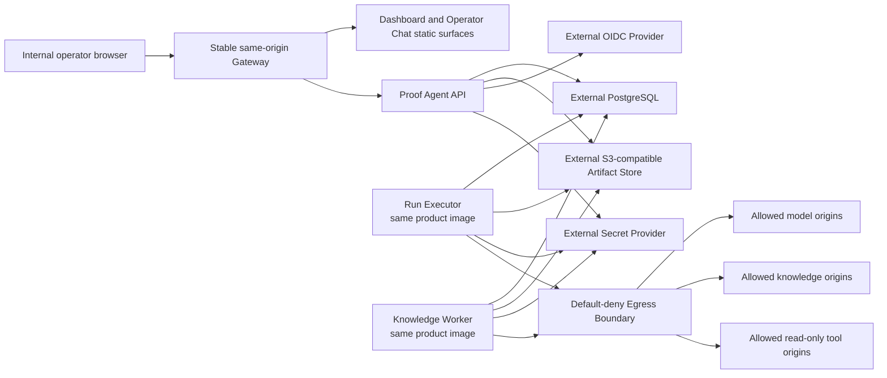
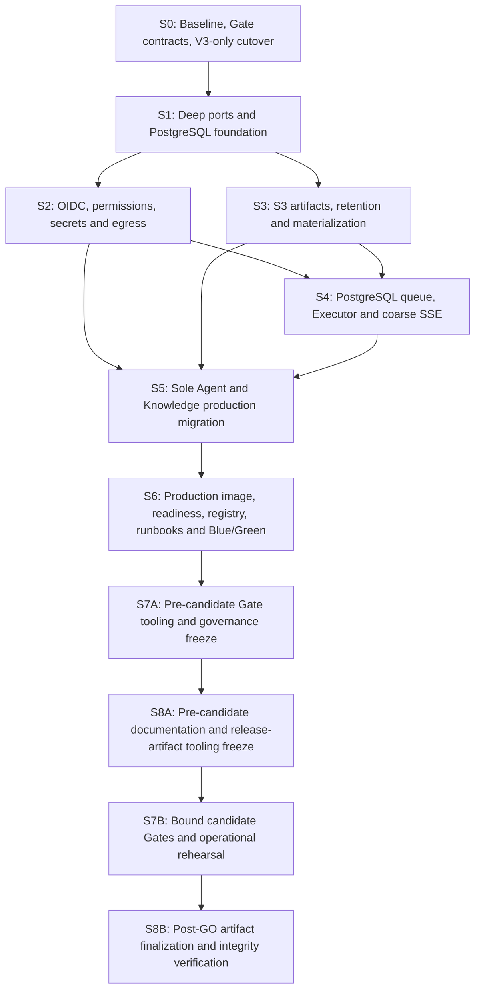

# Proof Agent Initial Production Release Closure Design

[KNOWN | HIGH] **Status:** User-approved design and written artifact; independently approved specification and S0-S8 implementation plans; implementation is pending.

[KNOWN | HIGH] **Date:** 2026-07-11.

[KNOWN | HIGH] **Decision sources:** ADR-0101 through ADR-0132 and the domain language linked from `CONTEXT-MAP.md`.

## 1. Purpose

[FRAME | HIGH] This design closes the gap between Proof Agent's current local-development MVP and one formally releasable internal production system. It is a program-level architecture composed of dependency-ordered vertical slices, not one monolithic patch. Implementation planning must produce a master dependency index plus one independently executable plan per slice; each slice must leave a runnable, tested product and contribute candidate-bound Evidence to the final Production Release Gate Manifest.

[FRAME | HIGH] The release is successful only when the immutable candidate, its sole Agent, its concrete external dependencies, its production configuration, and every required Gate result are bound to the same Production Candidate Binding and the machine verifier computes `GO`.

## 2. Current Evidence and Problem Statement

- [KNOWN | HIGH] The existing release-readiness report classifies the current production release as blocked and identifies 12 P0 findings, 12 P1 findings, and 5 P2 findings in `reports/proofagent-release-readiness-2026-07-10.html`.
- [KNOWN | HIGH] `LocalAgentConfigurationStore` in `proof_agent/configuration/local_store.py` combines Agent, Knowledge, model, tool, publication, validation, and audit persistence behind one filesystem implementation, so production PostgreSQL cannot be introduced safely by changing only application startup wiring.
- [KNOWN | HIGH] `RunStore` in `proof_agent/observability/storage/run_store.py` copies Trace and Receipt files and then writes JSON metadata into local directories without a production object-store boundary or atomic owner visibility transaction.
- [KNOWN | HIGH] `proof_agent/delivery/run_execution_service.py` executes a complete run synchronously and directly depends on local stores and legacy approval-resume objects; the accepted PostgreSQL queue, separate Run Executor process role, and asynchronous response flow do not exist.
- [KNOWN | HIGH] `proof_agent/observability/api/routers/health.py` derives health from the local RunStore and does not prove PostgreSQL, S3, OIDC, Secret Provider, schema, production Agent, or worker readiness.
- [KNOWN | HIGH] `.github/workflows/ci.yml` runs Python tests, Ruff, mypy, and a local CLI demo but does not build and test the complete frontend, installable distributions, production image, browser flows, security evidence, load, recovery, or real-LLM release Gate.
- [KNOWN | HIGH] The root `npm run build` invokes a missing `build` script in `packages/ui/package.json`, so the root frontend build contract is not currently closed.
- [KNOWN | HIGH] The current `Dockerfile` installs editable development dependencies, copies the entire source tree, and defaults to the demo; `docker-compose.yml` bind-mounts the source and is a development demo rather than the accepted production topology.
- [KNOWN | HIGH] The code and fixtures still expose `enterprise_qa`, `react_enterprise_qa`, `react_enterprise_qa_v2`, `react_enterprise_qa_v3`, Agentic RAG, LangGraph runners, approval routes, customer routes, and three public Agent packages despite the accepted V3-only, browser-operator-only, no-approval, sole-Agent production boundary.

[INFERRED | HIGH] These gaps are coupled: authentication cannot be productionized safely while authorization and persistence remain local; the queue cannot be correct without transactional storage and immutable execution snapshots; S3-backed knowledge cannot be used without verified local materialization; Blue/Green cannot be safe without queue fencing and expand-contract migrations; and none of these claims are releasable without a candidate-bound Gate authority.

## 3. Initial Production Scope

### 3.1 Included

- [FRAME | HIGH] One authenticated internal organization, one tenant, and a private-network deployment.
- [FRAME | HIGH] Browser Dashboard and Operator Chat served from one origin through a stable Gateway.
- [FRAME | HIGH] One public and production Agent identity: `agent_management_insurance_specialist`.
- [FRAME | HIGH] One supported Workflow Template: `react_enterprise_qa_v3`, executed by Controlled ReAct without a LangGraph runtime dependency.
- [FRAME | HIGH] PostgreSQL as the sole authoritative mutable structured state store.
- [FRAME | HIGH] S3-compatible object storage as the authoritative immutable artifact store.
- [FRAME | HIGH] External OIDC authentication, external secret lifecycle, exact-origin HTTPS egress control, read-only remote tools, PostgreSQL Case Memory, a PostgreSQL run queue, and same-image Run Executor and Knowledge Worker roles.
- [FRAME | HIGH] Single-host production Docker Compose with Blue/Green slots and external PostgreSQL, S3, OIDC, Secret Provider, and model-provider dependencies.

### 3.2 Explicit Non-Goals

- [FRAME | HIGH] No public-internet product, multi-tenant hosting, customer self-service, customer chat, or supported remote CLI or third-party API client.
- [FRAME | HIGH] No local production account, password, recovery, profile, user directory, per-user grant, or per-resource ACL system.
- [FRAME | HIGH] No workflow approval product, approval queue, approval command route, state-changing Agent tool, MCP stdio, or Local Tool Handler in production.
- [FRAME | HIGH] No Kubernetes, multi-host high availability, percentage canary, Redis, RabbitMQ, Celery, external run broker, or separate Run Worker service.
- [FRAME | HIGH] No guaranteed replay of every missed fine-grained SSE event and no recoverable per-object artifact-upload Saga.
- [FRAME | HIGH] No initial-production sandbox execution. A future Sandbox Execution Service is an independent execution plane requiring a separate threat model, spec, and release Gates.
- [FRAME | HIGH] No generic claim that every PostgreSQL, S3, OIDC, Secret Provider, Gateway, or model implementation is compatible.

## 4. Target Architecture

[FRAME | HIGH] The following diagram is the normative production component boundary.

- [FRAME | HIGH] Browser code never receives OIDC access or refresh tokens, raw secrets, database credentials, S3 credentials, or direct authority to widen egress.
- [FRAME | HIGH] API, Run Executor, and Knowledge Worker use explicit ports and immutable DTOs; provider SDK objects do not cross contract, control, trace, receipt, or API boundaries.
- [FRAME | HIGH] API and Run Executor ship from the same immutable image digest and differ only by process role.
- [FRAME | HIGH] Gateway, routing configuration, and public TLS remain outside both Blue and Green application slots.

## 5. Deep Module and Port Boundaries

[FRAME | HIGH] Production adapters must be introduced behind focused ports before PostgreSQL or S3 becomes the runtime authority. The implementation must not create a PostgreSQL clone of the current multi-thousand-line `LocalAgentConfigurationStore`.

| Port family | Responsibility | Production adapter | Local adapter |
|---|---|---|---|
| [FRAME | HIGH] Agent lifecycle | Drafts, Published Agent Versions, validation and publication references | PostgreSQL repositories | Existing local store split behind ports |
| [FRAME | HIGH] Shared assets | Knowledge Sources, Model Connections, Tool Sources, immutable revisions and reference checks | PostgreSQL repositories | Filesystem test/development adapters |
| [FRAME | HIGH] Security configuration | Permission Mapping and Egress Policy versions | PostgreSQL repositories plus deployment recovery mapping | Deterministic local configuration |
| [FRAME | HIGH] Run coordination | Admission, queue ordering, attempts, leases, coarse state, cancel and terminal commit | PostgreSQL run repositories | In-memory or filesystem test adapter |
| [FRAME | HIGH] Conversation and Case Memory | Operator Chat turns, conversation links and 30-day Case Memory | PostgreSQL repositories | Local development adapters |
| [FRAME | HIGH] Audit metadata | Configuration, authorization, security and lifecycle metadata | PostgreSQL repositories | Test recorder |
| [FRAME | HIGH] Artifact bytes | Immutable object put, exact-version get, digest verification and exact-version delete | S3-compatible adapter | Filesystem artifact adapter |
| [FRAME | HIGH] Secret resolution | Opaque handle validation and server-side resolution | External Secret Provider adapter | Explicit local-development environment adapter |
| [FRAME | HIGH] Egress execution | Normalized exact-origin enforcement for every outbound request | Guarded HTTPS transport | Deterministic blocked or fixture transport |

[FRAME | HIGH] A digest-keyed local Artifact Materialization Cache may exist in Run Executor and Knowledge Worker containers. A cold read downloads into a temporary location, verifies exact length and SHA-256, atomically exposes a read-only cache entry, and validates every member of a Knowledge index Manifest before opening it. Cache loss or eviction cannot alter authoritative state.

## 6. Identity, Session, and Authorization

### 6.1 Authentication

- [FRAME | HIGH] API performs OIDC Authorization Code flow with state, nonce, and PKCE; any confidential-client secret is resolved from a Production Secret Handle.
- [FRAME | HIGH] Provider tokens and claims remain server-side. The browser receives a rotated opaque session cookie with `Secure`, `HttpOnly`, and `SameSite=Lax`; the server stores only a hash of the browser session token and an encrypted provider-token envelope.
- [FRAME | HIGH] Session expiry is the earlier of seven days after login and 24 hours without accepted operator activity.
- [FRAME | HIGH] Trusted provider claims must be successfully refreshed or revalidated within one hour. Refresh failure, revocation, issuer or audience mismatch, nonce or state failure, or invalid signature blocks protected operations and requires successful authentication.
- [FRAME | HIGH] State-changing browser requests require the authenticated session, same-origin validation, and a CSRF token. Wildcard production CORS is forbidden.

### 6.2 Authorization

[FRAME | HIGH] Authorization is default-deny and tenant-global. Permissions from all matched trusted OIDC group or role claims are combined; an unmatched identity has no protected capability. Backend checks are authoritative and Dashboard visibility is only a usability projection.

| Domain | Initial named permissions |
|---|---|
| [FRAME | HIGH] Runs | `run.submit`, `run.view`, `run.cancel` |
| [FRAME | HIGH] Agents | `agent.view`, `agent.edit`, `agent.validate`, `agent.publish` |
| [FRAME | HIGH] Knowledge | `knowledge_source.view`, `knowledge_source.edit`, `knowledge_source.publish`, `knowledge_source.archive` |
| [FRAME | HIGH] Models | `model_connection.view`, `model_connection.edit`, `model_connection.validate`, `model_connection.archive` |
| [FRAME | HIGH] Tools | `tool_source.view`, `tool_source.edit`, `tool_source.validate`, `tool_source.archive` |
| [FRAME | HIGH] Evaluation | `evaluation.view`, `evaluation.run`, `evaluation_curation.review` |
| [FRAME | HIGH] Security configuration | `permission_mapping.view`, `permission_mapping.edit`, `egress_policy.view`, `egress_policy.edit` |
| [FRAME | HIGH] Secret handles | `secret_handle.view`, `secret_handle.use` |
| [FRAME | HIGH] Audit | `audit.view`, `audit.export` |

- [FRAME | HIGH] `approval.resolve` is absent. Production Agent publication rejects approval-required tools, approval UI and command routes are unavailable, and historical completed approval facts remain read-only under ordinary run or audit viewing permission.
- [FRAME | HIGH] One deployment-controlled Recovery OIDC Group always grants at least `permission_mapping.view`, `permission_mapping.edit`, and `audit.view`. Dashboard shows but cannot weaken, rename, replace, or delete this mapping.
- [FRAME | HIGH] Dashboard-managed Permission Mapping versions are completely validated and activated atomically without an approval workflow; the previous version remains available for audited rollback.

## 7. Secrets, Egress, and Tool Boundary

- [FRAME | HIGH] Production configuration stores only opaque Production Secret Handles. Proof Agent does not create, rotate, reveal, or delete secrets; the external Secret Provider owns that lifecycle.
- [FRAME | HIGH] Environment-variable credential references are allowed only in explicit local-development mode and are rejected by production configuration validation.
- [FRAME | HIGH] Every model, Knowledge, remote MCP, tool, and provider call passes through one guarded egress transport. The active policy contains normalized exact HTTPS origins; no wildcard, arbitrary URL, redirect widening, or blanket private-network exemption is accepted.
- [FRAME | HIGH] DNS resolution, connection target, redirects, retries, and provider SDK transport must remain within the admitted origin. A redirect or resolved destination outside the active policy fails closed.
- [FRAME | HIGH] Production Tool Contracts are read-only. A contract that creates, changes, deletes, sends, settles, or otherwise commits external state fails publication and runtime scope resolution even if it exposes an idempotency key.
- [FRAME | HIGH] MCP stdio and Local Tool Handler discovery, validation, publication, and execution are production-invalid. Local fixtures may remain in a development-only optional dependency set and cannot be included in the production image.

## 8. PostgreSQL State Model

[FRAME | HIGH] The initial relational model must express the following durable concepts and constraints without leaking database models into public contracts.

| Concept | Required invariant |
|---|---|
| [FRAME | HIGH] Operator Session | Opaque token hash, encrypted provider envelope, absolute and idle expiry, claim freshness and revocation state |
| [FRAME | HIGH] Versioned security config | One active Permission Mapping and Egress Policy version, atomic activation, immutable audit history |
| [FRAME | HIGH] Agent and shared assets | Immutable published versions and snapshots; mutable drafts cannot alter active runs |
| [FRAME | HIGH] Run Request | Unique `(operator identity, idempotency key)` admission identity and one frozen request payload |
| [FRAME | HIGH] Run Attempt | Immutable release, image, execution-contract, Agent, Knowledge, model, egress and Secret Handle snapshot; lease and terminal ownership |
| [FRAME | HIGH] Role Activation Lease | One ownership record per worker role, each naming exactly one active deployment slot and a monotonically increasing fencing epoch for production task claims |
| [FRAME | HIGH] Artifact Reference | Exact key, version ID, SHA-256, length, kind, owner, creation, retention and expiry state; no artifact payload blob |
| [FRAME | HIGH] Conversation | Operator Chat turns linked to governed runs, with raw-text expiry independent of audit retention |
| [FRAME | HIGH] Case Memory | Conversation- or case-scoped structured facts or trace-safe summaries, non-evidence, 30-day logical expiry |
| [FRAME | HIGH] Audit Metadata | Actor, permission, operation, target, configuration version, outcome, timestamp and trace-safe reason |

[FRAME | HIGH] Capacity admission and idempotency occur in one transaction. At most five claimed nonterminal Attempts may exist across `RUNNING`, `FINALIZING`, and `CANCEL_REQUESTED`; a cancellation request continues to occupy its execution slot until the Attempt reaches `CANCELLED` or another terminal state and releases its claim. At most 50 requests may be `QUEUED`. The next request receives an explicit `429` overload response and `Retry-After` without a half-created Run.

[FRAME | HIGH] Queue selection preserves per-operator fairness: while multiple operators have eligible queued work, one operator's second newly started request cannot precede every other waiting operator's first newly started request. Cancelled, expired, forbidden, or otherwise ineligible requests do not participate.

## 9. Run Submission, Execution, Progress, and Cancellation

### 9.1 Submission and Progress

1. [FRAME | HIGH] Browser submits a Published Agent Run with session, CSRF token, and idempotency key.
2. [FRAME | HIGH] API checks `run.submit`, validates the one production Agent boundary, atomically admits capacity, persists `QUEUED`, and returns `202` with `run_id` within 500 ms at P95.
3. [FRAME | HIGH] Run Progress Stream emits its first coarse state within one second at P95. Fine-grained trace-safe details are best-effort and raw model tokens are never emitted.
4. [FRAME | HIGH] Active Run Executor claims with a lease, claim token, Attempt number, release ID, and current fencing epoch, then freezes the Production Run Execution Snapshot.
5. [FRAME | HIGH] When a slot is free, queue commit to execution start is at most one second at P95.
6. [FRAME | HIGH] A standard supported case reaches a fully governed terminal answer within 60 seconds at P95, excluding visible queue time; every Attempt reaches an explicit terminal state within 120 seconds.

[FRAME | HIGH] Durable states are `QUEUED`, `RUNNING`, `FINALIZING`, `SUCCEEDED`, `FAILED`, `TIMED_OUT`, `CANCEL_REQUESTED`, and `CANCELLED`. Reconnect returns the current durable state and subsequent details; it does not promise every missed fine-grained event. Browser disconnection never cancels execution.

[FRAME | HIGH] Every claimed nonterminal Attempt counts toward the five-execution ceiling until its conditional terminal transition releases the claim; `CANCEL_REQUESTED` never frees capacity early.

[FRAME | HIGH] Terminal state and governed-result availability are separate facts. `SUCCEEDED` and any governed refusal or governed failure exposed as an audience result require a verified Production Artifact Manifest and `result_available=true`. An Executor loss, Artifact finalization loss, or other failure before the visibility transaction may write a PostgreSQL-only terminal infrastructure-failure record with `result_available=false`; Dashboard must show that no governed result or final audit bundle was committed, and the record cannot pass an evaluation or release Gate as a completed governed Run.

### 9.2 Cancellation and Lost Executors

- [FRAME | HIGH] Cancelling a queued request atomically prevents claim and produces `CANCELLED`.
- [FRAME | HIGH] Cancelling a running Attempt records `CANCEL_REQUESTED`; Executor stops at governed cancellation points, does not commit partial final artifacts, and records `CANCELLED` within the hard deadline.
- [FRAME | HIGH] Terminal commit is conditional on the live claim token, Attempt number, and fencing epoch, so a stale Executor cannot overwrite a newer state.
- [FRAME | HIGH] An Executor lost after beginning model or capability work is not silently replayed as the same Attempt. Lease expiry records an explicit failure such as `PA_EXECUTOR_LOST`; an operator may resubmit as a new Run. This accepts loss of uncommitted progress while avoiding hidden duplicate model calls and divergent output.

## 10. S3-First Artifact Finalization

1. [FRAME | HIGH] The producer freezes Trace, Governance Receipt, Knowledge index members, validation output, evaluation output, or export bytes and computes length and SHA-256 for every member.
2. [FRAME | HIGH] Every member uses a system-generated unique key containing no user text or filename and is created without overwrite.
3. [FRAME | HIGH] The producer reads the exact returned version, verifies length and SHA-256, and rejects ETag as a universal content digest.
4. [FRAME | HIGH] A canonical Production Artifact Manifest enumerates each exact key, version, role, media type, length, and digest; it is uploaded and verified last.
5. [FRAME | HIGH] One PostgreSQL transaction binds the verified Manifest and member references to the owner and records availability or Run terminal state. This is the only visibility point and must precede a success response.
6. [FRAME | HIGH] If the process dies before visibility commit, the uncommitted Attempt output may be lost. Unique unreferenced objects become Uncommitted Artifact Orphans and never become readable or reconstruct a terminal result.
7. [FRAME | HIGH] A reference-aware collector removes unreferenced objects older than 24 hours. Orphans older than seven days are an operational alert and a release-health failure.

[FRAME | HIGH] Trace and Receipt must describe the same frozen terminal sequence. `FINALIZING` and artifact verification consume the same 120-second Attempt deadline; failure to commit produces a PostgreSQL-only terminal infrastructure-failure record with `result_available=false`, never a successful answer or governed terminal result without audit artifacts.

## 11. Knowledge and Initial Agent Migration

- [FRAME | HIGH] `agent_management_insurance_specialist` is migrated to V3, PostgreSQL Case Memory, S3-backed source and index artifacts, Production Secret Handles, and the active Egress Policy.
- [FRAME | HIGH] Existing package-local Tool Handlers are removed. A remote HTTPS tool remains bound only if its contract is read-only, its connection is validated without revealing secrets, and every origin passes egress enforcement; otherwise tool capability is disabled.
- [FRAME | HIGH] Knowledge Worker builds a Local Index in an isolated temporary workspace, validates the complete local artifact, uploads its members and Manifest through S3-First Artifact Finalization, and makes a Knowledge revision or snapshot available only in the PostgreSQL visibility transaction.
- [FRAME | HIGH] Run Executor materializes the exact published Knowledge Snapshot into a digest-keyed read-only cache. Missing, corrupt, or mismatched members fail closed and cannot fall back to package paths or a mutable latest snapshot.
- [FRAME | HIGH] Case Memory is limited to the current conversation or case, expires logically after 30 days, remains non-evidence context, and cannot support citations or business truth.

## 12. V3-Only Hard Cutover and Deletion Boundary

### 12.1 Retained

- [FRAME | HIGH] `react_enterprise_qa_v3`, Controlled ReAct Orchestrator, V3 convergence, action-constraint, review, trace, snapshot, truth, claim, and resume semantics.
- [FRAME | HIGH] One public example package at `examples/agent_management_insurance_specialist/` after production migration.
- [FRAME | HIGH] One internal deterministic V3 fixture aligned with the sole Agent and used only for offline development and test authority.
- [FRAME | HIGH] Generic read-only projections for completed historical artifacts, plus Git history, accepted ADRs, and dated design and plan documents.

### 12.2 Removed or Migrated

- [FRAME | HIGH] Remove current public packages `examples/institution_insurance_specialist/` and `examples/insurance_customer_service/`.
- [FRAME | HIGH] Remove executable fixtures for `agentic_rag_example`, `enterprise_qa`, `react_enterprise_qa`, and `react_enterprise_qa_v2`; rewrite the surviving V3 fixture around the sole Agent and no-approval production semantics.
- [FRAME | HIGH] Remove template registrations, dispatch, validation, CLI, UI catalog, evaluation, fixtures, and current-documentation support for every non-V3 template name. Old names fail closed with a stable unsupported-version diagnostic.
- [FRAME | HIGH] Remove `workflow.runtime`, `workflow.checkpointer`, `CheckpointerConfig`, and the `react.max_steps` alias; V3 requires `max_plan_rounds`.
- [FRAME | HIGH] Move V3-owned helpers out of legacy modules before deleting `proof_agent/runtime/graph.py`, `proof_agent/runtime/react_graph.py`, `proof_agent/runtime/langgraph_runner.py`, `proof_agent/runtime/workflow_stage_adapter.py`, legacy ReAct execution adapters, LangGraph resume branches, and the direct `langgraph` dependency.
- [FRAME | HIGH] Remove approval command and queue routes and Dashboard controls. Legacy pending approvals become explicitly unresumable; completed historical facts remain read-only.
- [FRAME | HIGH] Remove production customer routes, customer navigation, seed data, tests, and documentation while retaining only generic contracts still required by current operator behavior.
- [FRAME | HIGH] Deactivate or quarantine legacy drafts and Published Agent Versions without automatic conversion.

## 13. Failure Semantics

[FRAME | HIGH] Production failures are explicit and fail closed. No dependency failure may trigger filesystem authority, local identity, local secrets, broad egress, package knowledge, Local Tool Handler, legacy workflow, or ungoverned model fallback.

| Failure | Required behavior |
|---|---|
| [FRAME | HIGH] OIDC unavailable or refresh fails | Reject protected operation; do not extend stale authorization |
| [FRAME | HIGH] PostgreSQL unavailable | Reject login/session mutation, configuration mutation and run admission with sanitized retryable service failure |
| [FRAME | HIGH] S3 unavailable during read | Fail the dependent knowledge or artifact operation; never use an unverified local file |
| [FRAME | HIGH] S3 unavailable during finalization | Retry only within the Attempt deadline, then write a terminal infrastructure-failure record with `result_available=false` and no audience result |
| [FRAME | HIGH] Secret Handle missing, revoked or unresolved | Fail connection validation or execution without revealing handle internals or cached raw secrets |
| [FRAME | HIGH] Origin, redirect or DNS target denied | Block the request with a stable egress error and security audit fact |
| [FRAME | HIGH] Model timeout, 429 or 5xx | Apply bounded retry within role and Run budgets, then record an explicit governed failure or timeout |
| [FRAME | HIGH] Queue at 5 active plus 50 queued | Return `429` and `Retry-After`; create no partial Run |
| [FRAME | HIGH] Executor dies | Fence stale ownership, mark the Attempt failed after lease expiry, preserve coarse audit state, require a new Run for retry |
| [FRAME | HIGH] Fine-grained SSE event is missed | Reconnect to current durable state and continue; do not claim full event replay |
| [FRAME | HIGH] Artifact digest mismatch | Reject visibility, mark the reference unhealthy or corrupt, alert, and require recovery |
| [FRAME | HIGH] Cancellation races with completion | A single conditional transition wins; terminal state and Artifact visibility cannot disagree |
| [FRAME | HIGH] Blue/Green drain exceeds 150 seconds | Abort release, restore old claims, leave Gateway unchanged |

## 14. Retention, Backup, and Recovery

| Data class | Application-visible lifetime | Maximum encrypted recovery copy |
|---|---:|---:|
| [FRAME | HIGH] Sensitive Validation Capture | 7 days unless explicitly authorized under its existing audit-retention rule | 7 additional days |
| [FRAME | HIGH] Case Memory | 30 days | 7 additional days |
| [FRAME | HIGH] Operator Chat raw text | 90 days | 7 additional days |
| [FRAME | HIGH] Trace-safe run, Receipt, configuration and security audit | 365 days | 7 additional days |
| [FRAME | HIGH] Knowledge and immutable configuration artifacts | While referenced by a retained snapshot or Published Agent Version | 7 additional days after logical expiry |

- [FRAME | HIGH] Logical expiry immediately removes application query, download and Dashboard visibility. Recovery copies are encrypted, independently authorized and audited, and cannot provide an ordinary history browser.
- [FRAME | HIGH] PostgreSQL PITR and exact S3 object-version recovery together must meet RPO at most 15 minutes and RTO at most four hours.
- [FRAME | HIGH] Before restored traffic is enabled, the process reapplies current retention and reference rules, removes already expired visibility, verifies every exact Artifact reference and digest, validates the sole production Agent, and completes an authenticated smoke Run.
- [FRAME | HIGH] Backup existence alone is not Evidence; a timed combined restoration rehearsal is required.

## 15. Production Image, Readiness, and Blue/Green Deployment

### 15.1 Image and Compose

- [FRAME | HIGH] Production images use frozen dependencies, immutable image digests, a non-root user, read-only root filesystem, dropped Linux capabilities, `no-new-privileges`, bounded writable temporary storage, and no source bind mount, local secrets, run history, development toolchain, or local-execution dependency.
- [FRAME | HIGH] Gateway, API, Run Executor, Knowledge Worker, Dashboard static surface, and Operator Chat static surface are separate Compose roles. API and Run Executor use the same product image.
- [FRAME | HIGH] Database migrations run as an explicit one-shot job under a lock; application startup never performs an implicit migration.
- [FRAME | HIGH] Queue and execution contracts carry an explicit version. Every release must prove both directions across the rollback pair: the candidate Executor can process requests admitted by the old API before Gateway switch, and the old Executor can process requests admitted by the candidate API before rollback. A release that cannot prove both directions must pause queue admission during the entire switch and rollback window rather than reinterpret queued data.

### 15.2 Health Contracts

- [FRAME | HIGH] `/livez` reports process liveness only.
- [FRAME | HIGH] `/readyz` reports release ID, image digest, deployment slot, schema revision and compatibility range, then proves PostgreSQL transaction, required schema, S3 read and recent write-read verification, OIDC discovery and keys, Secret Provider access, compiled egress policy, sole Initial Production Agent references, and role-specific worker state.
- [FRAME | HIGH] Standby workers are healthy without owning the production activation lease; readiness distinguishes `STANDBY`, `ACTIVE`, and `DRAINING`.

### 15.3 Release Choreography

1. [FRAME | HIGH] Bind candidate image, configuration, migrations, Agent, Gate Profile, and Deployment Compatibility Manifest.
2. [FRAME | HIGH] Run prechecks and a locked expand-only migration compatible with current and candidate releases.
3. [FRAME | HIGH] Start candidate slot with workers in `STANDBY`; pass readiness and isolated production-equivalent smoke.
4. [FRAME | HIGH] Put old workers into `DRAINING`; continue queue admission and wait at most 150 seconds for claimed Attempts to reach zero.
5. [FRAME | HIGH] Atomically switch Dashboard, Operator Chat, API, OIDC callback, and SSE Gateway routing together.
6. [FRAME | HIGH] Grant candidate workers the sole activation lease with a higher fencing epoch.
7. [FRAME | HIGH] Verify stable-origin OIDC, submission, progress, terminal commit and S3 artifacts.
8. [FRAME | HIGH] Soak for 30 minutes, then stop old compute while retaining rollback assets until the later of 24 hours and one complete support window.
9. [FRAME | HIGH] Rollback first routes browser traffic back to the ready old API while its Executor remains standby, then puts the candidate Executor into `DRAINING` for at most 150 seconds. After candidate claims reach zero, or after an unhealthy candidate is fenced and its leases expire, the old Executor receives a higher activation epoch. Lost candidate Attempts fail explicitly and are never replayed silently across releases. Rollback never runs a down migration; destructive contract migration occurs only in a later maintenance release after the rollback window.

## 16. Service Objectives and Operations

- [FRAME | HIGH] Availability SLO is 99.0% per calendar month, excluding at most four hours of announced maintenance, measured through an authenticated synthetic core workflow rather than process-only health.
- [FRAME | HIGH] Support is business days 09:00-18:00 `Asia/Shanghai`; P0 acknowledgement is 30 minutes and P1 acknowledgement is four hours inside that window. Outside-window response is best effort, while availability measurement continues.
- [FRAME | HIGH] Required operational telemetry includes authenticated availability, admission latency, first progress latency, queue wait, execution latency, finalization latency, queue depth, active Attempts, overloads, cancellation, timeouts, lease expiry, dependency health, auth failures, permission denials, egress denials, Secret resolution failures, artifact failures, orphan age, retention backlog and restore evidence.
- [FRAME | HIGH] Runbooks must cover OIDC outage, Recovery OIDC Group use, PostgreSQL outage and PITR, S3 corruption and exact-version recovery, Secret rotation and revocation, egress misconfiguration, Executor loss, queue overload, Blue/Green abort and rollback, and combined disaster recovery.

## 17. Machine Release Gate

### 17.1 Authority and Binding

- [FRAME | HIGH] `release-gate-manifest.json` uses a strict versioned JSON schema and an immutable Initial Private Pilot Gate Profile. Unknown fields, duplicate or unknown gates, and candidate-selected optionality fail verification.
- [FRAME | HIGH] Production Candidate Binding includes source commit, clean-tree state, product version, OCI digest, Python distribution, frontend assets, migration set, sole Agent ID and version, Agent bundle, evaluation contract, configuration snapshot, Gate Profile and Deployment Compatibility Manifest digests.
- [FRAME | HIGH] Every Gate result and Evidence object carries that binding and a verifiable content digest. A mutable tag, `runs/latest`, unverified local path, or webpage-only result is invalid Evidence.

### 17.2 Required Gate Families

| Gate family | Minimum proof |
|---|---|
| [FRAME | HIGH] Backend and frontend quality | Frozen install; complete pytest, Ruff, mypy, typecheck, frontend tests and build; domain check; line coverage at least 90% |
| [FRAME | HIGH] Distribution and image | Wheel and sdist clean-install smoke, static frontend assets, immutable production image and readiness smoke |
| [FRAME | HIGH] Supply chain and runtime security | SBOM, provenance, secret scan, SAST, dependency and image scan, zero Critical or High findings, hardened container and no production local execution path |
| [FRAME | HIGH] Identity and authorization | OIDC flow, CSRF, cookie limits, one-hour freshness, revocation, permission negatives and Recovery OIDC Group exercise |
| [FRAME | HIGH] Secrets and egress | Handle resolution, missing/revoke/rotate, no disclosure, exact-origin allow and deny, redirect and DNS enforcement |
| [FRAME | HIGH] Deterministic evaluation | Sole Agent, V3-only, all required governance and safety Gates, artifact sufficiency and zero required skips |
| [FRAME | HIGH] Real-LLM evaluation | Exact candidate image and Agent, production-equivalent model, supported answer, no-evidence refusal, clarification, state-change denial, provider failure and hard-budget behavior; successful read-only tool use when a validated remote Tool Source is bound, otherwise mandatory disabled-tool/no-selection behavior |
| [FRAME | HIGH] Dependency compatibility | Concrete versioned PostgreSQL, S3, OIDC, Secret Provider, Gateway and model evidence from the Deployment Compatibility Manifest |
| [FRAME | HIGH] Capacity and responsiveness | 20 online sessions, 5 active, 50 queued, next request explicit overload; 500 ms admission, 1 s first progress and free-slot start, 60 s standard P95 and 120 s hard deadline |
| [FRAME | HIGH] Queue and progress | Idempotency, fairness, queued/running cancel, lease loss, unique terminal commit, durable coarse reconnect and allowed fine-detail loss |
| [FRAME | HIGH] Resilience and recovery | Dependency fault matrix, PostgreSQL PITR, exact S3 version recovery, 100% reference/digest verification, RPO and RTO |
| [FRAME | HIGH] Deployment | Expand-contract migration, bidirectional N/N-1 queue-contract compatibility, standby readiness, 150-second drain, atomic switch, activation fencing, external smoke and rollback |
| [FRAME | HIGH] Browser and operations | OIDC, permission variation, configuration, run, SSE reconnect, cancel, audit export, inaccessible customer/approval surfaces, accessibility and alert/runbook exercises |

### 17.3 Decision and Freshness

- [FRAME | HIGH] Allowed producer statuses are `passed`, `failed`, `skipped`, `error`, and `not_run`. Any required status other than `passed` yields `NO-GO`.
- [FRAME | HIGH] Missing Evidence, failed digest, binding mismatch, incomplete dependency binding, insufficient sample, unmet threshold, invalid attestation, or stale Evidence also yields `NO-GO`.
- [FRAME | HIGH] Candidate-bound build and static Evidence remains valid only while binding is unchanged; vulnerability Evidence lasts 24 hours; production dependency, real-LLM, load, fault, browser and Blue/Green Evidence lasts 72 hours; full recovery Evidence lasts 30 days and is invalidated by relevant topology, backup-policy or migration change.
- [FRAME | HIGH] Deployment starts within 24 hours of the decision and before the earliest Evidence expiry. Initial production has no manual `GO` override and no release approval workflow.

### 17.4 Release Bundle and Download

- [FRAME | HIGH] The release produces `release-gate-manifest.json`, `release-readiness-report.html`, and `release-bundle-index.json`.
- [FRAME | HIGH] HTML is generated only from the verified Manifest, embeds its digest, shows candidate binding, dependency versions, all Gate results, metrics, freshness, blocker codes and Evidence links, and never becomes a second decision source.
- [FRAME | HIGH] A pre-bundle Release Closure Audit is computed from the verified Manifest, exact Evidence, approved requirements and frozen documentation; the HTML embeds that audit. Bundle Index is then generated last and records or attests the digest of the Manifest, Closure Audit, HTML and all Evidence bundles. A post-bundle integrity verification checks the Index and detached attestation but is not fed back into the already indexed HTML or Index.
- [FRAME | HIGH] A finalized PostgreSQL Release Registry directly anchors the exact Bundle Index and its detached attestation. The verified Index authorizes its exact members. An authenticated internal download endpoint guarded by `audit.export` streams only those registry- or Index-authorized exact objects with attachment filenames. A local `reports/` copy remains a development and review convenience, not production authority.
- [FRAME | HIGH] All renderer, Closure Audit, bundle, registry and download code plus active English and Chinese documentation must be frozen before Production Candidate Binding. After the verifier computes `GO`, finalization may only execute that bound code against immutable inputs and create external release artifacts; any source, runtime, frontend, test or documentation change invalidates the binding and returns the program to candidate Gate execution.

## 18. Verification Strategy

### 18.1 Pull Request Verification

- [FRAME | HIGH] Every slice runs focused contract and behavior tests first, then full Python tests, Ruff, mypy, domain context validation, frontend typecheck/tests/build when affected, and `git diff --check`.
- [FRAME | HIGH] Production store adapters use real PostgreSQL and an actual S3-compatible reference service in integration tests; identity and Secret Provider adapters use contract-faithful test services rather than mocks alone.
- [FRAME | HIGH] Security-negative tests prove no browser-supplied actor, secret, origin, permission, manifest path, workflow template or tool effect can widen server authority.

### 18.2 Candidate Verification

- [FRAME | HIGH] Candidate tests run from the immutable image rather than the source tree and bind every result to the Production Candidate Binding.
- [FRAME | HIGH] Required candidate Evidence includes the full Gate families in Section 17, a 30-minute production dependency load test, a four-hour soak at the accepted envelope, and a timed combined restore rehearsal.
- [FRAME | HIGH] A 3-5 operator internal pilot covering one complete support day must exercise login, permission differences, Agent configuration, knowledge publication, Operator Chat, cancellation, audit download, incident notification and rollback rehearsal before the initial release Gate can pass.

## 19. Dependency-Ordered Delivery Slices

[FRAME | HIGH] The implementation plan must use these slice dependencies and must not collapse them into one unreviewable change.

| Slice | Required outcome | Exit evidence |
|---|---|---|
| [FRAME | HIGH] S0 | Fix root build contract; establish Gate Profile, Candidate Binding and Manifest verifier contracts; remove legacy templates, examples, approval/customer production surfaces and LangGraph runtime after moving V3 helpers | V3-only deterministic baseline, unsupported-version negatives, decision-table Gate tests |
| [FRAME | HIGH] S1 | Split focused store ports; add migrations and PostgreSQL adapters for configuration, run, conversation, memory and audit metadata | Real-PostgreSQL transaction, concurrency, migration and repository tests |
| [FRAME | HIGH] S2 | Same-origin OIDC session, global permission mapping with recovery group, CSRF, Secret Handles, default-deny egress and read-only tool publication | Identity/security contract tests and negative browser/API tests |
| [FRAME | HIGH] S3 | S3 Artifact Port, S3-first finalization, verified materialization cache, retention, orphan collection and combined recovery utilities | Exact-version/digest, failure, GC, TTL and restore tests |
| [FRAME | HIGH] S4 | Bounded PostgreSQL queue, same-image Executor, frozen execution snapshot, cancellation, leases, fencing and durable coarse progress with best-effort detail | 5/50 capacity, fairness, idempotency, crash, cancel and reconnect tests |
| [FRAME | HIGH] S5 | Migrate and publish only `agent_management_insurance_specialist` with V3, Case Memory, S3 Knowledge and optional validated read-only HTTPS tools | Complete deterministic and real-LLM Agent evaluation contract |
| [FRAME | HIGH] S6 | Hardened image and production Compose, dependency-aware readiness, explicit migrations, exact Blue/Green choreography, finalized Release Registry and authenticated bundle-download endpoint, support policy, and all incident, rollback, retention and restore runbooks required by operations Gates | Clean-room image, standby, drain, switch, soak, rollback, registry/download, alert-delivery and runbook exercise prerequisites |
| [FRAME | HIGH] S7A/S7B | Before binding, complete CI, candidate binder and Gate producers for quality, security, compatibility, load, fault, recovery, browser and operations; after S8A freezes all remaining source/docs, bind once and execute the exact candidate without repository mutation | Candidate-bound, verified `release-gate-manifest.json` with no missing required result |
| [FRAME | HIGH] S8A/S8B | Before binding, finalize English release documentation, perform release-time Chinese sync, and freeze Closure Audit/report/bundle/integrity tooling; after S7B `GO`, execute only that bound tooling to compute closure, render HTML, generate and attest the Bundle Index last, verify integrity, and publish downloads | Candidate-bound bilingual docs and tooling; signed or attested Bundle Index, downloadable HTML, and final closure evidence without post-binding source mutation |

## 20. Definition of Done

- [FRAME | HIGH] Current code, active docs, UI, examples, fixtures and release suites expose only the sole production Agent and V3 Workflow Template; historical records remain clearly historical.
- [FRAME | HIGH] Production mode cannot start with local identity, filesystem authority, development secret references, wildcard egress, MCP stdio, Local Tool Handler, state-changing Agent tools, approval commands, customer routes, source bind mounts or missing concrete dependency bindings.
- [FRAME | HIGH] All accepted service, capacity, latency, retention, recovery, support and deployment objectives are measured by candidate-bound Evidence.
- [FRAME | HIGH] The strict verifier computes `GO` for the exact candidate with every required Gate `passed`; any mutation to a bound digest or required result recomputes `NO-GO`.
- [FRAME | HIGH] The remotely downloadable HTML report is a verified projection of the same Manifest, and the final re-audit contains no unresolved P0 or required P1 release blockers.

## 21. Implementation Planning Boundary

[FRAME | HIGH] After human review of this written specification, the next action is to invoke `writing-plans` and produce a master dependency-ordered Todo index plus a separate executable plan for each S0-S8 slice, each with file-level changes, test-first checkpoints, exit criteria, and review boundaries. Planning begins with S0 and may detail later slices only to the level their upstream contracts permit. No production implementation or deletion begins before that review gate.
