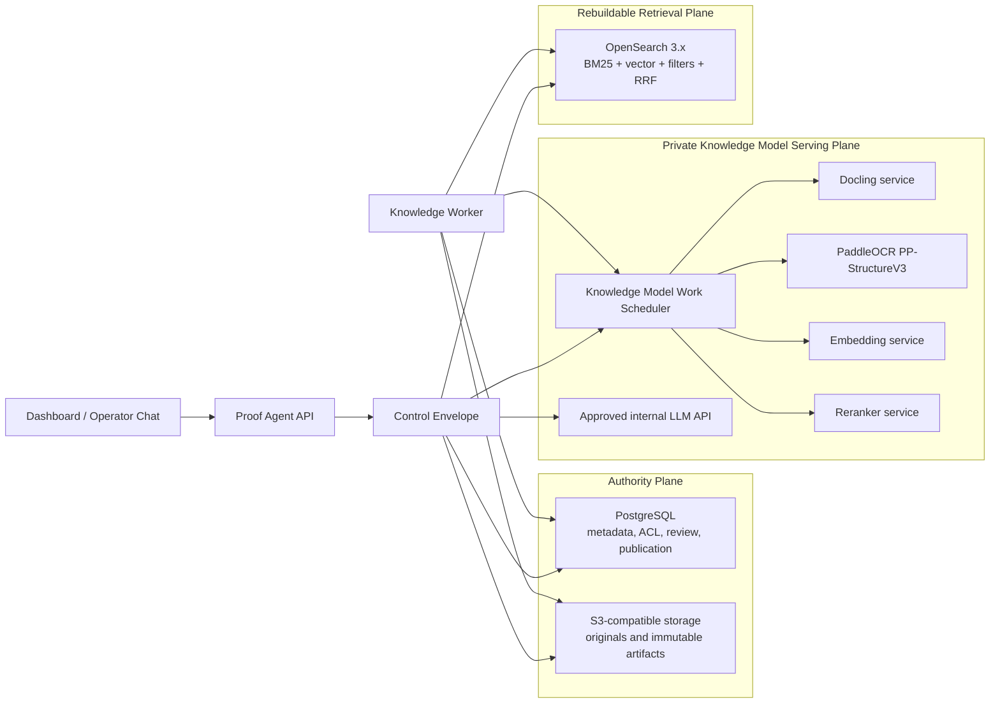
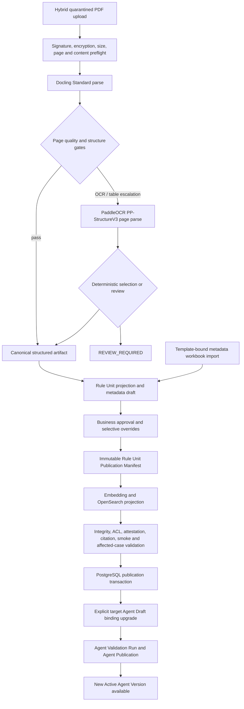
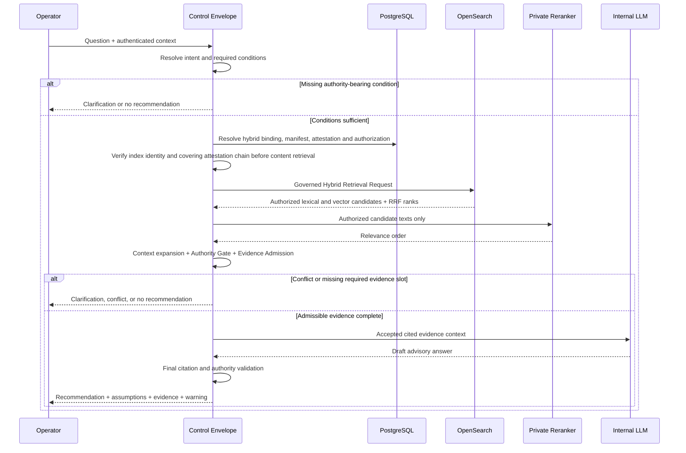

# Insurance Knowledge Architecture Design

## Status

[KNOWN | HIGH] This design records the Knowledge architecture approved through the 2026-07-12 `grill-with-docs` review for the institution insurance specialist Agent. It is a design authority for subsequent implementation planning; it does not claim that the described production components already exist in the repository.

## Executive Decision

[FRAME | HIGH] Build the expanded insurance Knowledge path as structured Insurance Rule Units over a self-hosted OpenSearch hybrid index. Use `pypdf` only for intake preflight, Docling Standard as the primary layout-aware parser, and page-level PaddleOCR PP-StructureV3 escalation for OCR or unresolved complex structure. Use `Qwen3-Embedding-0.6B` as the embedding baseline and `gte-multilingual-reranker-base` as the reranking baseline, both served inside the Private Knowledge Processing Boundary. Keep PostgreSQL as publication and authorization authority, S3-compatible storage as immutable original and artifact authority, and OpenSearch as a fully rebuildable retrieval projection.

[FRAME | HIGH] This design does not turn retrieval score into business authority. The Control Envelope independently enforces authorization, pinned publication identity, applicability, precedence, citation integrity, and Evidence Admission. Authority uncertainty always causes clarification or no recommendation; an advisory warning may describe residual relevance or completeness uncertainty but cannot waive an unresolved authority condition.

## 1. Scope And Success Conditions

### 1.1 In Scope

- [KNOWN | HIGH] The target users are insurance sales staff and institution specialists using an internal Agent for clause lookup, conditional guidance, and product comparison.
- [KNOWN | HIGH] The answer is advisory: staff remain responsible for confirmation, and the Agent does not make a formal underwriting, eligibility, sales-compliance, or policy-administration decision.
- [KNOWN | HIGH] The target document mix is approximately 10 percent simple text PDFs, 80 percent layout-complex PDFs, and 10 percent OCR-required or mixed PDFs.
- [KNOWN | HIGH] One expanded Knowledge Source is planned for 500 through 10,000 long PDFs and approximately 100,000 through 2,000,000 pages over two to three years.
- [KNOWN | HIGH] The expected query mix is approximately 30 percent clause lookup, 50 percent conditional guidance, and 20 percent product comparison.
- [KNOWN | HIGH] Routine approved rule changes target availability in one through four hours, subject to an explicit measured workload envelope.
- [KNOWN | HIGH] Access restrictions may apply at document or section level by institution, region, channel, and operator role.
- [KNOWN | HIGH] The deployment may add one unified retrieval service beyond the existing production PostgreSQL and S3-compatible stores.
- [KNOWN | HIGH] Initial private model serving has one shared 24-to-48-GB GPU, while the existing approved internal LLM API may receive accepted Knowledge context.

### 1.2 Non-Negotiable Outcomes

- [FRAME | HIGH] Every answer-bearing business assertion resolves to the exact approved document revision, page or structural anchor, and immutable Rule Unit lineage used at runtime.
- [FRAME | HIGH] Unauthorized Rule Units never enter lexical candidates, vector candidates, reranker input, LLM context, trace content, or user-visible citations.
- [FRAME | HIGH] Published Agent Versions use a discriminated binding union. A Resolved Hybrid Knowledge Binding pins `source_snapshot_id + index_generation_id + source_publication_seq + retrieval_profile_revision` plus the exact Rule Unit Publication Manifest and Knowledge Index Projection Attestation; legacy Local Index and remote bindings retain their existing immutable identity shapes.
- [FRAME | HIGH] A parser, index, embedding, reranker, authorization, publication, or citation failure cannot silently switch the Agent to another corpus or provider.
- [FRAME | HIGH] A failed replacement leaves the previously Published Knowledge version available and unchanged.
- [FRAME | HIGH] The deterministic no-network demo remains independent of Docling, PaddleOCR, OpenSearch, and private model-serving availability.

### 1.3 Non-Goals

- [FRAME | HIGH] This phase does not implement a general-purpose insurance rule engine or automatically execute underwriting and sales decisions.
- [FRAME | HIGH] This phase does not accept customer attachments or broaden Text-Only Customer Intake.
- [FRAME | HIGH] This phase does not allow external SaaS to process originals, parsed content, embeddings, reranker inputs, retrieved evidence, or Knowledge-bearing prompts.
- [FRAME | HIGH] This phase does not make OpenSearch, a parser vendor artifact, Markdown, embeddings, or an LLM-generated summary a source of business authority.
- [FRAME | HIGH] This phase does not promise a sub-fifteen-minute emergency stop-sale path; that requirement needs a separately reviewed structured or pre-scheduled activation design.

## 2. Current Baseline And Gap

- [KNOWN | HIGH] The current parser contract returns flat text, page count, and parser metadata through `ParsedKnowledgeDocument` in [`proof_agent/capabilities/knowledge/ingestion/contracts.py`](../../../proof_agent/capabilities/knowledge/ingestion/contracts.py).
- [KNOWN | HIGH] The current PDF parser uses `pypdf` Unicode text extraction in [`proof_agent/capabilities/knowledge/ingestion/parsers.py`](../../../proof_agent/capabilities/knowledge/ingestion/parsers.py).
- [KNOWN | HIGH] The current Local Index Provider builds and loads LlamaIndex `TreeIndex` artifacts and emits node-based citations in [`proof_agent/capabilities/knowledge/local_index.py`](../../../proof_agent/capabilities/knowledge/local_index.py).
- [KNOWN | HIGH] The current V1 Local Index intake rejects scanned PDFs and limits a Source to 500 documents; the expanded Hybrid path requires a provider-specific intake instead of mutating that retained contract.
- [KNOWN | HIGH] The existing Knowledge lifecycle already has useful Source, Document, Revision, Snapshot, Publication, Binding, Evidence, Citation, and Audit boundaries that this design extends instead of replacing.
- [INFERRED | HIGH] Flat text and per-document TreeIndex routing are not a reliable target for a corpus dominated by layout-dependent tables and approaching 10,000 PDFs because table semantics, page geometry, section-level ACLs, deterministic applicability filters, and corpus-wide hybrid retrieval need explicit structured projections.

## 3. Options Considered

| Option | Fit | Decision |
|---|---|---|
| [FRAME | HIGH] Extend current TreeIndex and flattened extraction | Lowest migration effort, but keeps document routing, structure loss, opaque node identity, and weak corpus-wide filtering | Rejected as the expanded production target; retained only as a bounded migration and compatibility path |
| [FRAME | HIGH] Structured Rule Units plus hybrid search | Preserves authority lineage and table structure while supporting lexical, vector, metadata, ACL, and comparison retrieval | Selected |
| [FRAME | HIGH] Full deterministic rule engine for every clause | Strongest formal execution semantics but requires costly rule authoring, conflict modeling, and ongoing business maintenance before broad value is proven | Deferred; add selectively for repeatedly used high-risk decisions after the Knowledge path produces evidence |

## 4. Target Architecture

[FRAME | HIGH] The system separates authoritative state, rebuildable retrieval state, and private model serving so no derived component becomes an accidental source of truth.



### 4.1 Authority Plane

- [FRAME | HIGH] PostgreSQL owns Knowledge Source identity, immutable document and revision metadata, ACL and applicability approval, review state, publication transactions, snapshot binding, Index Generation identity, Publication Sequence, and audit facts.
- [FRAME | HIGH] S3-compatible storage owns validated original PDFs and immutable vendor, canonical, preview, Rule Unit Publication Manifest, and related artifacts through the existing S3-first artifact-finalization discipline.
- [FRAME | HIGH] A Published Hybrid Knowledge binding is valid only when PostgreSQL names exact S3 artifact identities, one compatible OpenSearch Index Generation, one Publication Sequence, one Retrieval Profile Revision, and one passing Projection Attestation.

### 4.2 Rebuildable Retrieval Plane

- [FRAME | HIGH] OpenSearch stores only a derived Rule Unit search projection and vectors. It may be snapshotted for recovery speed, but PostgreSQL plus S3 remain sufficient to rebuild it.
- [FRAME | HIGH] The Hybrid Index Provider is the only adapter that translates a Governed Hybrid Retrieval Request into OpenSearch query syntax; OpenSearch SDK types never enter public contracts or Control Plane state.
- [FRAME | HIGH] Each physical index family is scoped by `source_id + index_generation_id`; multiple routine Publication Sequences share that family through immutable Rule Unit Revision membership intervals.

### 4.3 Private Model Serving Plane

- [FRAME | HIGH] Docling, PaddleOCR, embedding, and reranking run behind internal service boundaries, with pinned model and container revisions and no runtime model download.
- [FRAME | HIGH] One Knowledge Model Work Scheduler owns shared-GPU residency, admission, online priority, bounded offline work, pause or preemption, and queue-time metrics. Separate model services cannot independently guarantee priority.
- [FRAME | HIGH] The approved internal LLM API remains the answer-generation path; it receives only accepted, cited, authorized Knowledge context through the existing governed Model Provider boundary.

## 5. Canonical Domain And Artifact Model

| Concept | Required meaning |
|---|---|
| [FRAME | HIGH] Knowledge Document Revision | Immutable source-byte version of one managed PDF with original hash; parser configuration does not change this identity |
| [FRAME | HIGH] Structured Knowledge Artifact Build Identity | Immutable parser, model, OCR, preprocessing, source-hash, and canonical-schema compatibility identity for one structured derivative |
| [FRAME | HIGH] Structured Knowledge Document Artifact | Provider-neutral pages, blocks, headings, tables, cells, coordinates, reading order, OCR lineage, warnings, and parser provenance |
| [FRAME | HIGH] Insurance Rule Unit | Coherent business-reviewable rule represented by a document, clause, section, table row, or row group; an isolated cell is only an anchor or context element |
| [FRAME | HIGH] Insurance Rule Unit Revision | Immutable publication identity combining canonical content and lineage, approved authority metadata revision, and approved visibility-scope revision |
| [FRAME | HIGH] Insurance Rule Metadata Draft | Model- or parser-assisted proposal for product, rule type, applicability, effective period, authority, precedence, and ACL metadata; not authoritative until approved |
| [FRAME | HIGH] Knowledge Revision Review State | Business-visible state independent of technical ingestion state for unresolved structure, Rule Unit, or metadata review |
| [FRAME | HIGH] Knowledge Revision Publication Readiness | Proof that artifacts, approvals, embeddings, index projection, citations, and integrity checks are complete |
| [FRAME | HIGH] Knowledge Index Generation | Compatibility identity for canonical schema, search projection, mapping, embedding revision, instruction, dimension, normalization, and related index-affecting configuration |
| [FRAME | HIGH] Knowledge Source Publication Sequence | Monotonic Source-owned publication identity for corpus membership |
| [FRAME | HIGH] Knowledge Retrieval Profile Revision | Query-time expansion, fusion, reranker, context-expansion, candidate-budget, and prevalidated-degradation identity |
| [FRAME | HIGH] Rule Unit Publication Manifest | S3-backed authority enumerating exact Rule Unit Revision and authority digests for one publication |
| [FRAME | HIGH] Knowledge Index Projection Attestation | PostgreSQL-bound proof connecting one authoritative manifest to one exact OpenSearch index state |
| [FRAME | HIGH] Rule Unit Publication Membership | Derived sequence interval in which one immutable Rule Unit Revision belongs to the published corpus, independent of its business effective period |

### 5.1 Rule Unit Granularity

- [FRAME | HIGH] Document-level metadata is the default and is materialized into each Rule Unit projection.
- [FRAME | HIGH] Business reviewers create selective section-level, table-row, or row-group overrides only where applicability, authority, precedence, or visibility differs from the document default. An isolated cell may locate the exception but cannot carry authority independently.
- [FRAME | HIGH] A table row Rule Unit retains its table title, column headers, row header, page coordinates, cross-page continuation identity, and referenced definitions; isolated cell text is not sufficient evidence.
- [FRAME | HIGH] One optional logical rule key may relate revisions for review and diff, but runtime identity includes canonical content and lineage, Structured Knowledge Artifact Build Identity, Approved Insurance Rule Metadata revision, and Approved Insurance Knowledge Visibility Scope revision.
- [FRAME | HIGH] A content, applicability, effective-period, authority, precedence, supersession, or visibility change creates a new immutable Insurance Rule Unit Revision and publication-membership interval; it never mutates a historical OpenSearch authority projection in place.

### 5.2 Canonical Artifact Shape

[FRAME | HIGH] The provider-neutral artifact must be serializable without Docling or Paddle classes and must include at least the following stable fields:

```text
schema_version
document_id, revision_id, original_sha256
structured_artifact_build_identity
pages[]
  page_number, width, height, native_text_ratio
  blocks[]
    block_id, kind, text, reading_order, bbox, heading_path
    source_method: native | ocr | reconstructed
  tables[]
    table_id, title, bbox, continuation_of
    cells[]: row, column, row_span, column_span, text, bbox
warnings[]
quality_signals[]
```

- [FRAME | HIGH] Vendor-native JSON is retained as a diagnostic derivative, while canonical JSON is the only downstream parser contract.
- [FRAME | HIGH] Markdown and flattened text may be generated as preview or lexical projections but never replace canonical structure.

## 6. Ingestion, Review, And Publication Flow



### 6.1 Intake And Preflight

- [FRAME | HIGH] Hybrid Knowledge Document Intake reuses quarantine, system-generated storage paths, MIME and signature checks, encryption rejection, content hash, and request-envelope protection, but owns separate document, file, page, and batch limits for the expanded corpus.
- [FRAME | HIGH] Local Index retains the existing text-only V1 intake, scanned-PDF rejection, 50-MB and 500-page file limits, and 500-document Source cap until its separate lifecycle ends; Hybrid acceptance does not weaken or silently migrate it.
- [FRAME | HIGH] `pypdf` remains useful for page count, encryption checks, embedded-text sampling, and fast native-text diagnostics; its flattened extraction is not the canonical parser output.
- [FRAME | HIGH] Hybrid intake classifies pages rather than rejecting an entire PDF as scanned because one revision may mix native text, complex layout, and image-only pages. Hybrid capacity limits are frozen by implementation load tests and explicitly configured rather than inherited from Local Index.

### 6.2 Primary And Escalation Parsing

- [FRAME | HIGH] Docling Standard parses every accepted PDF into ordered structural objects and is the default path for simple and layout-complex native-text pages.
- [FRAME | HIGH] PaddleOCR PP-StructureV3 is invoked only for pages whose native-text recovery, table reconstruction, reading order, or quality signals fail configured thresholds.
- [FRAME | HIGH] Selection between Docling and Paddle results occurs at an explicitly recorded block or table boundary within one canonical page assembly; one block never silently mixes text from both parsers, and ambiguous disagreement enters Knowledge Revision Review State.
- [FRAME | HIGH] Cross-page table reconciliation retains each page result and continuation lineage; uncertain row merging requires explicit review instead of an unrecorded parser merge.
- [FRAME | HIGH] An LLM may explain or draft a proposed correction for reviewers but cannot silently merge contradictory parser results into a publishable artifact.
- [FRAME | HIGH] Failure on a rule-bearing page blocks revision readiness. A non-rule page may be excluded only through an explicit, audited reviewer decision that records the page and reason.

### 6.3 Rule Projection And Business Review

- [FRAME | HIGH] Structural slicing creates candidate Rule Units from heading sections, clauses, list items, and table rows while preserving definitions and cross-page relationships.
- [FRAME | HIGH] A model may draft product identity, document type, rule type, effective dates, applicability fields, precedence references, and ACL scope from approved taxonomies.
- [FRAME | HIGH] A business reviewer approves document defaults and only the exceptional section or row overrides. Model drafts never become business authority through confidence score alone.
- [FRAME | HIGH] Exact precedence order remains a versioned business-approved Insurance Rule Applicability Policy; the retrieval model may not invent or reorder it.

### 6.3.1 Supporting Workbook Metadata

- [FRAME | HIGH] Insurance Rule Metadata Workbook Import is a separate curation input, not Hybrid Knowledge Document Intake and not retrievable evidence.
- [FRAME | HIGH] The accepted XLSX or CSV template keys each row to exact `source_id`, `document_id`, `revision_id`, and optional canonical section, clause, table-row, or row-group anchor. Filename-only joins are rejected.
- [FRAME | HIGH] The importer rejects executable macros and external links, never executes formulas, stores the exact original plus normalized rows and template revision in S3, and writes row-level validation and audit facts in PostgreSQL.
- [FRAME | HIGH] PDF-derived and workbook-derived values remain parallel Insurance Rule Metadata Draft inputs. A field disagreement is shown to the reviewer and blocks readiness until explicitly resolved; neither input automatically wins.

### 6.4 Derived Projection And Publication

1. [FRAME | HIGH] One durable Source-scoped publication attempt acquires a fencing token and reserves a monotonically increasing Source Publication Sequence without making it visible; failed attempts may leave sequence gaps.
2. [FRAME | HIGH] The worker finalizes one immutable Rule Unit Publication Manifest containing exact Rule Unit Revision, content, parser-build, approved metadata, visibility, citation, and membership digests.
3. [FRAME | HIGH] Changed Rule Unit Revisions are embedded and written through attempt-scoped idempotent keys into the `source_id + index_generation_id` family; unchanged compatible units and vectors are reused.
4. [FRAME | HIGH] OpenSearch refresh, candidate counts, membership intervals, normalized ACL scope, citation resolution, and smoke retrieval are compared with the manifest, producing a Knowledge Index Projection Attestation bound to exact index UUID and refresh checkpoint.
5. [FRAME | HIGH] Final PostgreSQL commit takes a short Source-row lock and compares the live attempt token, one-use validation identity, Source Draft version, candidate digest, generation digest, manifest digest, and projection attestation before publishing the new Source snapshot, generation, sequence, manifest, and attestation identity.
6. [FRAME | HIGH] Source publication creates an Agent binding upgrade opportunity. The explicit Draft binding upgrade also resolves and pins the selected Knowledge Retrieval Profile Revision; the named target Agent becomes usable only after Agent Validation Run, Agent Publication, and Active Agent Version transition.
7. [FRAME | HIGH] A failure before either authority commit leaves the prior Source or Agent Version authoritative. Any unreferenced projection is an orphan for reconciliation, not an implicit publication.

## 7. Parser Technology Selection

| Component | Selected role | Reason and constraint |
|---|---|---|
| [KNOWN | HIGH] `pypdf` | Preflight and diagnostics | Already integrated; insufficient as canonical layout representation |
| [FRAME | HIGH] Docling Standard | Primary parser | Provider-neutral mapping can preserve pages, blocks, headings, tables, coordinates, and provenance without requiring VLM inference on every page |
| [FRAME | HIGH] PaddleOCR PP-StructureV3 | Page-level OCR and complex-structure escalation | Covers OCR, layout, table, formula, and seal-heavy pages while avoiding full-document duplicate processing |
| [FRAME | MED] MinerU | Time-boxed challenger only | Technically relevant for document conversion, but its code-license, deployment, schema, and GPU implications require separate legal and operational approval before production selection |

- [FRAME | HIGH] Pin exact source-byte hash, parser container, library, model and weight digests, OCR configuration, preprocessing, and canonical-schema revision in Structured Knowledge Artifact Build Identity; Knowledge Document Revision remains tied only to uploaded source bytes.
- [FRAME | HIGH] Disable network downloads and remote telemetry at runtime; mirror approved packages and model weights into the company-controlled supply chain.
- [FRAME | HIGH] Every parser pipeline revision receives a new Structured Knowledge Artifact Build Identity and runs the parser benchmark plus affected retrieval evaluation. It creates a new Knowledge Index Generation only when canonical schema, Rule Unit search projection, stored mapping, or another index-compatibility field changes.
- [FRAME | HIGH] A parser change that preserves stored compatibility but changes extracted content reuses the generation, produces new immutable Rule Unit Revisions, and advances Source Publication Sequence after review. Reuse of prior artifacts is permitted only after byte-for-byte reproducibility proof.

## 8. Search, Embedding, And Reranking Selection

### 8.1 OpenSearch

- [FRAME | HIGH] Use a self-hosted supported OpenSearch 3.x release as the one additional Knowledge Retrieval Index Service.
- [FRAME | HIGH] Create one physical index family per `source_id + index_generation_id`; routine Source Publication Sequences share the family, while cross-Source selection and Weighted Reciprocal Rank Fusion remain in the existing Control Plane.
- [FRAME | HIGH] Use BM25 for exact clause numbers, product names, rule terminology, exclusions, and Chinese keyword matches; use dense vectors for paraphrase and condition-to-rule semantic recall.
- [FRAME | HIGH] Apply one common authorization, publication-membership, effective-period, and approved applicability filter before both lexical and vector candidate generation.
- [FRAME | HIGH] Fuse lexical and vector ranks within one Source through reciprocal-rank fusion before private reranking. This Source-local RRF is distinct from existing cross-Source WRRF.
- [FRAME | HIGH] Use ICU normalization, exact keyword subfields for identifiers and taxonomy values, and a pinned Chinese tokenizer selected against the Gold Suite; analyzer changes create a new Index Generation.
- [FRAME | HIGH] Use aliases only as deployment mechanics. Runtime requires exact index UUID, generation, publication sequence, and passing Projection Attestation, so an alias cannot create mutable-latest semantics.

### 8.2 Search Projection

[FRAME | HIGH] Each OpenSearch Rule Unit document materializes query-safe fields so authorization and authority filters do not require model interpretation:

```text
identity:
  source_id, document_id, revision_id
  logical_rule_key, rule_unit_revision_id
  structured_artifact_build_identity, index_generation_id
publication:
  publication_seq_from, publication_seq_to
  authority_manifest_digest, metadata_revision_digest, visibility_revision_digest
lineage:
  page_numbers, block_ids, table_id, cell_coordinates, citation_uri
content:
  title, heading_path, rule_text, table_context, definitions
business:
  product_codes, rule_type, effective_from, effective_to
  applicability_taxonomy, authority_tier, precedence_policy_revision
security:
  visibility: PUBLIC | RESTRICTED
  institution_mode, allowed_institutions
  region_mode, allowed_regions
  channel_mode, allowed_channels
  role_mode, allowed_roles
  business_line_mode, allowed_business_lines
retrieval:
  lexical_text, dense_vector, projection_revision
```

- [FRAME | HIGH] Approved visibility is explicit `PUBLIC` or `RESTRICTED`. Restricted content uses `ALL` or `ALLOWLIST` for every dimension; values are ORed within one allowlist and dimensions are ANDed. Missing, malformed, or unapproved visibility blocks publication rather than becoming public or deny-all by convention.
- [FRAME | HIGH] OpenSearch fields are projections of PostgreSQL-approved facts and S3 artifacts, not editable Knowledge authority.
- [FRAME | HIGH] Publication validation compares the projection with every affected and retained Rule Unit Publication Manifest and creates an immutable Projection Attestation chain entry containing exact index UUID, generation, mapping, refresh checkpoint, manifest coverage, counts, and parent digest. Runtime accepts the binding's publication-time attestation or a verified descendant covering its pinned sequence, and rejects identity, chain, coverage, or candidate-digest drift before issuing a content query.

### 8.3 Embedding Baseline

- [FRAME | HIGH] Start the bakeoff with `Qwen3-Embedding-0.6B`, 1024-dimensional output, a pinned Chinese retrieval instruction, and normalized vectors.
- [FRAME | MED] Test its supported Matryoshka 512-dimensional projection as a cost and latency challenger; choose it only if the unseen cohort preserves required-evidence recall and complete-evidence coverage.
- [FRAME | HIGH] Record model repository revision, weight digest, tokenizer revision, instruction, dimension, pooling, normalization, inference image, and quantization in Knowledge Index Generation.

### 8.4 Reranking Baseline

- [FRAME | HIGH] Start with `gte-multilingual-reranker-base` as the shared-GPU baseline because its size is compatible with the initial envelope and it supports multilingual long-context reranking.
- [FRAME | HIGH] Mirror and audit any model package that requires custom model code; `trust_remote_code` is never permitted to fetch or execute changing code at runtime.
- [FRAME | MED] Compare `Qwen3-Reranker-4B` and the BGE-M3 plus `bge-reranker-v2-m3` family as challengers. A larger model wins only if hidden-set quality materially exceeds its latency, GPU-residency, and scheduling cost.
- [FRAME | HIGH] Relevance model output remains Provider-Native Relevance Score and cannot set authority, ACL, or Evidence Admission.
- [FRAME | HIGH] Reranker model revision, tokenizer, inference image, maximum input, batching, and scoring projection belong to Knowledge Retrieval Profile Revision, not Knowledge Index Generation.

### 8.5 Initial Retrieval Budgets

- [FRAME | MED] Begin measurement with approximately 100 candidates per lexical and dense lane, RRF to 50 candidates, private reranking, and 12 through 20 final Rule Units before bounded context expansion.
- [FRAME | HIGH] These are Knowledge Retrieval Profile Revision starting values, not business invariants. Tune them on the visible 300-case cohort and freeze the selected profile before one Sealed Knowledge Acceptance Evaluation.

## 9. Governed Runtime Retrieval



### 9.1 Intent And Condition Resolution

- [FRAME | HIGH] The Agent first classifies clause lookup, conditional guidance, comparison, or unsupported intent and extracts only values from approved business taxonomies.
- [FRAME | HIGH] Missing institution, region, channel, product, customer condition, date, or other authority-bearing input triggers a clarification when the missing value can change applicability or precedence.
- [FRAME | HIGH] A model may propose normalized values, but the Control Envelope validates them and constructs the final governed request; the model cannot author ACL or publication filters.

### 9.2 Governed Hybrid Retrieval Request

[FRAME | HIGH] The provider-neutral request contains one exact Resolved Hybrid Knowledge Binding, including Source snapshot, Index Generation, Publication Sequence, Retrieval Profile Revision, Rule Unit Publication Manifest identity, and Projection Attestation, plus runtime authorization scope, approved applicability filters, as-of time, query set, query type, and evidence-slot plan. It contains no raw OpenSearch DSL and no mutable-latest selector.

### 9.3 Filtering, Fusion, And Context Expansion

1. [FRAME | HIGH] The adapter verifies exact index UUID, generation, manifest digest, and a Projection Attestation equal to or descended from the binding's publication-time attestation with coverage of its pinned sequence, then OpenSearch filters authorization, publication membership, business effective period, and approved applicability before candidate retrieval.
2. [FRAME | HIGH] BM25 and dense retrieval run over the same filtered population.
3. [FRAME | HIGH] RRF combines ranks without treating backend numeric scores as comparable.
4. [FRAME | HIGH] The private reranker sees only already-authorized candidates.
5. [FRAME | HIGH] Rule Unit Context Expansion independently applies the same publication, visibility, and applicability filters to every heading, table-header, neighboring rule, continuation, and definition before reading its content, then adds only passing context with citation lineage and token accounting.

### 9.4 Required Evidence Slots

- [FRAME | HIGH] Clause lookup normally requires the requested clause plus any definition explicitly needed to interpret it.
- [FRAME | HIGH] Conditional guidance requires the governing rule, applicable conditions, relevant exclusions or exceptions, and any precedence source needed for the conclusion.
- [FRAME | HIGH] Comparison creates explicit per-product and per-dimension evidence slots; the Agent cannot infer a missing side from another product or from general model knowledge.
- [FRAME | HIGH] Missing, conflicting, unauthorized, or unresolved required slots block a recommendation even when other retrieved passages are relevant.

### 9.5 Authority Gate And Evidence Admission

- [FRAME | HIGH] Insurance Rule Authority Gate verifies each candidate's Rule Unit Revision, metadata and visibility digests, publication membership, business effective period, applicability, business-approved precedence, authorization, and citation against the PostgreSQL-bound Rule Unit Publication Manifest rather than treating returned OpenSearch fields as authority.
- [FRAME | HIGH] Evidence Admission separately determines whether an authority-valid candidate is sufficiently supported and useful for model context.
- [FRAME | HIGH] Retrieval relevance, business authority, and evidence admission use separate result fields and audit events; no numeric score is overloaded across these meanings.

### 9.6 Answer Contract

- [FRAME | HIGH] A successful response separates recommendation, known user conditions, assumptions, applicable rule basis, citations, detected conflicts or missing information, residual relevance or completeness warning, and the staff-confirmation reminder.
- [FRAME | HIGH] An authority warning is not an answer mode. If authority is unresolved, the result is clarification, conflict, or no recommendation.

## 10. Versioning And Consistency

### 10.1 Structured Build, Index Generation, Publication, And Retrieval Profile

- [FRAME | HIGH] Change Structured Knowledge Artifact Build Identity whenever parser adapter, library, model weights, OCR, preprocessing, source bytes, or canonical artifact schema changes; this identity versions the derivative and does not redefine Knowledge Document Revision.
- [FRAME | HIGH] Change `index_generation_id` when canonical artifact schema, Rule Unit projection, OpenSearch mapping or analyzer, embedding revision, instruction, dimension, pooling, normalization, or another compatibility field changes.
- [FRAME | HIGH] Advance `source_publication_seq` for approved corpus, authority metadata, visibility, or citation changes that reuse a compatible generation; changed authority or visibility creates a new immutable Rule Unit Revision.
- [FRAME | HIGH] Change `retrieval_profile_revision` for query expansion, Source-local RRF, reranker, context expansion, candidate budgets, or Prevalidated Retrieval Degradation without reindexing unless a stored compatibility field also changes.
- [FRAME | HIGH] Store Rule Unit Revision publication membership as sequence intervals so old Published Agent Versions continue to retrieve the exact historical corpus without duplicating a complete index per publication.

### 10.2 Read Visibility

- [FRAME | HIGH] One Source-scoped durable publication attempt and fencing token serialize projection work. Attempt-scoped idempotent OpenSearch writes and refresh validation occur before PostgreSQL exposes a new sequence; new units with a future `publication_seq_from` remain invisible to pinned old sequences, and closing an old unit interval must preserve every earlier sequence's result.
- [FRAME | HIGH] Final PostgreSQL publication takes a short Source-row lock and compares the live attempt, one-use validation identity, Source Draft version, candidate digest, generation digest, Rule Unit Publication Manifest digest, and Projection Attestation. Stale or superseded attempts cannot commit.
- [FRAME | HIGH] PostgreSQL publication is the single Source visibility point. A partial or failed index write cannot become active merely because documents exist in OpenSearch, and a consumed failed sequence may remain a harmless monotonic gap.
- [FRAME | HIGH] Each successful same-generation update appends a Projection Attestation whose parent is the prior chain head and whose coverage includes every retained earlier publication manifest. A historical binding may use a verified descendant attestation because that proof changes infrastructure state, not its pinned corpus identity.
- [FRAME | HIGH] A reconciler compares PostgreSQL plus exact S3 manifest authority with the attestation chain and OpenSearch generation and membership state, repairs missing projections from S3, and removes or reports orphan future projections after a retention window.

## 11. Failure, Degradation, And Security Semantics

### 11.1 Failure Classes

| Class | Examples | Behavior |
|---|---|---|
| [FRAME | HIGH] Transient infrastructure | Timeout, temporary service unavailability, rate limit | Bounded retry with backoff, lease ownership, idempotent artifact or projection key |
| [FRAME | HIGH] Content or review | Uncertain table, OCR ambiguity, Rule Unit boundary, metadata draft | Enter explicit REVIEW_REQUIRED; no publication readiness until corrected or approved |
| [FRAME | HIGH] Security or integrity | ACL ambiguity, generation mismatch, digest failure, wrong publication, citation failure | Fail closed immediately; never degrade |

### 11.2 Runtime Degradation

- [FRAME | HIGH] OpenSearch unavailable, index UUID or Projection Attestation mismatch, wrong generation, ACL-filter failure, or citation-resolution failure produces no advisory answer and never invokes TreeIndex or latest-state fallback.
- [FRAME | HIGH] Embedding unavailable may use BM25-only only for an exact Source and query-type path whose Sealed Knowledge Acceptance Evaluation passed and whose pinned Knowledge Retrieval Profile Revision explicitly enables that degradation.
- [FRAME | HIGH] Reranker unavailable may use Source-local RRF only under the same prevalidation and pinned-profile rule.
- [FRAME | HIGH] Internal LLM unavailable may expose an authorized evidence preview if the caller and product mode permit it, but it does not synthesize a recommendation.
- [FRAME | HIGH] Every degradation records the configured mode, triggering dependency, exact corpus identity, validation profile, and resulting outcome in trace-safe form.

### 11.3 Security

- [FRAME | HIGH] Knowledge-bearing network calls remain inside the Private Knowledge Processing Boundary even when the general Production Egress Policy could permit other origins.
- [FRAME | HIGH] Candidate exposure outside the caller's ACL is a zero-tolerance release and runtime security failure.
- [FRAME | HIGH] OpenSearch is a trusted internal prefilter enforcement component but not business authority: only a projection matched to an exact S3 Rule Unit Publication Manifest by a live PostgreSQL Projection Attestation may serve content, and every returned candidate is checked against manifest digests before reranking.
- [FRAME | HIGH] Trace, metrics, and error messages record identifiers, counts, timings, and safe reason codes without raw document content or identities of excluded unauthorized units.
- [FRAME | HIGH] Model and parser images, weights, tokenizers, and custom code are mirrored, hash-pinned, scanned, and admitted before deployment; production processes cannot download replacements.

## 12. Evaluation And Release Gates

### 12.1 Evaluation Assets

- [FRAME | HIGH] Insurance Knowledge Gold Suite contains 500 human-confirmed business cases: 300 visible tuning cases and 200 access-controlled unseen acceptance cases, preserving the agreed 30/50/20 query mix.
- [FRAME | HIGH] A sealed evaluator permits one acceptance execution per frozen production candidate and returns aggregate plus hard-gate results without exposing case content or item-level feedback to tuners. A deliberately revealed failed case moves to tuning and is replenished before another acceptance decision.
- [FRAME | HIGH] Every case labels expected resolution, required evidence slots, exact rule version, citation basis, applicable authority and precedence, and warning, clarification, conflict, or refusal expectations.
- [FRAME | HIGH] A separate 100-to-200-sample parser benchmark covers multi-column order, complex and cross-page tables, OCR, seals, page anchors, bounding boxes, headings, and pages that must enter review; at least 30 percent remains access-controlled for parser acceptance.
- [FRAME | HIGH] Rule-bearing page and citation-anchor loss and missed mandatory-review cases are zero-tolerance parser failures. Character, reading-order, and table-structure numeric thresholds are selected on the visible parser cohort and frozen before its sealed acceptance execution.
- [FRAME | HIGH] Historical consultation logs may seed curation only after authorization, deterministic sensitive-field removal, data minimization, taxonomy labeling, evidence annotation, and Domain plus Harness reviewer confirmation.

### 12.2 Non-Compensating Hard Gate

- [FRAME | HIGH] Unauthorized candidate exposure: zero.
- [FRAME | HIGH] Wrong source version, business effective period, or precedence: zero.
- [FRAME | HIGH] Unresolvable formal citation: zero.
- [FRAME | HIGH] Advisory recommendation under unresolved authority: zero.
- [FRAME | HIGH] High-severity unsupported business conclusion: zero.

[FRAME | HIGH] No blended score, judge preference, latency improvement, or advisory warning may offset a hard-gate failure.

### 12.3 Initial Quality Targets

- [FRAME | MED] Required-evidence Recall@50 is at least 95 percent overall and at least 90 percent in each query-type slice.
- [FRAME | MED] Conditional-guidance and comparison complete-evidence coverage in reranked Top 10 is at least 90 percent.
- [FRAME | MED] Human-reviewed support precision for ordinary business assertions is at least 98 percent, while high-severity unsupported assertions remain zero.
- [FRAME | HIGH] Results are sliced by query type, document type, institution, channel, parser path, and degradation mode so an aggregate average cannot hide local failure.

### 12.4 Change-Specific Gates

- [FRAME | HIGH] A parser pipeline change creates a new Structured Knowledge Artifact Build Identity and reruns the parser benchmark plus affected Gold cases; it creates a new Index Generation only if stored compatibility changes.
- [FRAME | HIGH] Canonical schema, Rule Unit projection, analyzer, mapping, embedding model, instruction, dimension, pooling, or normalization changes create a new Index Generation and run the complete applicable parser, retrieval, hard-gate, performance, and sealed acceptance gates.
- [FRAME | HIGH] Query expansion, fusion, reranker, context-expansion, candidate-budget, or degradation changes create a new Knowledge Retrieval Profile Revision and run the applicable retrieval, hard-gate, performance, and sealed acceptance gates without reindexing unless stored compatibility also changes.
- [FRAME | HIGH] Routine rule-file publication runs structural, ACL, authority, citation, membership, smoke, and affected-case checks without treating a document update as a model bakeoff.
- [FRAME | HIGH] Any Prevalidated Retrieval Degradation has its own exact Source, query-type, dependency-failure, and Sealed Knowledge Acceptance Evaluation evidence.

## 13. Performance, Capacity, And Operations

### 13.1 Initial Objectives

- [FRAME | MED] Under five active runs, hybrid retrieval plus private reranking targets P95 at or below five seconds, including Knowledge Model Work Scheduler queue time.
- [KNOWN | HIGH] The existing initial production objective keeps a standard governed answer at P95 within 60 seconds excluding visible queue time.
- [FRAME | HIGH] Offline ingestion may not worsen online retrieval P95 by more than ten percent inside the declared capacity envelope.
- [FRAME | HIGH] One global Knowledge Model Work Scheduler enforces online embedding and reranking priority across model services; offline OCR, layout parsing, embedding, and backfill are pausable and consume bounded queue slots.

### 13.2 Routine Change Workload Envelope

- [FRAME | HIGH] Before production acceptance, load tests freeze a versioned envelope containing changed-document count, page count, percentage of Docling-only pages, percentage of Paddle escalation pages, average table density, model revisions, hardware, online concurrency, validation workload, named target Agent count, and required reviewer availability.
- [FRAME | HIGH] The one-to-four-hour activation objective applies only inside that envelope and ends after explicit binding upgrade, Agent Validation Run, Agent Publication, and Active Agent Version availability. Larger, more OCR-heavy, or broader multi-Agent changes receive an explicit forecast and do not inherit the routine SLO.
- [FRAME | HIGH] The envelope is remeasured after parser, model, quantization, hardware, concurrency, or validation changes.

### 13.3 Operational Views And Alerts

- [FRAME | HIGH] Dashboards expose ingestion queue age, retry and review backlog, parser escalation rate, pages per minute, GPU memory and utilization, online-priority preemption, embedding backlog, OpenSearch indexing lag, orphan projection count, publication age, and rebuild progress.
- [FRAME | HIGH] Retrieval views expose per-stage P50/P95, lexical and dense candidate counts, RRF and rerank truncation, no-evidence rate, clarification, conflict, refusal and degradation rates, citation failures, and required-slot coverage.
- [FRAME | HIGH] Security views alert on any ACL-filter mismatch, unauthorized candidate exposure, generation mismatch, denied content-bearing egress, or runtime model-download attempt.
- [FRAME | HIGH] OpenSearch snapshots shorten recovery but do not replace periodic rebuild drills from PostgreSQL and S3 authority.

## 14. Rollout, Migration, And Rollback

### Phase 0 — Corpus Profile And Evaluation Authority

- [FRAME | HIGH] Sample the real corpus, quantify native, complex-layout, and OCR pages, build the parser benchmark, curate the 300 tuning cases, and seal the 200 acceptance cases before model selection.

### Phase 1 — Parser Shadow

- [FRAME | HIGH] Run Docling and Paddle escalation against representative approved revisions without changing current Published Knowledge. Review structural diffs, table fidelity, citation mapping, throughput, and review workload.

### Phase 2 — OpenSearch Shadow Retrieval

- [FRAME | HIGH] Build canonical artifacts, immutable Rule Unit Revisions, authoritative publication manifests, generation, embeddings, and attested OpenSearch projections in parallel with Local Index. Replay the same authorized queries and compare evidence recall, complete-slot coverage, ACL behavior, citations, and latency.

### Phase 3 — Assisted Pilot

- [FRAME | HIGH] Bind a controlled institution-specialist pilot to the new Published Knowledge path. Keep the answer advisory, require staff confirmation, capture trace-safe feedback, and expand evaluation cases through reviewed curation.

### Phase 4 — Gated Cutover

- [FRAME | HIGH] Extend Resolved Knowledge Binding as a discriminated union: retained Local Index snapshot and remote variants keep existing fields, while the new Hybrid variant requires Source publication, snapshot, generation, sequence, retrieval profile, manifest, and attestation identities.
- [FRAME | HIGH] Switch broader Published Agent bindings only after the sealed hard, quality, performance, deployment, and recovery gates pass.
- [FRAME | HIGH] Keep Local Index sources available only for explicitly pinned legacy Agent Versions during the migration window; do not configure them as exception-time fallback.

### Rollback

- [FRAME | HIGH] Immediate cutover rollback uses the existing Agent Version Rollback operation to select a retained immutable Published Agent Version and therefore restore its complete discriminated resolved binding; already-running executions remain pinned to the version with which they began.
- [FRAME | HIGH] Reverting shared Hybrid Source content is a different operation: create a Knowledge Source Rollback Draft from the chosen historical publication, perform fresh review and Source validation, publish a new monotonic Source version, explicitly upgrade the target Agent Draft binding, run Agent Validation, and publish a new Agent Version.
- [FRAME | HIGH] Neither rollback path queries mutable latest state, reconstructs authority from OpenSearch, mutates an old publication, or silently changes provider inside an active run.

## 15. Contract And Module Boundaries

| Repository boundary | Target responsibility |
|---|---|
| [FRAME | HIGH] `proof_agent/contracts/` | Provider-neutral Structured Knowledge Document, artifact build identity, Rule Unit Revision, Index Generation, Publication Sequence, Retrieval Profile Revision, manifest and attestation reference, discriminated resolved binding, governed retrieval, authority result, citation, and evidence DTOs |
| [FRAME | HIGH] `proof_agent/control/` | Request construction, authorization and applicability policy, Authority Gate, Evidence Admission, required evidence slots, degradation policy, and answer admission |
| [FRAME | HIGH] `proof_agent/capabilities/knowledge/` | Hybrid intake, workbook curation adapter, Docling, Paddle, embedding, OpenSearch, reranker, Knowledge Model Work Scheduler, publication projection, reconciliation, ingestion, and rebuild services |
| [FRAME | HIGH] `proof_agent/bootstrap/` | Configuration validation, exact generation and model references, secret handles, and composition without provider SDK leakage |
| [FRAME | HIGH] `proof_agent/observability/` | Trace-safe parsing, retrieval, authority, degradation, publication, and reconciliation facts plus Governance Receipt projections |
| [FRAME | HIGH] `proof_agent/evaluation/` | Parser benchmark, Gold Suite gates, slice metrics, model bakeoff, and release evidence |

- [FRAME | HIGH] Third-party Docling, Paddle, OpenSearch, model-serving, and tokenizer objects terminate inside adapters.
- [FRAME | HIGH] The Control Plane calls one Hybrid Index Provider protocol and one private reranker protocol; runtime graph mechanics cannot bypass Authority Gate or Evidence Admission.
- [FRAME | HIGH] Existing Local Index contracts remain intact until the migration plan explicitly removes them after all retained Published Agent references expire.

## 16. Test Strategy

### 16.1 Contract And Unit Tests

- [FRAME | HIGH] Canonical artifact serialization and schema-version rejection.
- [FRAME | HIGH] Rule Unit Revision identity changes for content, parser-build, approved metadata, or visibility changes while logical rule keys remain non-authoritative; isolated table cells cannot become authority units.
- [FRAME | HIGH] Metadata inheritance, selective row or row-group override, workbook row-to-revision anchor validation, conflict blocking, table context, and citation URI construction.
- [FRAME | HIGH] Index Generation fingerprint changes for every compatibility field and remains stable for unrelated publication metadata.
- [FRAME | HIGH] Retrieval Profile Revision changes for every query-time behavior field and does not change Index Generation without a stored compatibility change.
- [FRAME | HIGH] Publication Sequence membership interval correctness across add, replace, archive, rollback, and failed publication.
- [FRAME | HIGH] Explicit `PUBLIC` versus `RESTRICTED`, `ALL` versus `ALLOWLIST`, OR-within and AND-across authorization algebra, with missing or unapproved visibility blocking publication.
- [FRAME | HIGH] Separate relevance, authority, and admission result types with no score alias.

### 16.2 Integration Tests

- [FRAME | HIGH] Docling canonical conversion and selected-page Paddle escalation with fixture PDFs.
- [FRAME | HIGH] Idempotent S3 artifact and Rule Unit Publication Manifest finalization, Source-scoped publication fencing, stale-validation CAS rejection, embedding reuse, attempt-scoped OpenSearch bulk indexing, Projection Attestation, orphan reconciliation, and rebuild from authority.
- [FRAME | HIGH] BM25, vector, RRF, rerank, context expansion, citation resolution, conflict, and missing-slot behavior through the same Knowledge Retrieval Service used by the Agent.
- [FRAME | HIGH] Dependency-failure matrix proving only configured Prevalidated Retrieval Degradation continues and every authority or integrity failure stops.

### 16.3 Security And Replay Tests

- [FRAME | HIGH] Public, unrestricted-dimension, restricted-allowlist, missing-scope, cross-institution, region, channel, role, and independently authorized context-expansion queries prove zero unauthorized candidates before reranking and LLM context.
- [FRAME | HIGH] Historical Published Agent bindings replay the same Rule Unit membership after later publications and generation changes.
- [FRAME | HIGH] Trace, error, metric, and Governance Receipt projections contain no unauthorized content, raw originals, secret values, or excluded-unit identity leakage.

### 16.4 Performance And Recovery Tests

- [FRAME | HIGH] Five-active-run retrieval load with concurrent bounded ingestion verifies latency, GPU priority, queue backpressure, and ten-percent interference limit.
- [FRAME | HIGH] Routine workload-envelope tests measure end-to-end approved-file-to-Active-Agent-Version time, including Source publication, explicit binding upgrade, Agent Validation, and Agent Publication, instead of parser throughput alone.
- [FRAME | HIGH] OpenSearch loss and complete generation rebuild from PostgreSQL plus S3 prove that the derived plane is replaceable.

## 17. Implementation-Time Calibrations

[FRAME | HIGH] The architecture is approved, but three measured selections remain implementation gates rather than open architectural questions:

1. [FRAME | MED] Freeze the exact production parser and model revisions after internal supply-chain review and benchmark reproducibility.
2. [FRAME | MED] Choose 1024- versus 512-dimensional Qwen embeddings, the reranker winner, Chinese tokenizer, and retrieval budgets using the 300 tuning cases, then validate once on the sealed 200 cases.
3. [FRAME | HIGH] Freeze the numeric Routine Knowledge Change Workload Envelope from representative hardware and corpus load tests before treating one through four hours as an SLO.

## 18. Decision Records

- [KNOWN | HIGH] Trust, advisory scope, authority, metadata, scale, activation, serving, GPU, ACL, and evaluation-seeding decisions are recorded in [ADR-0133](../../adr/0133-production-knowledge-processing-remains-inside-company-trust-boundary.md) through [ADR-0145](../../adr/0145-use-one-rebuildable-knowledge-retrieval-index-service.md).
- [KNOWN | HIGH] Parser, OpenSearch, versioning, retrieval semantics, failure behavior, release gating, and Retrieval Profile versioning are recorded in [ADR-0146](../../adr/0146-layout-aware-parsing-uses-docling-with-paddle-escalation.md) through [ADR-0152](../../adr/0152-pin-hybrid-retrieval-profile-separately-from-index-generation.md).

## 19. Primary Technical References

- [KNOWN | HIGH] Docling documents its structured `DoclingDocument` model and pipeline options in [DoclingDocument concepts](https://docling-project.github.io/docling/concepts/docling_document/) and [pipeline options](https://docling-project.github.io/docling/reference/pipeline_options/); the evaluated release baseline was [v2.112.0](https://github.com/docling-project/docling/releases/tag/v2.112.0).
- [KNOWN | HIGH] PaddleOCR documents PP-StructureV3 layout, OCR, table, formula, seal, JSON, and Markdown outputs in the [official PP-StructureV3 guide](https://www.paddleocr.ai/main/en/version3.x/pipeline_usage/PP-StructureV3.html); the evaluated release baseline was [v3.7.0](https://github.com/PaddlePaddle/PaddleOCR/releases/tag/v3.7.0).
- [KNOWN | HIGH] OpenSearch documents [hybrid queries](https://docs.opensearch.org/latest/query-dsl/compound/hybrid/), [RRF score-ranker pipelines](https://docs.opensearch.org/latest/search-plugins/search-pipelines/score-ranker-processor/), and [efficient k-NN filtering](https://docs.opensearch.org/latest/vector-search/filter-search-knn/index/); exact supported production release selection must use the [official releases](https://opensearch.org/releases/) and internal compatibility policy.
- [KNOWN | HIGH] The evaluated embedding baseline is documented by the [`Qwen3-Embedding-0.6B` model card](https://huggingface.co/Qwen/Qwen3-Embedding-0.6B), and the evaluated reranking baseline by the [`gte-multilingual-reranker-base` model card](https://huggingface.co/Alibaba-NLP/gte-multilingual-reranker-base).
- [KNOWN | HIGH] The BGE challenger is documented by the official [`BAAI/bge-m3` model card](https://huggingface.co/BAAI/bge-m3); all model repositories and custom code still require company license, security, and supply-chain approval before deployment.
