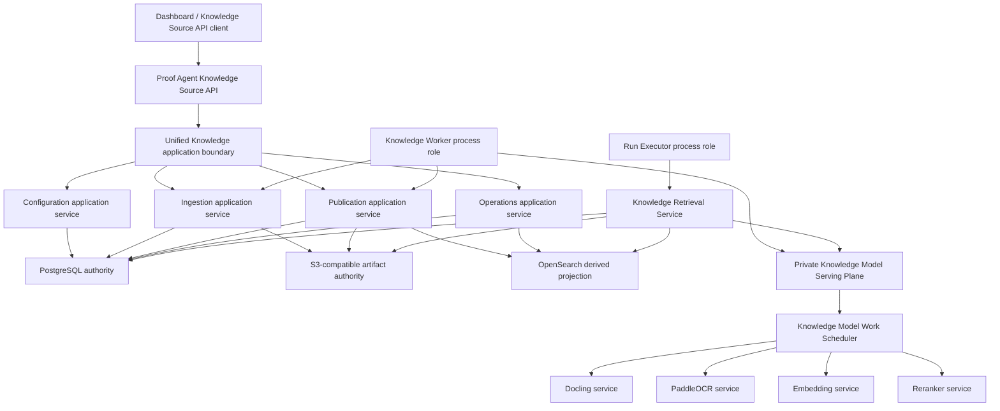

# Dashboard Hybrid Knowledge Source And Unified API Design

**Status:** Accepted
**Date:** 2026-07-27
**Related ADRs:** 0154, 0155, 0156, 0157, 0158, 0159, 0160

## Goal

[FRAME | HIGH] Dashboard shall manage a production Hybrid Index Knowledge Source from creation through explicit Source publication using one stable Proof Agent API. Development and production must not expose different public Knowledge Source contracts, and Source publication must stop before Agent release or activation.

[FRAME | HIGH] The target removes the deployable file-backed Development Knowledge Hub. Local Dashboard integration runs the production-grade Knowledge application service against disposable dependencies; package-local Markdown execution and test fakes remain separate.

## Current Evidence

[KNOWN | HIGH] `proof_agent/observability/api/app.py` selects different Knowledge Source routers for development and production even though both occupy the `/api/config/knowledge-sources` namespace.

[KNOWN | HIGH] `proof_agent/delivery/production_knowledge_api.py` accepts Hybrid document and metadata-workbook bytes as Base64 JSON, loads complete Source document and job collections, and performs publication work synchronously through the request path.

[KNOWN | HIGH] `dashboard/src/pages/KnowledgePage.tsx` creates only `local_index` and `http_json` Sources, while `dashboard/src/pages/KnowledgeDetailPage.tsx` exposes only partial Hybrid Review and Operations panels and does not close the Hybrid document-to-publication loop.

[KNOWN | HIGH] Production Hybrid composition already separates PostgreSQL transaction authority, S3-compatible exact artifacts, OpenSearch derived projection, the Knowledge Worker, and the private model graph. The unified application/API layer should compose these authorities rather than replace them.

## Target Architecture

### Boundary Meaning

[FRAME | HIGH] “Unified Knowledge application service” is a logical design-time application boundary, not one large stateful object or one process. Configuration, Ingestion, Publication, and Operations are focused services sharing contracts and ports. The API process and Knowledge Worker remain separately composed roles; Run Executor reaches the same governed authorities through Knowledge Retrieval Service rather than calling Dashboard application commands.

[FRAME | HIGH] The ambiguous label “Hybrid private services” is replaced by **Private Knowledge Model Serving Plane**. In the current Hybrid graph it contains the scheduler plus Docling, PaddleOCR, embedding, and reranker services. It does not include PostgreSQL, S3, OpenSearch, Knowledge Worker, Run Executor, OIDC, Secret Provider, Egress Policy, or answer/planner/reviewer LLM roles.

[FRAME | HIGH] Private-service endpoints, credentials, model digests, egress rules, and deployment topology remain deployment-owned. Dashboard displays only sanitized capability, readiness, degradation, and pinned revision facts.

## One Public API Contract

### Root And Version

[FRAME | HIGH] `/api/config/knowledge-sources` remains the only Source resource root. `/api/config/knowledge-source-capabilities` returns deployment/provider capabilities. The projection declares `schema_version: "knowledge-source-api.v1"`; V1 evolves additively, and an unavoidable breaking change requires an explicit later version.

[FRAME | HIGH] After Dashboard cutover, Base64 batch routes, mode-specific Knowledge DTOs/routers, and the development fallback are deleted. There is no long-lived alias, dual write, or silent forwarding path.

### Resource Surface

| Method | Relative path | Purpose |
|---|---|---|
| `GET` | `/knowledge-source-capabilities` | Provider, intake, feature, limit, and sanitized readiness projection |
| `GET`, `POST` | `/knowledge-sources` | Cursor-page Sources; create a capability-supported Source |
| `GET`, `PATCH` | `/knowledge-sources/{source_id}` | Source detail/action projection; edit Source Draft with CAS |
| `POST` | `/knowledge-sources/{source_id}/archive` | Archive Source |
| `POST` | `/knowledge-sources/{source_id}/restore` | Restore Source |
| `POST` | `/knowledge-sources/{source_id}/physical-deletion` | Narrow eligible irreversible deletion |
| `GET`, `POST` | `/knowledge-sources/{source_id}/documents` | Cursor-page documents; stream one new multipart file |
| `GET` | `/knowledge-sources/{source_id}/documents/{document_id}/revisions` | Cursor-page immutable revision history |
| `POST` | `/knowledge-sources/{source_id}/documents/{document_id}/revisions` | Stream one explicit replacement revision |
| `POST` | `/knowledge-sources/{source_id}/ingestion-jobs/{job_id}/retry` | Append a manual ingestion attempt |
| `POST` | `/knowledge-sources/{source_id}/ingestion-jobs/{job_id}/cancel` | Immediate or cooperative fenced cancellation |
| `POST` | `/knowledge-sources/{source_id}/metadata-imports` | Stream one asynchronous metadata `.xlsx` import |
| `GET` | `/knowledge-sources/{source_id}/metadata-reviews` | Cursor-page reviews and authoritative summary |
| `POST` | `/knowledge-sources/{source_id}/metadata-reviews/{review_id}/{approve|correct|reject}` | Versioned business-review command |
| `POST`, `GET` | `/knowledge-sources/{source_id}/publication-validations` | Start asynchronous preparation; page validation history |
| `POST`, `GET` | `/knowledge-sources/{source_id}/publications` | Perform short authority CAS; page publication history |
| `POST` | `/knowledge-sources/{source_id}/publications/{publication_id}/rollback-drafts` | Create a reviewed replacement Draft |
| `GET` | `/knowledge-sources/{source_id}/operations` | Cursor-page durable Source operations |
| `GET` | `/knowledge-sources/{source_id}/operations/{operation_id}` | Poll one operation |
| `GET` | `/knowledge-sources/{source_id}/audit` | Cursor-page trace-safe configuration audit |

### Capability Layers

[FRAME | HIGH] The deployment/provider capability projection determines valid creation paths, supported intake envelopes, limits, features, schema version, and sanitized dependency readiness. Production exposes `hybrid_index`; a local disposable composition may explicitly expose migration adapters.

[FRAME | HIGH] Source detail embeds an action capability projection. Each action contains `allowed` plus stable blocker codes derived from Source state, permission, dependency readiness, concurrency, and conflicting work. Commands always repeat those checks against authoritative state.

### Command Concurrency And Replay

[FRAME | HIGH] Every mutable Source projection carries monotonic `revision`. A first command execution compares `expected_revision`; accepted Source-state mutations, including worker and retry state, advance it. `source_draft_version_id` changes only when provider/publication configuration or candidate membership changes.

[FRAME | HIGH] Retryable mutations require an `Idempotency-Key` scoped to operator, Source, and command type. Exact replay returns the original result before Source CAS; reuse with a different canonical request fingerprint returns `409 idempotency_key_mismatch`. The API retains the replay record for at least 24 hours.

[FRAME | HIGH] Metadata reviews additionally compare review version and content identity. Publication consumes a one-use validation bound to Source Draft version, candidate, generation, manifest, and attestation.

### Asynchronous Operations

[FRAME | HIGH] An accepted asynchronous command returns `202 Accepted` with `operation_id`, accepted `source_revision`, and `poll_after_ms`. Dashboard polls durable operation state only while work is active, honors `Retry-After`, pauses while hidden, uses bounded backoff, and reloads Source/action projections after a terminal result.

[FRAME | HIGH] Durable quarantine, ingestion, review-import, and publication records are authority; the operation is their trace-safe read model. A future SSE channel may trigger refresh but cannot become authoritative state.

### Collection And Error Envelopes

[FRAME | HIGH] Sources, documents, revisions, operations, jobs, reviews, publications, and audit use opaque keyset cursors, default limit 50 and maximum 100. Cursors bind resource, normalized filters, and server-whitelisted deterministic sort. Repositories limit before materialization. Server-owned summaries remain independent of page contents.

[FRAME | HIGH] Errors use `application/problem+json` with stable `type`, `status`, `code`, safe `title` and `detail`, `trace_id`, `retryable`, and bounded optional revision, field-error, or blocker facts. Dashboard localizes on `code`; raw exceptions, private endpoints, credentials, Secret Handles, storage paths, and authorization-sensitive facts never appear.

## Binary Intake And Revision Lifecycle

[FRAME | HIGH] Dashboard sends one file per multipart command and implements a batch selection as bounded-concurrency independent commands with per-file outcomes. Browsers receive no direct S3 write authority. Document and metadata-workbook Base64 JSON endpoints are removed.

[FRAME | HIGH] The API streams an admitted request to a system-generated quarantine object while enforcing byte limits and calculating its digest. A short PostgreSQL transaction records the upload, idempotency result, Source mutation, durable operation, and eligible work. An unreferenced quarantine object from a failed transaction is non-authoritative and subject to bounded cleanup.

[FRAME | HIGH] Replacement explicitly targets one stable `document_id` and creates an immutable revision. The prior READY revision remains the candidate while replacement is pending or failed. READY completion atomically selects the replacement in the candidate and advances the Draft version; explicit Source publication is still required.

[FRAME | HIGH] One ingestion job remains bound to one revision. Automatic and manual executions append immutable attempt history. Recoverable failures receive at most two automatic retries; manual retry is capability-gated from `FAILED` or `CANCELLED`. Cancellation is immediate before claim and cooperative after claim, with fencing rejecting late results.

[FRAME | HIGH] Metadata workbook import streams one `.xlsx`, binds an exact document revision and Source revision, and runs asynchronously. The worker verifies the completed Hybrid build and workbook, stores original and normalized artifacts, and atomically creates the complete review set or none.

## Publication Boundary

[FRAME | HIGH] `POST /publication-validations` creates an asynchronous preparation operation. Knowledge Worker freezes the candidate, builds the manifest, obtains embeddings, writes attempt-scoped OpenSearch projection data, verifies exact read-back, creates projection attestation, and runs smoke retrieval. Success produces a Prepared Hybrid Knowledge Publication with one-use validation identity.

[FRAME | HIGH] `POST /publications` performs authorization, idempotency, Source revision and validation-freshness checks, then only the short PostgreSQL fenced CAS that consumes validation and advances publication authority. It does not call private models, S3, or OpenSearch. Abandoned staged projection remains non-authoritative derived state for recovery or cleanup.

[FRAME | HIGH] Source publication exposes a Knowledge Binding Upgrade Available signal. It never runs Phase F release evidence, publishes an Agent Version, or changes the Active Agent Version pointer.

## Permission Model

| Permission | Commands/read models |
|---|---|
| `knowledge_source.view` | Source, document metadata, reviews, operations, versions, sanitized health |
| `knowledge_source.edit` | Source edits, document lifecycle, Retry/Cancel, workbook import |
| `knowledge_source.review` | Metadata correct, approve, reject |
| `knowledge_source.publish` | Publication preparation and Source publication |
| `knowledge_source.archive` | Source Archive, Restore, and eligible Physical Deletion |
| `audit.view` | Source Audit tab and audit records |

[FRAME | HIGH] Operator identity is resolved server-side and never accepted from a command body. V1 records importer, reviewer, and publisher identities without requiring different natural people; deployment policy may later enforce four-eyes separation without changing the API.

## Dashboard Information Architecture

[FRAME | HIGH] `/knowledge` remains the global Knowledge Source Workspace. Creation paths come only from deployment capability projection. Production renders Hybrid creation rather than a frontend provider allowlist.

[FRAME | HIGH] `/knowledge/:sourceId` renders the following Hybrid tabs:

1. **Overview** — identity, lifecycle, published/candidate versions, authoritative aggregates, readiness, blockers, Agent references, upgrade opportunity.
2. **Documents** — upload set, cursor-paged documents, revisions, replace/archive, Retry/Cancel.
3. **Reviews** — workbook import, review summary, cursor-paged correct/approve/reject workflow.
4. **Versions & Publish** — candidate diff/exclusions, async validation, confirmation, publication history, rollback Draft.
5. **Operations** — durable operations, jobs, attempts, progress, sanitized outcomes and recovery actions.
6. **Provider & Health** — read-only Hybrid capabilities and pinned revisions; no endpoint or credential editor.
7. **Audit** — permission-gated trace-safe configuration history.

[FRAME | HIGH] Tab visibility is presentation only. Actions are rendered from capability projection and authorized again on every command.

## Migration And Cutover

[FRAME | HIGH] A one-shot Development Knowledge Hub migration command supports dry-run, source backup verification, Source ID conflict reporting, and a result manifest. It transfers supported shared `local_index` originals for re-admission/reingestion and `http_json` non-secret configuration for fresh verification/publication. It never imports cached indexes, credential values, or package-local Markdown Sources.

[FRAME | HIGH] Existing production Hybrid PostgreSQL and S3 authority receives expand-only schema migrations. It does not pass through the development migrator. Application startup never auto-migrates or dual-reads.

[FRAME | HIGH] API and Dashboard cut over atomically in one blue-green application slot after migrations and smoke checks. The old file-backed router/store, mode-specific public DTOs, Base64 endpoints, and fallback are then removed from that release.

## Non-Goals

- Agent publication, Phase F evidence, or Active Agent Version transition from Knowledge Source Dashboard.
- Browser-to-S3 upload credentials.
- Editing private parser/model endpoints, credentials, Egress Policy, or model deployment from Source configuration.
- SSE as V1 state authority.
- Runtime dual-read or automatic legacy-store migration.
- Importing legacy cached indexes or silently overwriting Source identity conflicts.

## Acceptance Criteria

- Production and local Dashboard compositions expose the same `knowledge-source-api.v1` shapes; differences appear only in capabilities.
- Production exposes Hybrid Source creation and the full document → review → validation → publication loop.
- All binary APIs are multipart single-file commands with bounded streaming and idempotency; no Knowledge Base64 batch remains.
- Every Source mutation has permission, idempotency, optimistic-concurrency, safe-error, and audit tests.
- Lists remain bounded with 10,000 Source documents and never materialize the full repository collection.
- Worker restart, response loss, duplicate command replay, cancel race, stale claim, stale validation, and publication CAS conflict preserve authority.
- Source publication performs no private-model, S3, or OpenSearch call in its authority-commit request.
- Dashboard cannot edit deployment-owned private-service configuration and cannot activate an Agent.
- The legacy deployable Development Knowledge Hub and fallback are absent after cutover; package-local Markdown examples still run.
