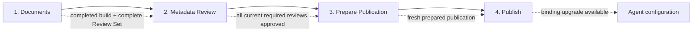
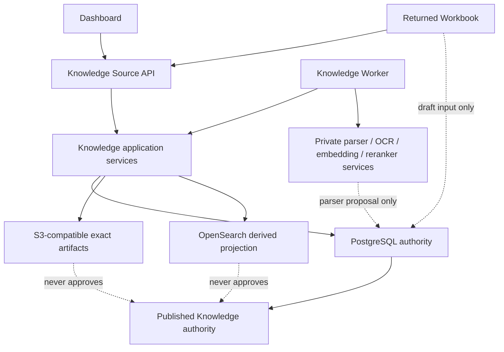

# Metadata Review And Workbook V2 Design

**Status:** Accepted

**Implementation:** Core V2 Review, Workbook, API, Dashboard, PostgreSQL authority and direct runtime cutover are implemented and locally verified. Operational data migration, production Profile provisioning, cross-editor acceptance and maintenance-window cutover evidence remain pending; see `docs/development-progress.md`.
**Date:** 2026-08-08
**Related ADRs:** 0161–0190

## Goal

[FRAME | HIGH] Make metadata review a clear, mandatory business workflow for `insurance_rule.v2` Knowledge Sources while keeping XLSX as an optional, safe bulk-edit surface. An operator must be able to move from a completed Hybrid document build through understandable metadata decisions, deterministic publication preparation, Source publication, and retrieval verification without learning internal storage identities or editing JSON.

[FRAME | HIGH] Metadata Review V2 replaces V1 directly in one maintenance-window cutover. The new release has no V1 parser, endpoint, Dashboard path, dual read, dual write, runtime fallback, or compatibility feature flag.

## Current Evidence

[KNOWN | HIGH] `proof_agent/capabilities/knowledge/hybrid/workbook.py` currently declares `insurance-rule-metadata.v1`, accepts one technical row table, and represents PDF and Workbook values as parallel proposals.

[KNOWN | HIGH] `dashboard/src/pages/KnowledgeDetailPage.tsx` currently places workbook import ahead of a flat metadata-review list and exposes generic review commands rather than a Document Default plus Rule Unit exception workspace.

[KNOWN | HIGH] The unified Knowledge Source API design already establishes PostgreSQL as transaction authority, S3-compatible storage as exact artifact storage, OpenSearch as a derived projection, and asynchronous Workers for long-running work. V2 preserves those boundaries.

## Product Outcome

The Source detail flow is server-guided and has four stages:

[FRAME | HIGH] Each stage and action is projected by the server. Dashboard never derives readiness from the rows currently loaded in the browser.

| Stage | Success condition | Typical blocker action |
|---|---|---|
| Documents | Exact document revision has a structurally valid completed build and a complete Review Set | Inspect/retry failed build or split an oversized document |
| Metadata Review | Current Document Default and every required Rule Unit Override are approved | Fill, save, approve, or reject the linked review |
| Prepare Publication | Candidate checks and retrieval verification produced a fresh prepared publication | Fix a stable blocker and prepare again |
| Publish | Prepared authority was consumed by the short publication CAS | Upgrade an Agent binding explicitly |

## Scope And Non-Goals

### In scope

- Immutable `insurance_rule.v2` Knowledge Metadata Scheme selection.
- Shared, versioned Insurance Metadata Profiles.
- Parser baseline, one editable Current Review Draft, approval history, and publication materialization.
- Document Default plus exception-only Rule Unit Override review.
- Dashboard Metadata Review Workspace.
- Server-generated Workbook V2 export, import preview, three-way merge, and atomic apply.
- Deterministic Source verification, prepared-publication expiry, migration, and direct cutover gates.

### Not in scope

- Requiring a Workbook to create or approve reviews.
- Applying insurance fields to every Hybrid Source.
- Treating spreadsheet formulas, protection, dropdowns, or parser output as authority.
- Source-wide Approve All.
- Automatically activating an Agent after Source publication.
- V1 runtime compatibility after cutover.

## Authority And Trust Boundaries

[FRAME | HIGH] PostgreSQL owns Source revision, exact candidate identity, Profile binding, Review Set generation, Current Review revisions, immutable decisions, prepared-publication state, and published Source version. S3 artifacts and OpenSearch documents cannot make a review current or approved.

## Metadata Scheme And Profile

[FRAME | HIGH] Source creation selects one server-advertised immutable Knowledge Metadata Scheme. Only `insurance_rule.v2` enables this design and requires one exact published Insurance Metadata Profile Revision. A capability-approved Source with no Scheme shows Metadata as `Not required` and does not expose insurance controls.

An Insurance Metadata Profile Revision defines:

- Allowed authority codes and labels.
- Taxonomy identity and exact taxonomy revision.
- Precedence policy identity, authority tiers, and ordering constraints.
- Governed effective-date rules.
- Stable code IDs and optional replacement mappings for later revisions.

[FRAME | HIGH] Profile lifecycle is separate from Source lifecycle. `knowledge_profile.view`, `knowledge_profile.edit`, and `knowledge_profile.publish` govern discovery, Draft Revision editing, and publication. A Source editor may bind a visible published revision but cannot modify the Profile inline.

### Initial local Profile

[FRAME | HIGH] Designated local environments publish `proofagent-insurance-reference.v1` with `reference_only=true` and may bind it to the local `ks_insurance` fixture during V2 migration. Its codes are explicitly declared fixtures and are never inferred from the uploaded PDF or parser output.

[FRAME | HIGH] Production does not auto-create or auto-bind a reference-only Profile. Every production insurance Source must bind an authorized, published, non-reference Profile before migration begins.

### Profile upgrade

Profile replacement first creates a non-mutating impact preview:

| Change class | Preview result | Apply result |
|---|---|---|
| Stable ID, unchanged constraints | Carry forward | New current review revision; renewed approval |
| Label only | Carry value with semantic-change notice | Renewed approval |
| Explicit replacement ID | Suggested mapping | `needs_input` until confirmed |
| Removed without replacement | Clear field | `needs_input` |
| Incompatible taxonomy, precedence, or date constraint | Blocking incompatibility | Apply disabled |

[FRAME | HIGH] Apply binds exact old/new Profile digests, Source revision, and review generations; it is atomic, creates new current Review revisions, invalidates prepared publication, and preserves prior approvals as history.

## Review Model

### Review hierarchy

Every completed document build creates:

1. Exactly one mandatory Document Metadata Default Review.
2. Rule Unit Metadata Override Reviews only for a parser-proposed divergence, missing or uncertain field, detected conflict, or explicit operator-designated exception.

[FRAME | HIGH] Publication materializes complete Approved Insurance Rule Metadata for every Rule Unit from the approved Document Default plus any approved Override. It does not create thousands of duplicate human approval decisions for inherited values.

### Baseline, draft, and decision

- **Parser Proposal** — immutable, non-authoritative comparison baseline.
- **Current Review Draft** — the only editable proposal; Dashboard and Workbook both update it.
- **Review Decision** — immutable saved-change, import-application, approval, or rejection history.
- **Approved Metadata** — immutable publication input created only by approval.

[FRAME | HIGH] A parser-to-human difference is a reasoned change, not a merge conflict. A conflict exists only when the server Current Review Draft and an offline Workbook changed the same export-base field differently.

### Business states and currency

Review business state is exactly one of:

- `needs_input`
- `ready_for_approval`
- `approved`
- `rejected`

[FRAME | HIGH] `current` is a separate currency dimension. `corrected`, `imported`, and `superseded` are history or lineage facts, not business states. Editing approved metadata creates a new current Review revision and does not mutate the approved record.

### Save and approval

[FRAME | HIGH] Dashboard does not autosave. The operator edits locally, supplies one required batch reason, and selects Save Draft. The command binds the exact Review identity and optimistic version, records a field diff, recomputes completeness, and advances Source authority only on success.

[FRAME | HIGH] Approval is disabled while local edits are dirty. The Document Default is approved separately. Explicitly selected, visible, current `ready_for_approval` Override reviews from the same document revision may be approved atomically; a filter or count never implies hidden selection.

## Build-To-Review Commit Boundary

[FRAME | HIGH] A structurally valid Hybrid build may complete even when parser metadata is missing. Missing business values create `needs_input` reviews rather than turning a valid document build into a technical failure.

[FRAME | HIGH] For `insurance_rule.v2`, Document Ready and candidate selection occur only when the following are committed in one fenced PostgreSQL authority boundary:

- Exact completed build identity.
- Canonical Rule Unit and anchor set.
- Immutable parser proposals, including explicit missing values.
- Complete Review Set and authoritative summary.
- Updated Source revision and candidate membership.
- Terminal operation result.

[FRAME | HIGH] S3 artifacts are written before this transaction but remain non-authoritative until referenced by the commit. A ready insurance candidate with zero reviews is invalid.

## Dashboard Metadata Review Workspace

The Reviews tab is task-oriented:

1. **Summary and blockers** — authoritative totals, progress, rejected and needs-input counts, and next action.
2. **Document selector** — state, unresolved count, default status, override count, and citation identity.
3. **Document Default panel** — structured Profile-backed controls, parser comparison, required reason, Save Draft, Approve, Reject.
4. **Rule Unit Overrides table** — filterable by state, reason, exception type, and changed field; explicit selection only.
5. **Inspector** — source citation and safe preview, immutable parser baseline, current values, differences, reason, and decision history.
6. **Workbook bulk-edit panel** — secondary Generate/Download, Upload/Preview, Resolve/Apply workflow.
7. **History** — collapsed immutable V2 revisions and migrated read-only V1 lineage.

[FRAME | HIGH] Corrections JSON is removed. Profile-backed labeled selectors and date/number controls replace raw object editing. Publication blocker deep links open the exact document and relevant filter.

## Workbook V2 Contract

`insurance-rule-metadata.v2` is generated only by the server and contains exactly five allowlisted sheets:

| Sheet | Visibility | Purpose |
|---|---|---|
| `Instructions` | Visible, read-only | Version, workflow, editable-column explanation, expiry, and safe error guidance |
| `Document Defaults` | Visible | One editable default row and locked document/review context |
| `Rule Unit Overrides` | Visible | Complete canonical Rule Unit inventory with inheritance/override controls and locked context |
| `Reference Values` | Visible, read-only | Profile codes, labels, and registered static Data Validation ranges |
| `_Manifest` | Hidden, protected | Export, environment, Source, document, Profile, anchor, review-generation, base-value, and range identities |

Governed fields include:

- `authority`
- `effective_from`
- `effective_to`
- `taxonomy_id`
- `taxonomy_revision_id`
- `precedence_policy_revision_id`
- `precedence_authority_tier`
- `precedence_order`

[FRAME | HIGH] `Rule Unit Overrides` also includes locked Rule Unit identity, canonical anchor, citation, inherited/effective indicator, override reason, and a maximum 512-character safe preview. It initially filters toward required or overridden rows without excluding any row from export identity.

[FRAME | HIGH] Only a still-valid server Export may be returned. The browser, operator, and external automation cannot originate a blank template or author internal identities. Workbook protection and hidden cells are usability aids only.

## Durable Workbook Commands

Workbook round trip has three idempotent asynchronous commands:

1. **Generate Export** — freezes exact base identity and writes the XLSX; no Source mutation.
2. **Create Import Preview** — streams one returned XLSX, validates it, and produces either a bounded Validation Report or a field-level merge Preview; no Source mutation.
3. **Apply Preview** — accepts only a stored fresh Preview identity plus reason, rechecks authority, applies all draft changes atomically, advances review generation and Source revision, invalidates prepared publication, and consumes the Preview and Export.

Suggested resource surface:

| Method | Relative path | Result |
|---|---|---|
| `POST` | `/knowledge-sources/{source_id}/documents/{document_id}/metadata-workbook-exports` | `202` durable Generate operation |
| `GET` | `/knowledge-sources/{source_id}/metadata-workbook-exports/{export_id}/content` | Permission-checked API stream |
| `POST` | `/knowledge-sources/{source_id}/metadata-workbook-import-previews` | `202` durable multipart Preview operation |
| `GET` | `/knowledge-sources/{source_id}/metadata-workbook-import-previews/{preview_id}` | Validation or merge projection |
| `POST` | `/knowledge-sources/{source_id}/metadata-workbook-import-previews/{preview_id}/apply` | `202` durable atomic Apply operation |

[FRAME | HIGH] Each mutation uses an Idempotency Key and exact Source/review identities. Content is streamed through Proof Agent; the browser receives no S3 URL or credential.

## Three-Way Merge

For every editable field, Preview compares Export Base (`B`), Current Server Draft (`S`), and Returned Workbook (`W`):

| Condition | Classification | Proposed value |
|---|---|---|
| `S = B` and `W = B` | unchanged | `S` |
| `S = B` and `W != B` | workbook-only | `W` |
| `S != B` and `W = B` | server-only | `S` |
| `S = W` | matching change | `S` |
| `S != B`, `W != B`, `S != W` | conflict | Explicit operator choice required |

[FRAME | HIGH] A template, environment, Source, document revision, Profile, or canonical anchor-set mismatch is structural staleness and rejects the operation before merge. Review-generation drift alone is mergeable when the structural identity remains exact.

[FRAME | HIGH] Apply is all-or-nothing. It cannot silently skip invalid, stale, hidden, or conflicting rows.

## Workbook Validation And Security

The Import Worker rejects:

- Every cell formula.
- Unknown sheets, columns, names, or manifest identities.
- Unknown/dynamic validation references or functions.
- External links, DDE, macros, ActiveX, OLE, data connections, embedded packages, and external pivot caches.
- Path traversal, duplicate/ambiguous OOXML parts, decompression limit violations, invalid literal types, or Profile-invalid codes.

[FRAME | HIGH] Only static internal Data Validation ranges or named ranges registered in the Export manifest are permitted. Import validates their semantic range identity so supported Excel and LibreOffice rewrites do not fail merely because ZIP/XML byte layout changed. Every imported literal is still validated against the pinned Profile.

Limits for one document revision and Workbook:

| Limit | Value |
|---|---:|
| Canonical Rule Units | 10,000 |
| Compressed XLSX | 10 MiB |
| Expanded package | 80 MiB |
| Normalized payload | 32 MiB |
| Cell length | 4,096 characters |
| Safe source preview | 512 characters |
| Reference values | 10,000 |

[FRAME | HIGH] Capacity is not sharded across multiple Workbooks. A document exceeding 10,000 Rule Units stops at Documents with `metadata_review_capacity_exceeded` and an action to split or restructure the source document.

### Validation Report

A failed controlled validation creates a durable, content-safe report containing:

- Total error count.
- At most the first 100 errors.
- Sheet, row, field, stable code, and localized suggested-action key.

[FRAME | HIGH] The report never includes raw cell values, rule text, storage locations, private endpoints, stack traces, or library exceptions. Concurrent divergence is a valid conflict Preview, not an invalid-file error.

## Publication Preparation And Verification

[FRAME | HIGH] Prepare is asynchronous. It freezes the exact candidate, verifies review coverage and approved materialization, builds/attests the OpenSearch projection, runs the automatic System Retrieval Smoke Check, and executes all enabled Source Verification Cases.

Each Source Verification Case contains:

- `must_retrieve` or `must_not_retrieve` expectation.
- Expected current document and anchor, or expected absence.
- Authorization context.
- As-of time.
- Business rationale.

[FRAME | HIGH] Enabled cases are deterministic and blocking. Model scores and exploratory queries are not release gates; exploratory work belongs to Retrieval Preview.

[FRAME | HIGH] A prepared Hybrid publication expires after 24 hours. State distinguishes `prepared`, `stale`, `expired`, and `consumed`. Final Publish performs only a short PostgreSQL CAS and makes no private-model, S3, or OpenSearch call.

## Permissions

| Permission | Authority |
|---|---|
| `knowledge_profile.view` | Discover published Profiles |
| `knowledge_profile.edit` | Edit Profile Draft Revisions |
| `knowledge_profile.publish` | Publish immutable Profile Revisions |
| `knowledge_source.view` | Read Source, reviews, operations, and safe history |
| `knowledge_source.edit` | Save review drafts, Workbook Export/Preview/Apply, resolve conflicts, bind/upgrade Profile |
| `knowledge_source.review` | Approve or reject exact current Review revisions |
| `knowledge_source.publish` | Prepare and Publish Source |
| `audit.view` | Read trace-safe configuration audit |

[FRAME | HIGH] Small deployments may grant edit, review, and publish to one actor. Optional four-eyes policy may forbid self-approval or self-publication without changing API contracts.

## Retention And Audit

- Workbook Exports and unapplied Previews expire after 30 days by default; structural staleness or successful Apply closes them earlier.
- Purged unapplied artifacts leave only bounded digest-level audit.
- Applied import originals, normalized changes, merge results, exact review identities, and actor decision follow Knowledge configuration audit retention.
- Export, download, upload, preview, conflict resolution, Apply, Save, approval, rejection, Profile binding, Prepare, and Publish are auditable.
- Audit projections contain no raw document/workbook content, governed field values, secrets, or storage locators.

## Migration And Direct Cutover

### Data treatment

- Existing published Source versions remain authority-stable.
- V1 workbook/review/decision lineage becomes read-only legacy audit history.
- Each current unpublished candidate binds a published Profile and materializes a new V2 Review Set from its completed build and parser proposals without PDF re-upload.
- Eligible V1 values may enter as attributed draft input but receive no inherited approval.
- Migration is explicit, dry-run-capable, repeatable, and never runs during application startup.

### Cutover sequence

1. Stop Knowledge Source writes and Workers.
2. Verify database/artifact backup and all migration preconditions.
3. Execute and compare repeatable migration dry-runs.
4. Run the explicit schema/data migration.
5. Deploy V2 Dashboard, API, and Worker together.
6. Execute the complete acceptance gate while writes remain closed.
7. Reopen writes only after every gate passes.

[FRAME | HIGH] Failure before writes reopen restores the pre-cutover snapshot and old image. After the first V2 authority mutation, rollback to V1 is invalid and recovery proceeds forward.

## Implementation Slices

[FRAME | HIGH] These are development slices, not runtime compatibility phases. They may merge incrementally behind unavailable code paths, but the product switches only once.

1. **Contracts and PostgreSQL authority** — Scheme/Profile, review generations/revisions/decisions, Workbook operation records, prepared expiry, migrations, and repository CAS.
2. **Build transaction and migration** — complete Review Set materialization, missing-metadata behavior, V1 read-only lineage conversion, repeatable dry-run, and local reference Profile seed.
3. **Review application service and API** — Save/approve/reject/batch approve, Profile lifecycle/upgrade, authoritative summaries, stable blockers, and permissions.
4. **Workbook service** — V2 generator, semantic OOXML validator, bounded reports, three-way Preview, atomic Apply, retention, and artifact audit.
5. **Dashboard** — four-stage stepper, task-oriented Reviews workspace, Profile Library and binding, recoverable Workbook workflow, deep links, dirty guards, and localized errors.
6. **Prepare/Publish verification** — deterministic cases, 24-hour expiry, short publication CAS, and end-to-end projections.
7. **Direct cutover tooling** — maintenance controls, backup preconditions, migration report, acceptance command, and forward-repair runbook.

## Acceptance Criteria

- A valid Hybrid build with missing metadata becomes Documents-complete with `needs_input` reviews rather than a technical failure.
- Document Ready is impossible without an exact complete Review Set in the same PostgreSQL commit.
- Dashboard can complete the metadata workflow without Workbook export or JSON editing.
- Workbook Export → Excel edit → Preview → Apply and Export → LibreOffice edit → Preview → Apply preserve semantic identity.
- Formula, macro, external-link, embedded-object, ZIP-bomb, path-traversal, invalid-Profile, and configured-limit fixtures fail closed with bounded safe reports.
- Dashboard and offline Workbook concurrent changes produce exact three-way results and never silently overwrite authority.
- Document Default approval and explicitly selected Override batch approval preserve exact identities and atomicity.
- Profile upgrade Preview is non-mutating; Apply invalidates affected approvals and prepared publication.
- Prepared publication expires at 24 hours and cannot be consumed after candidate or review changes.
- `ks_insurance` completes document build, metadata review, Prepare, Publish, and deterministic retrieval verification without PDF re-upload after local migration.
- Production migration refuses a missing or reference-only Profile binding.
- Migration dry-run is repeatable, backup restoration is demonstrated, and no V1 runtime surface ships in the V2 image.
