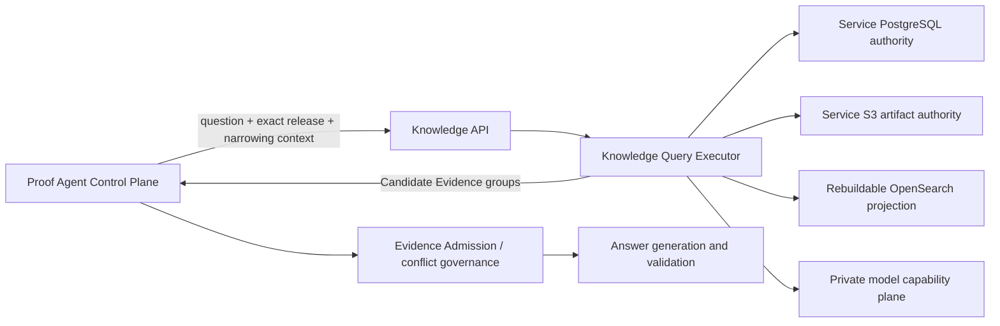
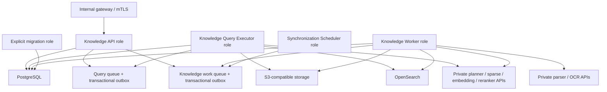
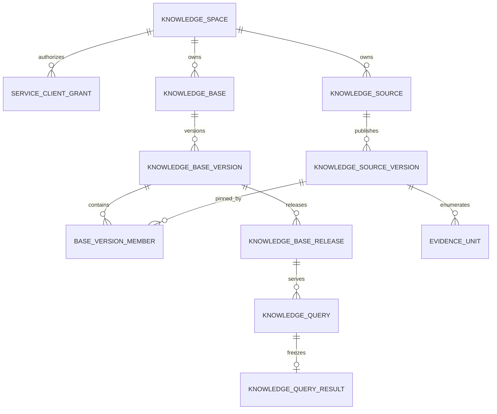
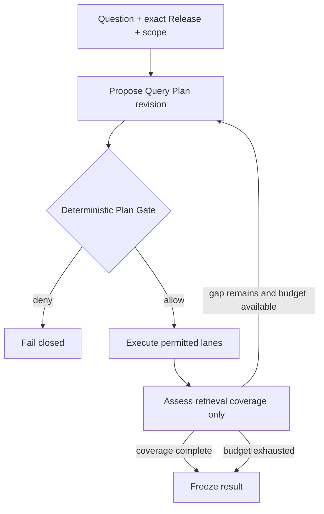
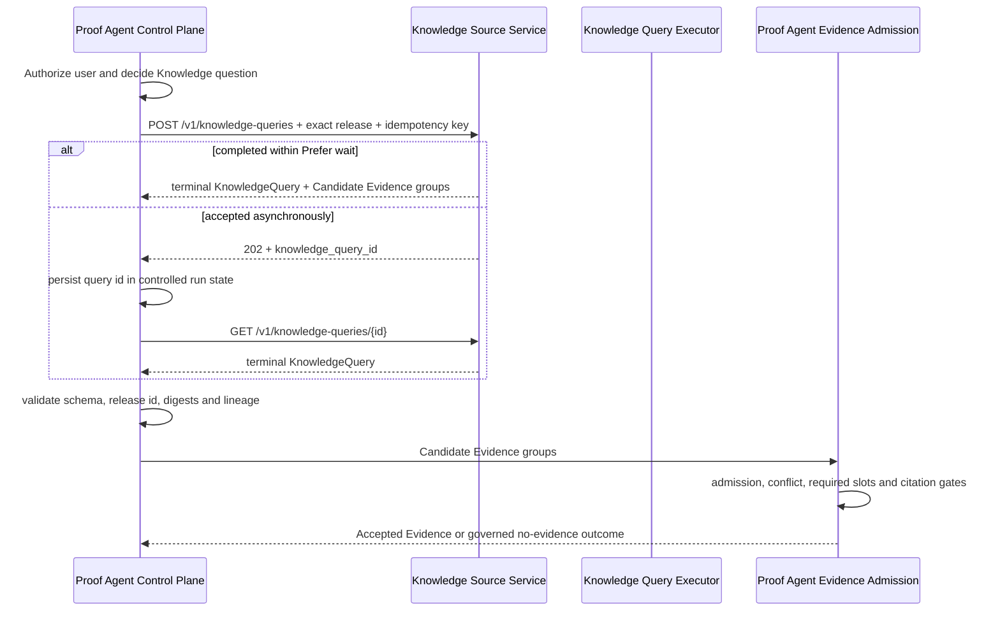

# Knowledge Source Service 总体设计

**状态：** 已完成关键设计评审；待实现

**日期：** 2026-08-11

**关联 ADR：** [ADR-0192](../../adr/0192-separate-knowledge-source-service-from-agent-evidence-admission.md) 至 [ADR-0207](../../adr/0207-deploy-one-knowledge-service-with-isolated-process-roles.md)

## 0. 文档定位

[KNOWN | HIGH] 本文描述目标架构，不表示 Knowledge Source Service 已经实现或达到生产就绪。当前 Hybrid Knowledge 仍由 Proof Agent 进程内组合 PostgreSQL、S3、OpenSearch 和私有模型能力；当前 `KnowledgeRetrievalService` 仍同时包含路由、Provider 协调、融合和 Evidence Admission。证据位于 `proof_agent/bootstrap/production_hybrid_runtime.py`、`proof_agent/control/knowledge/retrieval_service.py` 和 `proof_agent/capabilities/knowledge/hybrid/`。

[FRAME | HIGH] 本设计把可复用的 Knowledge 数据处理与 Candidate Evidence 检索拆成独立服务，同时保持 Proof Agent Control Plane 对用户授权、Evidence Admission、事实和冲突治理、答案推理及最终输出的唯一责任。

## 1. 目标、验证与非目标

### 1.1 目标

- [FRAME | HIGH] Knowledge Source Service 可脱离 Proof Agent 独立部署、迁移、扩缩、监控和恢复。
- [FRAME | HIGH] 服务接收文档、扫描件、结构化文件、数据库快照、HTTP JSON 快照和受控对象清单，保留原始数据并生成可重放的规范化产物。
- [FRAME | HIGH] 服务建立同时支持 Lexical、Sparse、Dense 和 Structured 的混合 Knowledge Base，并向多个 Agent 提供同一版本化查询契约。
- [FRAME | HIGH] 一个 Knowledge Space 可以授权多个 Agent；一个 Source、Base、Release 和 Query 只能属于一个 Space。
- [FRAME | HIGH] 每条 Candidate Evidence 都携带确切 Knowledge Base Release、Source Version、Evidence Unit、Citation Locator、Content Hash 和 Retrieval Lineage。
- [FRAME | HIGH] 服务支持显式、受预算约束的 Agentic Knowledge Retrieval，但不成为答案 Agent 或事实裁判。

### 1.2 必须验证的结果

- [FRAME | HIGH] 对 V1 格式清单中的结构化和非结构化数据完成分析、原始保留、规范化、版本发布、索引、查询和引用回放。
- [FRAME | HIGH] 对结构化数据完成类型安全的投影、过滤、排序、分组和聚合，并证明聚合结果可解析到确切输入记录或输入集合清单。
- [FRAME | HIGH] 对非结构化数据完成结构感知切分、四通道检索、RRF、可选 Reranker 和独立引用的上下文扩展。
- [FRAME | HIGH] 两个以上 Agent 客户端可在同一 Space 内按各自 Grant 查询同一个 Base Release，且任何查询都不能跨 Space 或扩大访问范围。
- [FRAME | HIGH] Proof Agent 仅通过服务 API 获取 Candidate Evidence，随后在本地执行 Evidence Admission、冲突治理和答案生成；Proof Agent 不读取服务数据库、对象或搜索索引。
- [FRAME | HIGH] 旧 Release 在保留期内可重放；新 Release 发布、索引重建或服务升级不得静默改变既有 Agent 行为。

### 1.3 非目标

- [FRAME | HIGH] V1 不提供跨组织 SaaS 多租户，不把 Knowledge Space 宣称为完整租户隔离模型。
- [FRAME | HIGH] 服务不创建最终用户、用户角色或业务权限，不替代调用方的用户授权。
- [FRAME | HIGH] 服务不执行 Evidence Admission、事实真实性判断、冲突裁决、答案推理或最终答案生成。
- [FRAME | HIGH] V1 不在 Agent 查询期间实时联邦访问上游数据库、HTTP API、互联网或任意工具。
- [FRAME | HIGH] V1 不接受任意 SQL、OpenSearch DSL、可执行脚本、动态插件、宏、归档递归解压或模型生成的授权条件。
- [FRAME | HIGH] V1 不把 PostgreSQL、S3 或 OpenSearch 暴露为 Agent 集成契约。

## 2. 当前基线与差距

| 主题 | 当前证据 | 目标差距 |
| --- | --- | --- |
| 运行边界 | [KNOWN | HIGH] `production_hybrid_runtime.py` 在 Proof Agent 内组合 Hybrid 运行时 | 需要独立进程、独立发布和独立数据权威 |
| Control Plane | [KNOWN | HIGH] `control/knowledge/retrieval_service.py` 同时执行 Provider 调用和 Evidence Admission | Candidate Retrieval 必须与 Admission 分离 |
| 检索通道 | [KNOWN | HIGH] 当前 Hybrid OpenSearch 主要实现 BM25 与 dense kNN | 需要独立 learned Sparse 和 Structured 通道 |
| 查询契约 | [KNOWN | HIGH] 当前没有独立 Knowledge Query 资源 API | 需要可恢复、幂等、版本化的多 Agent API |
| 数据类型 | [KNOWN | HIGH] 现有生产设计主要围绕 PDF 与 Insurance Rule Unit | 需要通用文档、扫描件和结构化 Dataset Revision |
| 版本边界 | [KNOWN | HIGH] 现有 Hybrid 已有 Source Publication、Index Generation 和 Retrieval Profile | 需要 Base Version 与原子 Knowledge Base Release 聚合层 |
| 数据权威 | [KNOWN | HIGH] Proof Agent 生产设计已采用 PostgreSQL、S3 和 OpenSearch 三类角色 | 需要把这些角色的逻辑所有权迁入独立服务 |

## 3. 已收敛设计树

| 节点 | 结论 | 决策来源 |
| --- | --- | --- |
| 服务责任 | 只处理 Knowledge 和 Candidate Evidence，不处理答案治理 | 用户确认，ADR-0192 |
| 数据权威 | 服务独占逻辑数据权威；物理集群可共享 | 用户确认，ADR-0193 |
| 结构化数据 | 保留类型化 Dataset Revision，不降级为文本 RAG | 用户确认，ADR-0194 |
| Query Aggregate | Knowledge Base Version 组合 Source；Release 才可查询 | 用户确认，ADR-0195、0205 |
| 多 Agent | 单组织、Knowledge Space 隔离；一个 Space 支持多个 Agent | 用户确认，ADR-0196 |
| 服务授权 | 服务维护 Agent Client Grant；用户权限仍由调用方负责 | 用户确认，ADR-0197 |
| 查询规划 | 服务生成 Knowledge Query Plan，确定性 Plan Gate 批准执行 | 用户确认，ADR-0198 |
| 外部数据 | 查询前物化不可变快照；运行时不实时联邦 | 用户确认，ADR-0199 |
| 检索通道 | Lexical、learned Sparse、Dense、Structured 明确分离 | 用户确认，ADR-0200 |
| 相关性融合 | Lexical、Sparse、Dense 使用 Weighted RRF，可选私有 Reranker | 用户确认，ADR-0201 |
| Agentic | 显式、受限、逐轮过 Gate，仅判断检索覆盖 | 用户确认，ADR-0202 |
| Structured 输出 | 独立结果组，不进入 RRF 或语义 Reranker | 用户确认，ADR-0203 |
| Evidence Unit | 层级化、结构感知、最小独立引用单元 | 用户确认，ADR-0204 |
| 发布 | 异步准备、原子 Release、Agent 显式升级 | 用户确认，ADR-0205 |
| 查询资源 | `KnowledgeQuery` 与 `/v1/knowledge-queries` | 用户确认，ADR-0206 |
| 进程拓扑 | 一个产品、一个逻辑权威、多个隔离进程角色 | 最佳实践补全，ADR-0207 |

## 4. 权威边界



| 责任 | Knowledge Source Service | Proof Agent 或其他 Agent Runtime |
| --- | --- | --- |
| Source、Base、Release 生命周期 | 拥有 | 仅保存外部不可变引用 |
| 原始数据和规范化产物 | 拥有 | 不直接访问 |
| 索引、规划、检索和 Retrieval Lineage | 拥有 | 发出问题并验证响应契约 |
| Agent 服务身份与 Client Grant | 拥有 | 持有自身客户端凭据 |
| 最终用户认证和业务权限 | 不创建 | 拥有 |
| Effective Access Scope | 取 Grant、Release Policy 和可信 narrowing context 的交集 | 提供不可扩权的已签名 narrowing context |
| Evidence Admission | 禁止 | 拥有 |
| 事实、冲突、答案 | 禁止 | 拥有 |

[FRAME | HIGH] Candidate Evidence 的相关性排序、结构化查询结果和 Retrieval Coverage 停止信号都不是 Evidence Admission、事实真实性或答案正确性证明。

## 5. 服务与进程拓扑



### 5.1 进程角色

- [FRAME | HIGH] **Knowledge API** 负责认证、请求验证、幂等、短事务、查询资源读取、管理命令和安全错误映射，不执行 OCR、索引构建或长查询。
- [FRAME | HIGH] **Knowledge Query Executor** 只处理在线 Knowledge Query 队列，拥有更高资源优先级，执行 Plan Gate、检索通道、Agentic 轮次、融合、结果固化和取消检查。
- [FRAME | HIGH] **Knowledge Worker** 处理隔离上传、解析、OCR、规范化、Evidence Unit、结构化快照、索引构建、Release Preparation 和清理任务。
- [FRAME | HIGH] **Synchronization Scheduler** 只按已发布连接配置生成有界同步命令；同步本身仍由 Worker 执行并使用同一租约和幂等规则。
- [FRAME | HIGH] **Migration role** 是显式、非自动重启的数据库迁移入口；API 和 Worker 启动不得隐式执行迁移。

### 5.2 代码与发布边界

- [FRAME | HIGH] 初期可继续位于同一 Git 仓库，但新增独立 Python distribution、依赖锁、OCI image、迁移头、配置 schema、健康检查和发布流水线。
- [FRAME | HIGH] 服务内部使用一个模块化代码库，不为 ingestion、publication、query planning、fusion 或 citation resolution 增加独立网络微服务。
- [FRAME | HIGH] Proof Agent 只依赖 OpenAPI 生成或手写的版本化客户端，不导入服务的 domain、repository 或 adapter 模块。
- [FRAME | HIGH] Query 与 ingestion 使用独立队列、并发闸门和资源池。在线查询可暂停或限速离线 OCR、embedding 和 backfill。

### 5.3 建议模块

```text
knowledge_source_service/
  contracts/       # API DTO、枚举、schema version
  domain/          # Space、Source、Base、Release、Query、Evidence Unit
  application/     # commands、queries、gates、orchestration
  ports/           # repositories、artifact、index、models、connectors
  adapters/        # PostgreSQL、S3、OpenSearch、parser、model、connector
  delivery/        # HTTP/OpenAPI、health、metrics
  workers/         # query executor、ingestion、sync、release preparation
  bootstrap/       # process-role composition only
```

## 6. 核心领域模型与约束



### 6.1 不变量

- [FRAME | HIGH] 每个 Source 和 Base 必须且只能关联一个 `knowledge_space_id`。
- [FRAME | HIGH] Base Version 的所有 Source Version 必须属于同一 Space；数据库约束和应用校验都执行该检查。
- [FRAME | HIGH] Release、Query、Result 和 Candidate Evidence 的 Space 从父资源推导，不接受客户端独立声明。
- [FRAME | HIGH] Source Version、Base Version、Release、Evidence Unit、Query Result 一旦可见即不可变。
- [FRAME | HIGH] Query 只能绑定一个确切 Release；Agentic 多轮期间不得切换 Release、Space 或 Access Scope。
- [FRAME | HIGH] 核心身份、状态、引用和保留字段使用关系列和外键；JSONB 只保存有 `schema_version` 的扩展详情，不替代核心约束。

### 6.2 PostgreSQL 权威表组

| 表组 | 权威内容 |
| --- | --- |
| Space 与 Client | Space、服务客户端、Grant、Base/Action allowlist、最大访问边界 |
| Source | Source Draft、连接配置引用、同步游标、Source Version、Dataset Revision |
| Base | Base、Base Version、成员 Source Version、检索兼容配置 |
| Release | Preparation、validation、attestation、Release、推荐指针、引用和保留 |
| Query | Knowledge Query、请求指纹、状态、deadline、cancel request、attempt、result ref |
| Work | bounded queue、lease、claim token、fencing epoch、retry、outbox、dead-letter review |
| Audit | 配置操作、发布操作、Grant 变更、trace-safe Query facts |

[FRAME | HIGH] 服务使用独立数据库或独立 schema、数据库角色和迁移历史。即使物理 PostgreSQL 与 Proof Agent 共用，双方角色也不能读取或写入对方表。

## 7. 原始数据、产物与搜索投影

### 7.1 权威分工

| 存储 | 角色 | 禁止事项 |
| --- | --- | --- |
| PostgreSQL | 可变状态、身份、事务、引用、队列、授权、发布可见性 | 不保存大文件或把搜索结果当权威 |
| S3-compatible | 不可变 originals、canonical artifacts、manifests、query results、validation artifacts | 不使用客户端路径，不以对象存在代表发布成功 |
| OpenSearch | Lexical、Sparse、Dense 和授权预过滤的可重建投影 | 不保存唯一原始数据，不决定 Release 或 Evidence Admission |

### 7.2 对象键与完整性

- [FRAME | HIGH] 对象键由服务生成并包含不可变身份与 digest；客户端文件名仅作为已清洗显示元数据。
- [FRAME | HIGH] 所有对象写入使用唯一临时键、长度和 SHA-256 校验、manifest 完整性校验，再由 PostgreSQL 短事务绑定可见性。
- [FRAME | HIGH] 未被 PostgreSQL 权威引用的对象或索引文档属于 orphan，可在保留窗口后由 reconciliation 清理，不执行跨存储补偿 Saga。
- [FRAME | HIGH] Query Result 的 Candidate Evidence 内容存入加密的 S3 不可变结果对象；PostgreSQL 只保存状态、digest、对象引用、到期时间和 trace-safe 摘要。

建议对象布局：

```text
spaces/{space_id}/sources/{source_id}/versions/{source_version_id}/originals/...
spaces/{space_id}/sources/{source_id}/versions/{source_version_id}/canonical/...
spaces/{space_id}/sources/{source_id}/versions/{source_version_id}/evidence-unit-manifest.json
spaces/{space_id}/bases/{base_id}/releases/{release_id}/release-manifest.json
spaces/{space_id}/queries/{knowledge_query_id}/result.json
```

### 7.3 保留与删除

- [FRAME | HIGH] 已被 Release 引用的 Source Version、manifest 和 index generation 不可物理删除。
- [FRAME | HIGH] 已被 Agent binding 引用或处于保留窗口的 Release 保持可查询。
- [FRAME | MED] Knowledge Query 原始请求和结果内容默认保留 24 小时，以支持幂等重试和异步恢复；Space policy 可在安全上限内调整。到期后保留 query id、digest、状态、计数、时延和安全错误码，不保留原文。
- [FRAME | HIGH] 配置与安全审计遵循 Proof Agent 现有一年生产审计保留目标，但不得把 Query Evidence 内容复制进审计记录。

## 8. Intake Format Profile V1

| 类别 | 支持 | 关键限制 |
| --- | --- | --- |
| 文档 | PDF、DOCX、PPTX、HTML、Markdown、plain text | content signature；无密码、宏、脚本、外部对象执行 |
| 扫描件 | PNG、JPEG、TIFF | 像素、页数和 OCR 预算限制；保留 bbox 与 OCR lineage |
| 结构化文件 | CSV、XLSX、mapped JSON、JSONL、Parquet | 显式 schema/mapping；禁止公式执行、宏和外链 |
| 数据库 | PostgreSQL table/view snapshot | 只读账号、allowlist、repeatable snapshot、行列和时长上限 |
| HTTP | bounded JSON snapshot | HTTPS allowlist、无重定向、代理或脚本、大小和 schema 限制 |
| 对象存储 | service-controlled manifest | 只引用清单允许的对象；不递归发现或解压 |

[FRAME | HIGH] V1 拒绝 archives、nested attachments、加密或密码文件、宏、脚本、可执行内容、legacy `.doc/.xls/.ppt`、音频、视频、邮件归档、任意 XML 和未映射的深层 JSON。

### 8.1 Intake 流水线

```mermaid
flowchart LR
    A["Quarantine"] --> B["Signature / malware / bounds preflight"]
    B --> C["Format-specific extraction"]
    C --> D["Canonical normalization"]
    D --> E["Quality and schema validation"]
    E --> F["Document Structure Graph or Dataset Revision"]
    F --> G["Evidence Unit Manifest"]
    G --> H["Lexical / Sparse / Dense / Structured projections"]
    H --> I["Source Version validation and publication"]
```



- [FRAME | HIGH] 每一阶段写入不可变中间产物或可恢复状态；worker crash 后从最后一次权威提交恢复，不依赖内存进度。
- [FRAME | HIGH] 解析器、OCR、normalizer、tokenizer、embedding、Sparse encoder 和 projection schema 都以版本和 digest 记录。
- [FRAME | HIGH] 任何会改变 Evidence Unit Manifest 或结构化值的处理变化创建新 Source Version，不原地重算已发布版本。

### 8.2 文档解析策略

- [FRAME | HIGH] PDF 延续 Docling primary + page-level PaddleOCR escalation，输出 provider-neutral canonical structure；`pypdf` 仅做预检和诊断。
- [FRAME | HIGH] DOCX、PPTX、HTML、Markdown 和 text 使用确定性格式适配器，保留 heading、list、table、slide、notes、link 和 source coordinate 能力范围内的结构。
- [FRAME | HIGH] PNG、JPEG、TIFF 通过 OCR 生成带 bbox、页序和模型 lineage 的结构节点；低质量或冲突进入 `review_required`，不静默发布。
- [FRAME | HIGH] 模型可以生成 metadata draft 或 Routing-Only Derived Summary，但不能改写 original、自动批准冲突或成为 source-backed Candidate Evidence。

### 8.3 结构化摄取策略

- [FRAME | HIGH] CSV、XLSX、JSON、JSONL 和 Parquet 规范化为 immutable Structured Knowledge Dataset Revision，冻结 schema、类型、null、时区、decimal precision、collation 和稳定 record identity。
- [FRAME | HIGH] XLSX 不执行公式；用于查询的公式单元必须具有可信 cached value 并记录公式存在，否则进入 review 或拒绝。
- [FRAME | HIGH] mapped JSON 必须声明 record root、field mapping、类型和 record key；未知字段按 policy 拒绝或隔离，不能无声丢弃。
- [FRAME | HIGH] PostgreSQL snapshot 在只读 `REPEATABLE READ` 事务或等价 exported snapshot 中读取 allowlisted table/view；不接收 Agent SQL，不读取系统 catalog、函数或动态对象名。
- [FRAME | HIGH] HTTP JSON 使用静态 allowlisted endpoint、Secret Handle、固定请求模板和 response mapping；记录 ETag、Last-Modified、upstream revision 或观测时间，不在 Query 阶段调用。

## 9. Evidence Unit 与 Citation

### 9.1 Document Structure Graph

[FRAME | HIGH] 每个文档 Source Version 产生 provider-neutral Document Structure Graph，保留 document、section、page/slide、heading、paragraph、list item、table region、figure caption、code block 和 OCR region 的适用层级、顺序和坐标。

### 9.2 Evidence Unit 身份

```text
evidence_unit_identity =
  knowledge_source_version_id
  + canonical_citation_locator
  + content_hash
```

- [FRAME | HIGH] Evidence Unit 是最小语义完整、可独立引用的结构单元，而不是固定 Token chunk。
- [FRAME | HIGH] 超长内容只按版本化句子、列表或表格边界确定性拆分。
- [FRAME | HIGH] 相同文本出现在不同位置时保留不同 Evidence Unit identity；Content Hash 用于完整性，不替代位置身份。
- [FRAME | HIGH] Citation Locator 可精确定位 PDF page+bbox、DOCX paragraph/table cell、PPTX slide+shape、HTML DOM anchor、文本行段、Dataset record set 或 aggregate input set，但不暴露存储路径。

### 9.3 Context Expansion

- [FRAME | HIGH] 检索先排序叶子 Evidence Unit，再执行受预算约束的 post-ranking context expansion。
- [FRAME | HIGH] heading path、table header、adjacent sibling 和 referenced definition 必须独立通过 Access Scope，并保留自己的 id、hash 和 citation。
- [FRAME | HIGH] 上下文不得拼接为匿名大块；Candidate Evidence 明确区分 `primary_evidence_unit` 与 `context_evidence_units[]`。
- [FRAME | HIGH] Derived Summary 只能参与 routing，并在 Retrieval Lineage 中记录影响；不能作为 source-backed content 返回。

## 10. Knowledge Base Version 与 Release

### 10.1 版本关系

- [FRAME | HIGH] Source Version 冻结 admitted originals、canonical artifacts、Dataset Revisions、Evidence Unit Manifest 和 processing lineage。
- [FRAME | HIGH] Base Version 冻结目标 Source Version 集合、retrieval-index compatibility、retrieval profile 和 Base policy。
- [FRAME | HIGH] Release 绑定 Base Version 与实际可查询的 index UUID/generation、manifest、attestation 和 validation，只有 Release 可以成为 Query target。

### 10.2 发布状态

```text
Base Draft
  -> Base Version
  -> Release Preparation: preparing
  -> ready_to_publish | failed | expired
  -> atomic publish
  -> Knowledge Base Release: queryable
  -> retired
  -> deletion_eligible（无引用且过保留期）
```

- [FRAME | HIGH] Preparation 执行所有 S3、OpenSearch 和私有模型工作，不持有长 PostgreSQL 事务，也不改变查询可见性。
- [FRAME | HIGH] Atomic publish 只执行一段短 CAS：校验 one-use preparation、所有 digest、attestation、Base Version 和 fencing token，然后整体创建 Release。
- [FRAME | HIGH] `recommended_release_id` 是管理投影，只支持新绑定和升级提示；Query API 禁止解析它。
- [FRAME | HIGH] 回滚通过 Agent 显式重新绑定旧 Release 完成，不修改旧 Release、Source Version 或索引内容。

## 11. Knowledge Query 执行设计

### 11.1 Query Plan 与 Plan Gate

[FRAME | HIGH] Agent 提交问题、确切 Release、策略、类型化 narrowing constraints 和 execution budget；Knowledge Source Service 生成 Knowledge Query Plan。Agent 不提交 SQL、OpenSearch DSL、lane-native query 或物理索引名。

Plan Gate 依次验证：

1. [FRAME | HIGH] authenticated client 与 Client Grant 是否允许 `knowledge.query` 和目标 Release；
2. [FRAME | HIGH] Release 是否 queryable，manifest、index generation 和 attestation 是否匹配；
3. [FRAME | HIGH] Access Scope 是否为 Grant、Release policy 与已验证 narrowing context 的交集；
4. [FRAME | HIGH] Plan 引用的 Source、Dataset Revision、field、operator 和 lane 是否属于该 Release；
5. [FRAME | HIGH] filter、grouping、aggregation、Top-K、round、model-call、token 和 deadline 是否在所有上限内；
6. [FRAME | HIGH] Plan 是否包含 backend-native executable syntax、mutable `latest`、跨 Space 引用或权限扩张；
7. [FRAME | HIGH] 每个 requested result group 是否标记 required/advisory，且 degradation profile 已在 Release 中预验证。

[FRAME | HIGH] Plan Gate 是确定性代码，planner 不能批准自己的计划。拒绝记录安全 reason code 和 trace-safe plan digest，不记录 chain-of-thought。

### 11.2 四个检索通道

| Lane | 输入与索引 | 输出语义 | 排序 |
| --- | --- | --- | --- |
| Lexical | analyzed/exact fields、term、phrase、BM25 | 精确术语与词法相关性 | lane-local rank |
| Sparse | pinned learned sparse encoder 与 weighted vocabulary | learned semantic term expansion | lane-local rank |
| Dense | pinned embedding、dimension、normalization、vector index | semantic proximity | lane-local rank |
| Structured | Bounded Structured Knowledge Query 与 exact Dataset Revision | record 或 aggregate-backed Candidate Evidence | explicit typed order |

- [FRAME | HIGH] 四个通道独立记录 budget、query revision、index identity、native score、rank、filter 和 failure。
- [FRAME | HIGH] 所有文档候选在检索、Reranker 和 context expansion 前执行同一 Access Scope 过滤；禁止先取敏感内容再过滤。
- [FRAME | HIGH] OpenSearch 返回值必须与 Release Manifest 和 projection digest 一致；不一致立即 fail closed。

### 11.3 Ranked Retrieval Lane Fusion

[FRAME | HIGH] Lexical、Sparse 和 Dense 对同一 Evidence Unit 精确去重后执行 Weighted Reciprocal Rank Fusion：

```text
rrf_score(unit) = Σ lane_weight / (rrf_k + lane_rank(unit))
```

- [FRAME | HIGH] `lane_weight`、`rrf_k`、per-lane Top-K、fusion Top-K 和 dedup revision 固定在 Release retrieval profile 中。
- [FRAME | HIGH] 不直接比较 BM25、Sparse、Dense 或 Reranker 的 raw scores。
- [FRAME | HIGH] 可选私有 Reranker 只接收已授权、已去重的融合候选，并记录 model/tokenizer/image revision、输入序列和 rank transition。
- [FRAME | HIGH] RRF 和 Reranker 只产生相关性顺序，不产生 authority、confidence、truth 或 admission 值。

### 11.4 Structured Retrieval

[FRAME | HIGH] Bounded Structured Knowledge Query 使用版本化 typed AST，只允许：

- field projection；
- `eq`、`ne`、`lt`、`lte`、`gt`、`gte`、`in`、`between`、`is_null` 等 allowlisted typed predicates；
- bounded sort 和 limit；
- bounded group-by；
- `count`、`sum`、`avg`、`min`、`max` 和经批准的 exact distinct count；
- 明确的 decimal、timezone、null、collation 和 overflow 语义。

[FRAME | HIGH] V1 不允许 arbitrary expression、subquery、window function、user-defined function、dynamic table、cross-Space join 或 Agent-authored SQL。多个 Dataset 可由一个 Query Plan 分别查询并返回多个 Structured Evidence Groups；V1 不执行临时跨 Dataset join。需要跨 Dataset 关系时，必须先发布明确的 versioned relation 或 materialized Dataset Revision。

[FRAME | HIGH] Aggregate Candidate Evidence 的 Citation Locator 绑定 exact Dataset Revision、typed AST digest、input predicate、record count 和 input-set digest。大量输入身份存入不可变 input manifest，响应不展开无界 record id 列表。

### 11.5 Typed Mixed Retrieval Composition

- [FRAME | HIGH] Relevance Ranked Group 包含 Lexical、Sparse、Dense 融合和可选 Reranker 后的 Candidate Evidence。
- [FRAME | HIGH] 每个 Structured Query 产生单独 Structured Evidence Group，保留 schema、typed order、record/aggregate lineage 和独立预算。
- [FRAME | HIGH] 两类 group 共用 Query、Release 和 Result envelope，但没有 cross-group global rank。
- [FRAME | HIGH] Proof Agent 可接收全部 group 并独立执行 Evidence Admission；服务不替调用方决定哪个 group 更可信或更适合答案。

### 11.6 Agentic Knowledge Retrieval



- [FRAME | HIGH] `single_pass` 是默认策略；`agentic` 必须显式请求并获 Client Grant 和 Release profile 允许。
- [FRAME | HIGH] Agentic 可改写 query、分析覆盖缺口、选择已允许 lane 和发起 follow-up retrieval。
- [FRAME | HIGH] 每轮生成新 plan revision 并重新通过 Plan Gate；同一 Query 的 Release、Space 和 effective Access Scope 不变。
- [FRAME | HIGH] 独立 hard budget 至少包含 `max_rounds`、`max_model_calls`、`max_candidates`、`max_model_tokens` 和 `max_duration_ms`。
- [FRAME | HIGH] evaluator 只能返回 coverage-complete、continue 或 abort 类检索控制信号；不能输出 Evidence Admission、事实充分性、冲突结论或答案。
- [FRAME | HIGH] Planner 不具有网络工具、数据库连接、文件系统、任意函数或上游 Source 调用能力。

### 11.7 Failure 与 Degradation

| 故障类型 | 默认行为 |
| --- | --- |
| Release、manifest、attestation、ACL、citation 或 digest 不一致 | 立即 fail closed，不返回成功 Result |
| Required lane 或 Required Structured Group 失败 | Query `failed` |
| Advisory lane 失败且 Release 未预验证降级 | Query `failed` |
| Advisory lane 失败且 pinned degradation profile 允许 | Query `succeeded`，`execution_summary.degraded=true` 并记录缺失 lane |
| Agentic planner/evaluator 失败 | 默认 `failed`；仅显式允许的 `single_pass` fallback 可继续 |
| deadline 或 cancel | 停止新工作；旧 worker 不得提交 success；终态为 `expired` 或 `cancelled` |
| Query Result artifact 写入或绑定失败 | 不可见、不成功；orphan 后续清理 |

[FRAME | HIGH] Structured Group 不能由文本检索结果补偿，Access/Integrity 故障不能由任何降级补偿，服务不得调用 Proof Agent 本地 Hybrid 作为 exception fallback。

## 12. 精确查询 API

### 12.1 命名规则

- [FRAME | HIGH] 领域资源称为 **Knowledge Query**，类型名使用 `KnowledgeQuery`，外部字段使用完整的 `knowledge_query_id`。
- [FRAME | HIGH] HTTP collection 使用复数名词 `/v1/knowledge-queries`。
- [FRAME | HIGH] `operation` 只描述通用 HTTP 行为时使用；公开 Query contract 不出现 `operation_id`。
- [FRAME | HIGH] `job_id`、`claim_token`、`lease_id` 仅用于内部 worker contract。
- [FRAME | HIGH] Candidate 相关字段不使用模糊 `score`、`confidence`、`accepted`、`truth` 或 `answer`。

### 12.2 Resource surface

| Method | Path | 语义 |
| --- | --- | --- |
| `POST` | `/v1/knowledge-queries` | 创建一个幂等 Knowledge Query；可 bounded wait |
| `GET` | `/v1/knowledge-queries/{knowledge_query_id}` | 读取状态和终态结果 |
| `POST` | `/v1/knowledge-queries/{knowledge_query_id}:cancel` | 显式请求取消，幂等 |

[FRAME | HIGH] `POST` 必须携带 `Idempotency-Key`。`Prefer: wait=N` 只改变响应等待时间；未完成时返回 `202 Accepted`、`Location` 和 `Retry-After`。完成后返回同一 Query resource，而不是另一种同步响应类型。

### 12.3 CreateKnowledgeQueryRequest

```json
{
  "knowledge_base_release_id": "release-opaque-id",
  "question": "2025 年理赔总额及其主要增长原因是什么？",
  "strategy": "agentic",
  "query_constraints": {
    "as_of": "2025-12-31T23:59:59+08:00",
    "filters": []
  },
  "access_narrowing_context": {
    "assertion_token": "signed-opaque-assertion"
  },
  "execution_budget": {
    "max_rounds": 3,
    "max_model_calls": 6,
    "max_candidates": 200,
    "max_model_tokens": 12000,
    "max_duration_ms": 30000
  },
  "deadline_at": "2026-08-11T10:30:00Z"
}
```

- [FRAME | HIGH] `knowledge_base_release_id`、`question`、`strategy`、`execution_budget` 和 `deadline_at` 是显式字段。
- [FRAME | HIGH] `query_constraints` 只包含 Release schema 允许的类型化约束，不能携带 backend query language。
- [FRAME | HIGH] `access_narrowing_context` 是受信 issuer 签名的 assertion，不接受未签名角色、Space、ACL 或 row filter。若 Grant/Release policy 要求 context 而请求缺失，Query fail closed。
- [FRAME | HIGH] effective budget 取 request、Client Grant、Release profile 和 service hard limit 的最小值，并在 `execution_summary` 中返回。

### 12.4 KnowledgeQuery resource

```json
{
  "schema_version": "knowledge-query.v1",
  "knowledge_query_id": "query-opaque-id",
  "knowledge_base_release_id": "release-opaque-id",
  "state": "succeeded",
  "submitted_at": "2026-08-11T10:29:10Z",
  "started_at": "2026-08-11T10:29:10Z",
  "completed_at": "2026-08-11T10:29:18Z",
  "deadline_at": "2026-08-11T10:30:00Z",
  "cancel_requested_at": null,
  "result_availability": "available",
  "result_expires_at": "2026-08-12T10:29:18Z",
  "result": {},
  "problem": null,
  "links": {
    "self": "/v1/knowledge-queries/query-opaque-id",
    "cancel": "/v1/knowledge-queries/query-opaque-id:cancel"
  }
}
```

[FRAME | HIGH] `state` 只能是 `queued`、`running`、`succeeded`、`failed`、`cancelled` 或 `expired`。其中 `expired` 表示执行在 deadline 前未成功完成，不表示一个已成功 Result 的保留期到期。只有 `succeeded` 且 `result_availability=available` 时包含 `result`；只有 `failed`、`cancelled` 或执行 `expired` 可包含 trace-safe `problem`。终态不可逆。

### 12.5 KnowledgeQueryResult

```json
{
  "schema_version": "knowledge-query-result.v1",
  "evidence_groups": [
    {
      "evidence_group_id": "group-1",
      "group_type": "relevance_ranked",
      "ordering": {
        "kind": "relevance",
        "final_rank_field": "reranked_rank"
      },
      "candidate_evidence": []
    },
    {
      "evidence_group_id": "group-2",
      "group_type": "structured",
      "ordering": {
        "kind": "typed",
        "fields": ["claim_year asc"]
      },
      "candidate_evidence": []
    }
  ],
  "query_plan_summary": {},
  "execution_summary": {
    "strategy": "agentic",
    "rounds": 2,
    "stop_reason": "coverage_complete",
    "degraded": false,
    "budget_usage": {}
  },
  "retrieval_lineage": {}
}
```

### 12.6 CandidateEvidence

```json
{
  "candidate_evidence_id": "candidate-opaque-id",
  "knowledge_space_id": "space-opaque-id",
  "knowledge_base_id": "base-opaque-id",
  "knowledge_base_version_id": "base-version-opaque-id",
  "knowledge_base_release_id": "release-opaque-id",
  "knowledge_source_id": "source-opaque-id",
  "knowledge_source_version_id": "source-version-opaque-id",
  "evidence_unit_id": "evidence-unit-opaque-id",
  "content": {
    "media_type": "text/plain",
    "text": "..."
  },
  "content_hash": "sha256:...",
  "citation_locator": {
    "kind": "pdf_region",
    "page": 12,
    "bounding_boxes": []
  },
  "context_evidence_units": [],
  "ranking": {
    "lane_contributions": [],
    "fused_rank": 4,
    "reranked_rank": 2,
    "structured_order": null
  },
  "retrieval_lineage": {}
}
```

- [FRAME | HIGH] `ranking` 是 discriminated detail：Structured Candidate 不具有 `fused_rank` 或 `reranked_rank`；Relevance Candidate 不伪造 `structured_order`。
- [FRAME | HIGH] `lane_contributions[]` 明确记录 lane、native score、lane rank、weight 和 RRF contribution；不存在 universal score。
- [FRAME | HIGH] 每个 context unit 使用与 primary unit 相同的 identity、hash、citation 和 lineage 规则。

### 12.7 HTTP 与错误语义

| HTTP status | 使用场景 |
| --- | --- |
| `201 Created` | 新 Query 在 bounded wait 内完成并返回资源 |
| `202 Accepted` | Query 已创建但仍 queued/running |
| `200 OK` | GET、取消重放或 exact idempotency replay |
| `400 Bad Request` | 语法错误或无效 header |
| `401/403` | 未认证或 Client Grant 不允许 |
| `404 Not Found` | 不存在或为避免枚举而隐藏的资源 |
| `409 Conflict` | Idempotency-Key fingerprint 冲突或终态状态冲突 |
| `422 Unprocessable Content` | typed contract、constraint 或 deadline 预验证失败 |
| `429 Too Many Requests` | Client/Space/query queue 受限，携带 `Retry-After` |
| `503 Service Unavailable` | 必需依赖未就绪或 admission 暂停 |

[FRAME | HIGH] 错误采用 RFC 9457 `application/problem+json`，字段为 `type`、`status`、`code`、安全 `title/detail`、`trace_id`、`retryable` 和有界 blocker facts。不得返回 secret、私有 endpoint、storage path、raw exception、未授权 identity 或 source content。

### 12.8 Idempotency、取消和结果过期

- [FRAME | HIGH] Idempotency scope 是 authenticated client + `Idempotency-Key`；canonical fingerprint 覆盖完整 request 和 contract version。
- [FRAME | HIGH] exact replay 返回同一 `knowledge_query_id` 和结果；不同 fingerprint 返回 `409 idempotency_key_mismatch`。
- [FRAME | HIGH] 取消命令本身幂等。Worker 在每个阶段和 bounded provider call 前后检查 cancel/deadline；失去 lease 或收到 cancel 后不能提交 success。
- [FRAME | HIGH] V1 将执行 deadline 与 Result retention 分开：执行超时进入 `state=expired`；成功 Result 到达 `result_expires_at` 后，Query 保持 `state=succeeded`，`result_availability` 变为 `expired`，`result` 置空，GET 仍返回 `200` 和 trace-safe metadata。客户端不会把“曾成功但内容已清理”误判为“查询执行失败”。

## 13. 管理 API 边界

[FRAME | HIGH] Knowledge Source Service 同时提供独立的 operator/admin API；Proof Agent Dashboard 可以通过 BFF adapter 调用，但不得成为 Source/Base 数据权威。建议资源名保持平坦、明确：

```text
/v1/knowledge-spaces
/v1/knowledge-service-clients
/v1/knowledge-service-client-grants
/v1/knowledge-sources
/v1/knowledge-sources/{knowledge_source_id}/versions
/v1/knowledge-source-synchronizations
/v1/knowledge-bases
/v1/knowledge-bases/{knowledge_base_id}/versions
/v1/knowledge-base-release-preparations
/v1/knowledge-base-releases
/v1/knowledge-queries
```

- [FRAME | HIGH] 长命令返回明确领域资源，例如 `KnowledgeSourceSynchronization` 或 `KnowledgeBaseReleasePreparation`；只有跨领域通用管理投影才使用 `operation`。
- [FRAME | HIGH] Mutation 使用 `Idempotency-Key` 和 optimistic concurrency；binary intake 使用单文件 multipart stream，不使用 Base64 JSON 或 browser-to-S3 credentials。
- [FRAME | HIGH] 管理查询采用 opaque keyset cursor，server-owned stable sort，默认 50、最大 100；API 不在内存中加载完整 Source 或 document collection。

## 14. 身份、授权与安全

### 14.1 Agent 服务身份

- [FRAME | HIGH] 生产 Agent client 使用 OAuth 2.0 client credentials 取得短期 access token，并由内部 gateway 强制 mTLS。Token 至少校验 issuer、audience、client identity、expiry、not-before 和签名；JWKS 不可用且缓存过期时 fail closed。
- [FRAME | HIGH] 每个 Agent client 有独立 credential 和 Knowledge Service Client Grant，即使多个 Agent 属于同一 Knowledge Space 也不共享 API key。
- [FRAME | HIGH] Grant allowlist 包含 Space、Base/Release、action、最大 budget、允许 strategy 和 access-context requirement；Agent 不能通过 request body声明 Grant。

### 14.2 Effective Access Scope

```text
effective_scope =
  client_grant_max_scope
  ∩ release_resource_policy
  ∩ verified_access_narrowing_context
```

- [FRAME | HIGH] `access_narrowing_context` 由受信 issuer 签名，只能缩小范围；服务拒绝未知 issuer、过期 assertion、unsupported claim 和请求 Release 不匹配。
- [FRAME | HIGH] Grant 或 Release 声明必需 context dimension 时，缺失值不解释为 unrestricted，而是拒绝 Query。
- [FRAME | HIGH] Access filter 在 Source 选择、Dataset row、index candidate、Reranker input、context expansion 和 citation resolution 的每个内容读取点执行。
- [FRAME | HIGH] excluded unit 的身份、计数细节和内容不得泄漏到 error、trace 或 timing-sensitive list response。

### 14.3 Operator 管理身份

- [FRAME | HIGH] 管理面使用企业 OIDC 与服务自身的细粒度 operator permissions；Agent client token 不能调用管理 mutation。
- [FRAME | HIGH] Grant 变更、Source intake、connection、review、Base Version、Release Preparation、publish、retire 和 deletion 都写配置审计。

### 14.4 Content 与模型安全

- [FRAME | HIGH] 上传内容和检索内容始终视为 untrusted data。Planner prompt 使用结构化消息、内容分区和 strict output schema；文档内指令不能修改 scope、budget、Release、tool access 或 Plan Gate。
- [FRAME | HIGH] Planner、OCR、parser、Sparse、embedding 和 Reranker 模型通过私有服务调用，model/image/weight/tokenizer revision 和 digest 固定；生产禁止运行时下载模型或执行远端自定义代码。
- [FRAME | HIGH] Database/HTTP connectors 使用独立只读 Secret Handle、default-deny egress、static allowlist、DNS/IP revalidation、无 proxy/redirect 和有界响应。
- [FRAME | HIGH] 日志、metric、error 和 audit 不记录 raw query、raw evidence、secret、signed assertion 或未授权 Source identity；内容只存在于受访问控制的 Query Result artifact 和调用方后续权威 artifact 中。

## 15. 异步执行、并发与恢复

### 15.1 Queue 与 Outbox

- [FRAME | HIGH] 创建 Query、Source work 或 Release Preparation 时，在同一 PostgreSQL 事务写入领域状态、idempotency record、queue item 和 transactional outbox。
- [FRAME | HIGH] Dispatcher 可重复投递；consumer 使用 immutable work identity 和 request digest 实现幂等，不依赖 exactly-once transport。
- [FRAME | HIGH] Query queue 与 Knowledge work queue 分离，并分别具有 per-client、per-Space 和 global capacity limit。
- [FRAME | HIGH] Query Executor 比 OCR、embedding backfill 和 bulk indexing 具有更高 scheduler priority；offline work 必须可暂停和恢复。

### 15.2 Lease 与 Fencing

- [FRAME | HIGH] Worker claim 使用 `attempt_number`、随机 `claim_token`、可续租 `lease_expires_at` 和单调 `fencing_epoch`。
- [FRAME | HIGH] 每次 provider call、artifact publish、index commit 和 terminal state commit 前后验证 ownership；lease 续租失败后旧 worker 不得启动新调用或提交结果。
- [FRAME | HIGH] 已经完成但未绑定的 immutable artifact 可由新 worker按 digest 校验并复用；旧 worker 的 late terminal update 由 fencing 拒绝。
- [FRAME | HIGH] Transient fault 使用有界 exponential backoff 和 jitter；content、schema、security、integrity fault 不自动重试。

### 15.3 Backpressure

- [FRAME | HIGH] API 在队列容量或 Client quota 满时返回 `429` 或 `503` 和 `Retry-After`，不接受后再无限排队。
- [FRAME | HIGH] 每个 Query 的 fan-out、candidate、round、model token 和 wall time 均有硬上限；每个 Source sync 有 row、byte、duration 和 change-count 上限。
- [FRAME | HIGH] Query cancellation 和 deadline 优先于 retry；cancelled/expired work 不进入 dead-letter replay。

### 15.4 Reconciliation 与 Rebuild

- [FRAME | HIGH] 定期 reconciliation 检查 PostgreSQL refs、S3 manifest、OpenSearch generation、outbox 和 active lease，产出安全差异而不是自动猜测 authority。
- [FRAME | HIGH] OpenSearch 完整丢失后可从 PostgreSQL + S3 rebuild 新 generation，通过 attestation 和新 Release 恢复；不从搜索索引反向重建 authority。
- [FRAME | HIGH] S3 manifest 或 PostgreSQL authority 损坏属于恢复事件，不允许以 OpenSearch 继续服务。

## 16. Observability 与审计

### 16.1 Trace

[FRAME | HIGH] 每个 Knowledge Query 关联 W3C `traceparent`、`knowledge_query_id`、authenticated client、Release、plan revision 和 round id。Trace 记录：

- state transition 与耗时；
- Plan Gate allow/deny code；
- lane budget、candidate count、rank transition 和 degradation；
- Structured AST digest、result count 和 input-set digest；
- Agentic coverage action、budget usage 和 stop reason；
- artifact、manifest、index generation、attestation 和 result digest；
- retry、cancel、deadline、lease loss 和 stable problem code。

[FRAME | HIGH] Trace 不记录 chain-of-thought、raw planner prompt、raw query text、raw evidence、signed assertion、secret 或 excluded identity。需要内容调查时使用受授权的 Query Result 和 Source artifact，不扩大 trace audience。

### 16.2 Metrics

| 维度 | 指标 |
| --- | --- |
| API | admission latency、HTTP status、idempotency replay/conflict、quota rejection |
| Query | queue age、P50/P95、state、strategy、round、stop reason、degradation |
| Retrieval | per-lane latency/candidates/empty rate、RRF truncation、rerank latency、context expansion |
| Structured | scanned rows、filtered rows、groups、aggregate inputs、limit rejection |
| Intake | bytes/pages/records、format、parser path、OCR escalation、review backlog |
| Storage | S3 errors/orphans、OpenSearch lag/drift、rebuild progress、PG queue/lease |
| Security | auth failure、cross-Space rejection、context assertion failure、ACL mismatch、egress denial |

[FRAME | HIGH] Metrics label 只使用低基数 allowlist；不得把 question、Source name、record value、user subject 或 arbitrary client field 作为 label。

### 16.3 Audit

- [FRAME | HIGH] 配置审计记录 actor/client、time、resource、prior/result version、command、decision 和 digest，不复制 binary 或 evidence content。
- [FRAME | HIGH] Query audit 记录 client、Release、strategy、state、counts、degradation、result digest 和 retention，不能冒充 Proof Agent Governance Receipt。
- [FRAME | HIGH] Proof Agent 自己记录 Candidate Evidence 被 Admission 接受或拒绝的事实；服务 audit 不回写该决定。

## 17. Proof Agent 接入设计

### 17.1 适配边界

[FRAME | HIGH] Proof Agent 新增 provider-neutral `KnowledgeCandidateService` port 和 `KnowledgeSourceServiceClient` adapter。Published Agent Version 绑定 exact `knowledge_base_release_id` 与 client-credential reference；endpoint、token 和 transport 细节属于 deployment configuration，不进入 Agent prompt。

[FRAME | HIGH] 目标路径不复用当前进程内 `HybridIndexProvider` 作为 fallback。Proof Agent 的 `control/knowledge` 保留：

- 是否需要 Knowledge 的外层决策；
- 用户授权和业务 policy；
- Query 问题与可信 access narrowing assertion；
- Candidate Evidence contract validation；
- Evidence Admission、required evidence slots、事实/冲突治理；
- Accepted Evidence context assembly、答案和引用 validation。

[FRAME | HIGH] Knowledge Source Service 接管：

- Source/Base/Release 解析；
- Query Plan、Plan Gate 和 Agentic inner loop；
- Lexical/Sparse/Dense/Structured execution；
- RRF、Reranker、context expansion；
- Candidate Evidence identity、citation 和 retrieval lineage。

### 17.2 调用时序



### 17.3 Proof Agent 请求规则

- [FRAME | HIGH] `Idempotency-Key` 从 immutable run id + retrieval action id + semantic attempt 生成；HTTP retry 复用同一 key，新的外层 retrieval action 使用新 key。
- [FRAME | HIGH] Proof Agent 的 Controlled Run State 持久化 `knowledge_query_id`、Release、request digest 和 poll state，进程恢复后继续读取同一 Query。
- [FRAME | HIGH] Proof Agent 校验 response `schema_version`、Release identity、group discrimination、candidate identity、hash、citation 和 lineage；任何缺失或未知枚举 fail closed。
- [FRAME | HIGH] Remote timeout、auth failure、integrity failure 或 Query `failed` 映射为稳定 Knowledge failure，不改走本地 Source、`latest` Release 或另一 Provider。
- [FRAME | HIGH] Structured Evidence Groups 保持类型化进入 Proof Agent Admission；不得在 adapter 中扁平化为普通文本 chunk。

### 17.4 Agentic 嵌套

- [FRAME | HIGH] Proof Agent outer ReAct action 显式选择 `strategy=agentic`；服务不得根据问题自行升级策略。
- [FRAME | HIGH] Outer `max_plan_rounds/max_tool_calls` 与 inner Knowledge Query execution budget 分开计数并同时执行。
- [FRAME | HIGH] 服务返回 coverage stop reason，Proof Agent 决定是否需要外层 clarification、另一项被授权 capability 或答案；服务不能控制 outer route。

## 18. Migration、Cutover 与 Rollback

### Phase 0 — Contract authority

- [FRAME | HIGH] 冻结 OpenAPI、error code、Candidate Evidence、Citation Locator、Retrieval Lineage 和 Release manifest schemas。
- [FRAME | HIGH] 建立 contract tests、format fixtures、structured fixtures、query replay corpus 和 Proof Agent fake service。
- [FRAME | HIGH] 新服务先以独立 schema、S3 prefix、OpenSearch namespace 和 credentials 启动，不读取 Proof Agent 存储。

### Phase 1 — Intake and authority shadow

- [FRAME | HIGH] 通过显式 migration command 从批准的 originals 和配置 export 重摄取，不复制旧缓存 index、credential value 或 mutable file-store state。
- [FRAME | HIGH] 对相同 approved Sources 生成 Source Version、Evidence Unit Manifest 和 Dataset Revision，比较结构、citation 和 content hash。
- [FRAME | HIGH] 当前 Proof Agent path 仍是 runtime authority；shadow service 不向最终答案供 Evidence。

### Phase 2 — Retrieval shadow

- [FRAME | HIGH] 创建 Base Version 与非生产 Release，使用同一 authorized query set 对比现有 Hybrid 与新服务的 recall、required evidence coverage、citation、ACL、latency 和 failure semantics。
- [FRAME | HIGH] Shadow comparison 只记录 aggregate 和已授权差异；不得把新服务结果静默混入当前 Evidence。
- [FRAME | HIGH] Parser、Sparse、Dense、RRF、Reranker 和 Structured acceptance gates 全部通过后才进入 pilot。

### Phase 3 — Proof Agent pilot binding

- [FRAME | HIGH] 为一个受控 Published Agent Draft 添加 remote service binding，运行 Agent Validation，再发布新的 Agent Version。
- [FRAME | HIGH] Pilot 使用 exact Release 和无 fallback adapter；旧 Published Agent Version 继续固定旧 path，可通过 Agent Version rollback 恢复。
- [FRAME | HIGH] 采集 trace-safe query、Admission、answer citation、latency、cancel/resume 和 operator feedback evidence。

### Phase 4 — Gated cutover

- [FRAME | HIGH] 按 Agent Version 显式迁移其 bindings，不以环境开关同时改变所有 Agent。
- [FRAME | HIGH] 所有目标 Agent 完成 release gates 后，删除 Proof Agent 运行时对本地 Hybrid persistence/index 的读取路径；保留历史 Published Agent Version 的受控迁移窗口，不把它配置为 exception fallback。
- [FRAME | HIGH] Proof Agent Dashboard 的 Source/Base 管理改为服务 API adapter 或跳转独立管理面；Proof Agent 只保留 Agent binding 配置。

### Rollback

- [FRAME | HIGH] Agent 运行时回滚选择保留的旧 Published Agent Version，因此恢复完整绑定和 contract；已开始的 run 继续使用启动时固定的 binding。
- [FRAME | HIGH] Knowledge content 回滚发布一个引用历史 Source Version 的新 Base Version 和新 Release，再显式升级 Agent；不修改旧 Release。
- [FRAME | HIGH] 服务部署回滚必须保持数据库 schema、Query state 和 OpenAPI 双向兼容窗口；旧二进制不识别的新 Query state 不得在切换前产生。

## 19. Capacity、SLO 与资源调度

### 19.1 初始目标

- [FRAME | MED] `POST /v1/knowledge-queries` admission P95 不超过 500 ms，不含 bounded wait。
- [FRAME | MED] 在五个并发在线 Query 的初始硬件 envelope 内，`single_pass` Hybrid retrieval + private Reranker P95 不超过 5 秒。
- [FRAME | MED] `agentic` 在 `max_rounds=3`、明确 30 秒 hard duration 下测量；正式 P95 在代表性硬件测试后冻结，不从单轮目标推算。
- [FRAME | HIGH] 离线 ingestion 不得使在线 Query P95 恶化超过 10%，否则 scheduler 必须暂停或限速离线 work。
- [FRAME | HIGH] Routine Knowledge change 继续使用一至四小时目标，但必须绑定文档/页数、OCR mix、model revision、hardware、online concurrency、review 和 validation 的 workload envelope。
- [FRAME | HIGH] Availability、RPO 和 RTO 与 Proof Agent 初始生产目标兼容；Knowledge 服务自身的正式值必须由独立 failure injection、restore 和 rebuild drill 证明。

### 19.2 容量维度

- [FRAME | HIGH] 设计沿用一个 Source 500–10,000 长文档、约 100,000–2,000,000 页的 expanded Knowledge planning envelope，但新增格式和 Dataset 的正式上限必须单独测量。
- [FRAME | HIGH] 限额分为 file、page/pixel、row、column、record bytes、Source、Base members、Query candidates、group count、result bytes、concurrency 和 queue age，不能只设一个总文件大小。
- [FRAME | HIGH] Service capability endpoint 发布部署实际支持的 format、model、limit 和 readiness，不允许 Agent 根据文档假设未部署能力。

## 20. 验收与测试矩阵

### 20.1 Format 与 normalization

| 测试组 | 必须证明 |
| --- | --- |
| PDF | native、multi-column、complex table、cross-page table、OCR-only、mixed page、citation bbox |
| DOCX | heading/list/table、footnote、replacement revision、citation anchor |
| PPTX | slide order、shape/text/table、speaker notes policy、citation shape |
| HTML/Markdown/Text | safe parse、stable anchor、script removal、encoding/line citation |
| PNG/JPEG/TIFF | OCR bbox、rotation、quality gate、low-confidence review |
| CSV/XLSX | schema/types/null/decimal/date、no macro/formula execution、stable record id |
| JSON/JSONL/Parquet | required mapping、schema drift、nested rejection、row identity |
| PostgreSQL | read-only snapshot consistency、bounds、watermark、credential isolation |
| HTTP JSON | allowlist、TLS、no redirect/proxy、size/schema bounds、revision observation |
| Object manifest | exact allowlisted members、digest、no recursion or archive discovery |

### 20.2 Structured analysis

- [FRAME | HIGH] projection、typed filter、sort、group-by、count/sum/avg/min/max、null、timezone、decimal overflow 和 deterministic order 单元测试。
- [FRAME | HIGH] arbitrary SQL、dynamic field、unsupported operator、unbounded group、cross-Dataset join 和 schema mismatch 拒绝测试。
- [FRAME | HIGH] record Candidate Citation 与 aggregate input manifest 可重放测试。
- [FRAME | HIGH] Structured Group 不进入 RRF、Reranker 或 global rank 的 contract test。

### 20.3 Retrieval quality

- [FRAME | HIGH] Lexical clause/id precision、Sparse semantic expansion、Dense paraphrase recall、lane isolation 和 exact Evidence Unit dedup。
- [FRAME | HIGH] Weighted RRF 公式、weight、rank、tie-break 和 every-contribution lineage 的 deterministic test。
- [FRAME | HIGH] Reranker input authorization、revision pinning、rank transition 和 unavailable degradation test。
- [FRAME | HIGH] context expansion 每个 added unit 独立 Access Scope、identity、hash、citation 和 budget test。
- [FRAME | MED] 沿用 expanded insurance Gold Suite 目标：Required-evidence Recall@50 ≥95% overall、每类 ≥90%；Top-10 complete-evidence coverage ≥90%，但新格式与 Structured slice 必须新增独立门槛。

### 20.4 Agentic

- [FRAME | HIGH] explicit strategy、single-pass default、per-round Plan Gate、scope/release immutability、all hard budgets 和 cancel/deadline test。
- [FRAME | HIGH] prompt-injected Source content 不能改变 grant、scope、Release、budget、tool access 或 output schema。
- [FRAME | HIGH] evaluator 只能输出 coverage action；truth、admission、answer 字段 schema rejection。
- [FRAME | HIGH] planner/evaluator failure、explicit fallback、no silent fallback 和 complete round lineage test。

### 20.5 Security 与隔离

- [FRAME | HIGH] 两个 Agent clients 共享一个 Space 但拥有不同 Base/Release Grant 的正反测试。
- [FRAME | HIGH] 跨 Space Source/Base/Release/Query、forged Space id、missing required context、invalid signature、expired assertion 和 context widening 的零暴露测试。
- [FRAME | HIGH] Access Scope 在 search、row query、Reranker、context expansion、citation read 每个阶段的测试；unauthorized candidate exposure 必须为零。
- [FRAME | HIGH] error、trace、metric、audit、OpenAPI example 和 log redaction 测试。
- [FRAME | HIGH] connector SSRF、redirect、DNS rebinding、proxy env、oversized response、archive bomb、macro 和 secret leakage 测试。

### 20.6 Version、concurrency 与 recovery

- [FRAME | HIGH] Idempotency replay/conflict、double submit、response loss、worker crash、lease expiry、stale token、late result、cancel race 和 deadline race。
- [FRAME | HIGH] Release Preparation stale/expired、CAS conflict、partial S3、partial OpenSearch、attestation mismatch 和 orphan cleanup。
- [FRAME | HIGH] Old Release replay after new Source/Base/Release、parser/model/index changes。
- [FRAME | HIGH] Complete OpenSearch rebuild from PostgreSQL + S3 and wrong-generation fail closed。
- [FRAME | HIGH] Blue/Green API/worker compatibility and rollback-window migrations。

### 20.7 Proof Agent 集成验收

1. [FRAME | HIGH] Proof Agent Published Agent Version 固定一个 exact Knowledge Base Release。
2. [FRAME | HIGH] 同步完成和 `202` poll/resume 两条路径都产生同一 Candidate Evidence contract。
3. [FRAME | HIGH] Proof Agent adapter 保留 Structured Group、rank fields、citation、hash 和 lineage，不扁平化或重算 score。
4. [FRAME | HIGH] Candidate Evidence 在 Proof Agent 内经过 Evidence Admission 后才进入 answer context。
5. [FRAME | HIGH] Query Service failure、integrity mismatch 或 auth denial 产生 governed no-evidence/failure outcome，不使用本地 fallback。
6. [FRAME | HIGH] 端到端回答引用可解析到服务保存的 exact original；服务自身不返回答案。
7. [FRAME | HIGH] 网络层和数据库层证明 Proof Agent credential 无权读取服务 PostgreSQL、S3 namespace 或 OpenSearch index。

## 21. 实施切片

| Slice | 纵向结果 | Exit criteria |
| --- | --- | --- |
| S0 Contract | OpenAPI、DTO、error、fake server、Proof Agent client port | contract tests；unknown fields/enums fail closed |
| S1 Service foundation | 独立 image、PG schema、S3 namespace、auth、Grant、Query resource | independent startup；two-client isolation；idempotent query lifecycle |
| S2 Source and Release | Source Version、Base Version、Preparation、atomic Release | immutable replay；stale CAS；orphan recovery |
| S3 Document path | allowlisted documents/scans、canonical graph、Evidence Units、citations | format fixtures；manifest；citation resolution |
| S4 Ranked retrieval | Lexical、Sparse、Dense、RRF、Reranker、context expansion | quality/ACL/lineage gates |
| S5 Structured path | file/DB/API snapshot、typed AST、Structured Groups | analysis/aggregate/citation gates |
| S6 Agentic | planner/evaluator roles、per-round Gate、budgets、cancel | bounded-loop and injection suite |
| S7 Proof Agent pilot | remote binding、poll/resume、Admission mapping | one Published Agent E2E；no direct storage/no fallback |
| S8 Cutover and hardening | shadow, capacity, recovery, Blue/Green, migration removal | sealed acceptance、rebuild、rollback、operations evidence |

[FRAME | HIGH] 每个 Slice 使用 tracer-bullet vertical path，先证明一条 Source → Release → Query → Candidate → Proof Agent Admission 链路，再扩大格式或性能。不得先构建无法被端到端查询和引用验证的孤立 parser/index 子系统。

## 22. 实施时校准项

[FRAME | HIGH] 以下项目需要测量或部署选择，但不再作为产品边界问题追问：

1. [FRAME | MED] exact parser/OCR/model/image/tokenizer revisions 与 supply-chain approval；
2. [FRAME | MED] Sparse encoder、Dense embedding dimension、Reranker winner 和 Chinese analyzer；
3. [FRAME | MED] per-format file/page/pixel/row limits；
4. [FRAME | MED] lane Top-K、RRF weights/k、Reranker limit、context budget；
5. [FRAME | MED] Agentic max rounds/model calls/tokens/duration 和 model prompts；
6. [FRAME | MED] Query Result retention、idempotency retention 和 audit retention 的 deployment policy；
7. [FRAME | MED] single-pass、Agentic、ingestion、sync、rebuild 的正式 SLO/SLA；
8. [FRAME | MED] 初始 GPU、CPU、memory、OpenSearch shards 和 Query/ingestion concurrency。

[FRAME | HIGH] 每项校准都必须冻结为 versioned capability、Index Generation、Retrieval Profile、Release Policy 或 Deployment Compatibility Manifest；不得使用运行时 mutable default 改变已发布 Release 行为。

## 23. 完成定义

[FRAME | HIGH] 只有同时满足以下条件，才可以宣称本目标“已实现”：

- 独立 Knowledge Source Service 能在不启动 Proof Agent 的情况下部署、迁移、摄取、发布和查询；
- V1 每类格式至少有一条成功路径和所有拒绝类安全测试；
- Structured 与 unstructured 分析、存储、查询和引用均通过集成测试；
- Lexical、Sparse、Dense、Structured 与 Agentic 路径均绑定 exact Release 并产生完整 lineage；
- 两个以上 Agent client 的 Grant 与 Space 隔离通过安全测试；
- Proof Agent 通过正式 client adapter 完成 Query、poll/resume、Candidate validation、Evidence Admission 和 cited answer；
- Proof Agent 不再直接读取目标 Knowledge 数据存储，目标 runtime 不存在 local Hybrid fallback；
- shadow、quality、capacity、failure injection、rebuild、rollback、Blue/Green 和 operator runbook evidence 绑定同一 release candidate；
- active docs、OpenAPI、domain glossary、ADRs、migration guide 和 operations guide 与实现一致。

## 24. 相关设计权威

- [KNOWN | HIGH] Proof Agent 当前 active boundary 与生产约束见 [`docs/technical-design.md`](../../technical-design.md) 和 [`AGENTS-COMMON.md`](../../../AGENTS-COMMON.md)。
- [KNOWN | HIGH] Expanded insurance parser、OpenSearch、private model、quality 与 migration 基线见 [Insurance Knowledge Architecture Design](2026-07-12-insurance-knowledge-architecture-design.md)。
- [KNOWN | HIGH] 当前 Dashboard Hybrid management API、asynchronous command 和 publication 基线见 [Dashboard Hybrid Knowledge Source And Unified API Design](2026-07-27-dashboard-hybrid-knowledge-source-unified-api-design.md)。
- [FRAME | HIGH] 本文与 ADR-0192 至 ADR-0207 是独立 Knowledge Source Service 的目标设计权威；在实现完成并验证前，不覆盖 active technical design 对当前运行状态的描述。
